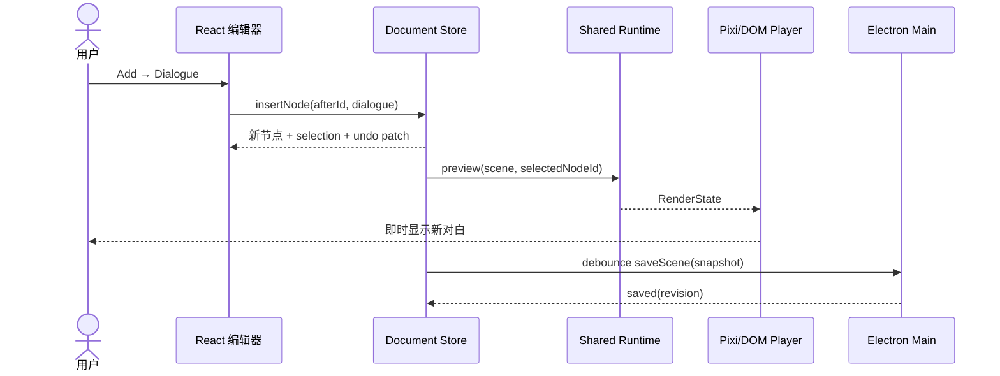
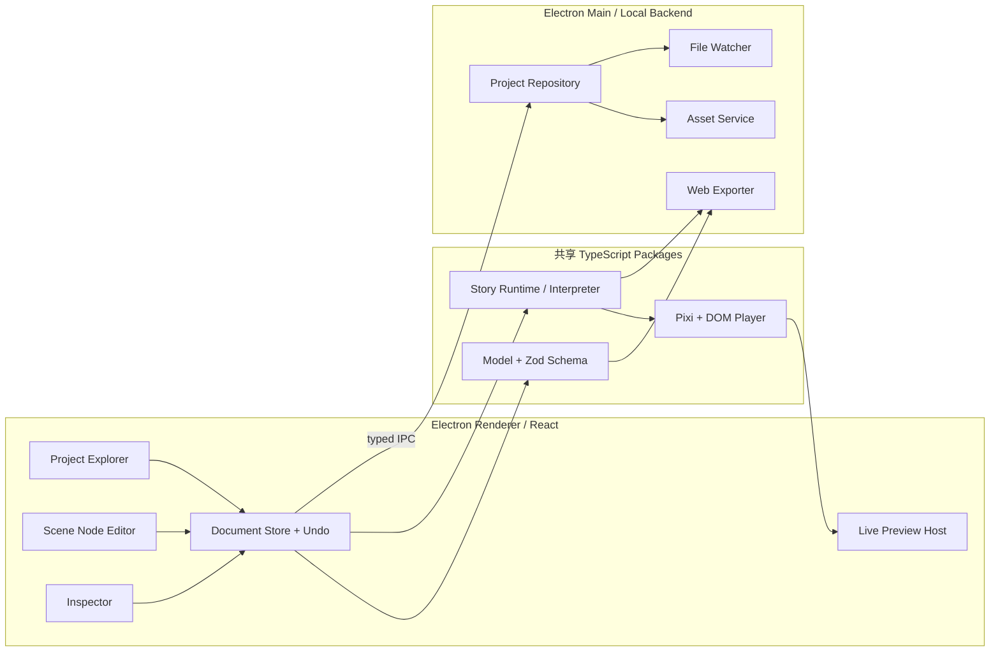

# Mini 视觉小说引擎：30 天 MVP 开发计划

> 文档版本：v1.0  
> 制定日期：2026-08-03  
> 默认资源：1 名全职开发者、20 个工作日、约 160 小时  
> 首发目标：macOS arm64 编辑器 + 可部署的 Web 游戏；Windows 编辑器为 P1  
> 暂定项目名：MiniVN（后续可替换）

## 0. 执行结论

这个项目应当在 `My_Game_Engine/` 中从零开始，不建议直接修改 `Piccolo/`。

Piccolo 是 C++17、Vulkan、ImGui、GLFW、Lua 和 Jolt Physics 组成的通用 3D 引擎。它的停靠式编辑器、资源浏览器、属性面板、编辑/运行模式切换，以及“编辑器与游戏视口共存”的设计值得参考；但 3D 渲染、物理、反射代码生成和原生跨平台构建都不是视觉小说 MVP 的关键路径。直接改造会让一个月主要消耗在底层引擎，而不是对白编辑与实时预览。

本计划的主路线是：

- 桌面编辑器：Electron + React + TypeScript + Vite
- 本地后端：Electron Main Process + 受限 IPC，不建立 HTTP 服务
- 运行时：独立 TypeScript 剧情解释器
- 画面：PixiJS 8 渲染背景、立绘和转场；React/DOM 渲染对白、选项和设置
- 项目数据：分文件、带版本号的 JSON；Zod 负责运行时校验和迁移
- 编辑方式：节点式编辑器为 P0；CodeMirror 6 类 Ren'Py 源码模式为 P1
- 实时预览：编辑器和导出游戏共用同一个 `runtime` 与 `player`
- 游戏导出：首月只承诺静态 Web 目录/ZIP，不承诺每个游戏的多平台签名安装包

为什么默认选 Electron：一个月硬期限下，前端、运行时与本地后端可以全部使用 TypeScript，能减少跨语言调试和打包风险。若开发者已经熟悉 Rust/Tauri，且安装体积是 P0，可在 D1 前整体替换为 Tauri 2；开发中途禁止换壳。

## 1. 对当前目录和参考原型的判断

### 1.1 当前状态

| 目录 | 状态 | 结论 |
|---|---|---|
| `My_Game_Engine/` | 审计时为空（现已加入本计划） | 新引擎的目标目录，可按本计划搭建 |
| `Piccolo/` | 约 2.6 GB 的通用 3D 引擎 | 只借鉴编辑器思想，不作为 VN 引擎代码底座 |

Piccolo 当前包含：

- `World Objects`：场景对象列表
- `Components Details`：选中对象属性面板
- `File Content`：资源文件树
- `Game Engine`：同窗游戏视口
- `Editor Mode / Game Mode`：编辑和运行切换
- JSON 资源、Lua 脚本、C++ 运行时和 Vulkan 渲染

### 1.2 可以借鉴的映射

| Piccolo 概念 | MiniVN 对应概念 | 处理方式 |
|---|---|---|
| World Objects | Scene Outline / 有序剧情节点 | 借鉴列表选择交互，底层改为有序数组 |
| Components Details | Node Inspector | 根据对白、背景、立绘等节点类型显示表单 |
| File Content | Asset Browser | 保留资源树思路，补充导入、引用和缺失检查 |
| Game Engine | Live Preview | 共用最终 Player，而不是单独做一套预览 |
| Editor/Game Mode | 编辑 / 播放 / 从当前节点预览 | 保留模式切换，但加入播放游标 |
| 点击资源创建对象 | Add 后插入剧情节点 | 借鉴“创建后自动选中”，加入稳定 ID 和插入位置 |
| JSON Asset | 版本化 Project/Scene JSON | 保留相对路径和可迁移 Schema |

### 1.3 不直接复用的内容

- Vulkan、3D Mesh、光照、粒子、骨骼动画和 Jolt Physics
- C++ 反射代码生成系统
- 当前 ImGui 字符串展示逻辑：它不具备多行文本编辑和中文 VN 排版能力
- 当前 `unordered_map` 关卡对象结构：剧情必须是有顺序、可跳转的节点序列
- 当前 Lua 每帧执行方式：视觉小说需要确定性的指令解释器和可恢复状态

Piccolo 使用 MIT License；如果将来复制其具体源码，必须保留许可证和版权声明。只借鉴交互和架构思想则不需要将整个仓库打进新引擎。

## 2. 一个月后的交付目标

### 2.1 MVP 成功标准

一个第一次使用引擎的人，应能在 15 分钟内完成：

1. 新建项目。
2. 导入一张背景和两个角色立绘。
3. 新建两个角色。
4. 点击 `Add → Dialogue`，在当前节点后加入对白。
5. 编辑人物和中文文本，并在 250 ms 左右看到预览变化。
6. 添加选项，并跳转到另一个场景。
7. 保存、关闭、重新打开后内容不丢失。
8. 导出一个不依赖编辑器后端的 Web 游戏。

### 2.2 P0：首月必须完成

- 新建、打开、最近项目
- 场景新增、重命名、删除、排序和入口场景
- 角色及表情/立绘定义
- 对白、旁白、背景、显示立绘、隐藏立绘、选项、跳转、结束节点
- `Add` 在当前选中节点之后插入；未选中时追加到场景末尾
- 节点式文本编辑、复制、删除、拖拽排序、基础撤销/重做
- 实时预览、从场景开头播放、从当前节点预览、暂停和重启
- 图片、BGM 和 SFX 资源导入、相对路径引用、缺失引用检查
- 手动保存、500–800 ms 防抖自动保存、原子写入、恢复副本
- 项目 Schema 校验、错误提示和版本号
- Web Player 导出为静态目录和 ZIP
- 当前开发机平台的编辑器安装包
- 核心单元测试和一条完整 E2E 主路径

### 2.3 P1：有余力再做

- 语音、音频淡入淡出、更细的音量分组
- CodeMirror 6 源码模式及简单 DSL
- 玩家对话历史、自动播放、快进和一个自动存档
- 文本框主题、字体、字号和颜色配置
- Windows/macOS 双平台编辑器打包
- 外部文件变更监听与可视化冲突合并

### 2.4 明确延后

- 任意脚本执行、完整 Python/Lua API
- 复杂变量、表达式语言和可视化节点图
- 动画时间轴、骨骼动画、粒子和物理系统
- 云同步、账户、多人协作和远程数据库
- 插件商城、自动更新、在线素材商城
- 完整本地化工作台、语音对齐和视频支持
- 每个游戏一键生成已签名的 Windows/macOS 独立安装包

范围原则：D10 后不再新增 P0；如果延期，按“源码模式 → 音频增强 → 跨平台包 → 玩家存档”的顺序裁剪，不能牺牲 Add、预览、保存和导出闭环。

## 3. 核心用户体验

### 3.1 编辑器布局

```text
┌──────────────────────────────── 顶部工具栏 ────────────────────────────────┐
│ Project  Save  Undo  Redo  + Add  ▶ Play  ▶ From Here  ■ Stop  Export │
├──────────────┬──────────────────────────┬─────────────────────────────────┤
│ Project      │ Scene Editor             │ Live Preview                    │
│ - Scenes     │ [Dialogue] Alice         │ 16:9 游戏画面                   │
│ - Characters │   早上好……               │                                 │
│ - Assets     │ [Background] classroom   ├─────────────────────────────────┤
│              │ [Choice] ...             │ Node Inspector / Diagnostics    │
└──────────────┴──────────────────────────┴─────────────────────────────────┘
```

- 左栏：项目、场景、角色和资源。
- 中栏：有序剧情节点；文本可直接内联编辑。
- 右上：与导出游戏共用的实时 Player。
- 右下：当前节点属性、校验错误和资源引用。
- `Add` 同时出现在工具栏和节点之间的插入点，减少鼠标移动。

### 3.2 `Add Dialogue` 的完整行为

1. 读取当前 `sceneId` 和 `selectedNodeId`。
2. 生成稳定 UUID，构造 `DialogueNode`。
3. 默认说话人沿用前一条对白；找不到时使用旁白。
4. 在选中节点后插入；无选中节点时插到末尾。
5. 新节点自动选中，并聚焦正文输入框。
6. 通过一个可撤销的 `InsertNodeCommand` 更新文档状态。
7. 预览在内存中重算，不等待磁盘保存。
8. 500–800 ms 无新输入后，后端原子保存场景文件。



### 3.3 交互细节

- 中文输入法组合输入期间，不触发错误格式化或抢焦点。
- `Enter` 只换行；`Cmd/Ctrl + Enter` 可播放当前节点。
- `Cmd/Ctrl + S` 手动保存；`Cmd/Ctrl + Z/Shift + Z` 撤销/重做。
- 删除节点前可直接撤销；删除仍被引用的场景时必须二次确认。
- 文档有未落盘修改时，标题栏显示圆点；关闭前等待保存完成。
- 语法/引用错误不能清空预览，应保留“最后一次有效预览”并显示诊断。

## 4. 技术选型

### 4.1 主选技术栈

| 层 | 推荐 | 用途 |
|---|---|---|
| Workspace | pnpm workspace | 管理 Editor、Player 和共享 packages；首月不引入 Turborepo |
| Desktop | Electron + Electron Forge | 桌面壳、原生窗口、安装包 |
| Frontend | React + TypeScript `strict` + Vite | 编辑器 UI、类型安全和快速开发 |
| UI Layout | CSS Modules/Variables + `react-resizable-panels` | 可调整三栏布局；不必首月自研 docking 系统 |
| State | Zustand + Immer patches | 文档状态、选中状态、撤销/重做 |
| Data | Zod + 版本化 JSON | 数据校验、类型推导和迁移 |
| Runtime | 纯 TypeScript reducer/interpreter | 解释剧情节点，保持确定性和可测试性 |
| Rendering | PixiJS 8 + React/DOM | Pixi 负责舞台，DOM 负责中文文本和选项 |
| Audio | Web Audio API；必要时 Howler.js | BGM、SFX、语音和音量分组 |
| Source Editor | CodeMirror 6（P1） | 可选 DSL 视图、语法高亮和诊断 |
| Backend | Electron Main + Node `fs/promises` | 项目读写、资源导入、文件监控和导出 |
| Watcher | chokidar（P1） | 监控外部文件变化 |
| Tests | Vitest + React Testing Library + Playwright | core、组件、Web Player 与关键路径测试 |
| Quality | ESLint + Prettier + `tsc --noEmit` | 代码规范和独立类型检查 |

版本策略：开工日选择稳定版并锁定 lockfile；一个月内只接受安全修复，不追逐新 major。Vite 只转译 TypeScript，CI 必须单独执行 `tsc --noEmit`。

### 4.2 Electron 与 Tauri 2 决策

| 维度 | Electron（本计划主选） | Tauri 2（条件备选） |
|---|---|---|
| 一个月开发速度 | 前后端均为 TS，Web 团队最快 | 需少量 Rust、权限和系统 WebView 知识 |
| 包体/内存 | 较大，随包携带 Chromium/Node | 较小，复用系统 WebView |
| 跨平台画面一致性 | 自带统一 Chromium，更易控制 | 各平台 WebView 不同，需额外 QA |
| 本地能力 | Main + preload + IPC | Rust commands + capability/plugin |
| 安全 | 必须启用 sandbox、contextIsolation、白名单 IPC | capability 作用域更细，但也需正确配置 |
| 打包 | Electron Forge | Tauri CLI/Bundler |

选择规则：

- 不熟 Rust、一个月硬期限：Electron。
- 已经熟悉 Rust/Tauri、包体是硬指标：Tauri 2。
- D1 做出决定；之后所有路线、测试和打包只维护一套桌面壳。
- 无论选哪一个，`model/runtime/player` 都保持纯 TypeScript，桌面壳只替换本地 I/O 适配器。
- 若选 Tauri，把下文的白名单 IPC 映射为同名 Rust commands，并用 capability scope、官方 fs/dialog 插件和 Rust 路径校验实现相同安全边界。

### 4.3 PixiJS 而不是完整游戏框架

视觉小说需要的核心是分层图片、文本、选项、转场和音频，不需要物理、地图和复杂碰撞。PixiJS 提供场景树、Sprite、GPU 加速与资产加载，但不会强迫剧情状态服从一个完整游戏框架的 Scene 生命周期。

推荐混合渲染：

- PixiJS：背景、立绘、层级、淡入淡出、遮罩和后续特效。
- React/DOM：姓名、对白、选项、历史、设置、无障碍和中文排版。
- `runtime` 只输出 `RenderState`，不能直接依赖 Pixi 对象。
- `0.1.0` 明确使用 PixiJS 的 WebGL 渲染路径，不把仍需更多跨平台验证的 WebGPU 作为发布依赖。
- 若 D5 前 Pixi 集成阻塞，先实现 `DomStageRenderer`，保留 `StageRenderer` 接口，D11 再换 Pixi。

### 4.4 JSON 优先，源码模式后置

P0 的事实来源是带稳定 ID 的结构化 JSON。原因：

- Add、拖拽、撤销、引用检查和预览游标都需要稳定节点 ID。
- 视觉编辑不会遇到“解析失败后无法保存”的问题。
- 文件可版本控制、人工修复、按场景拆分，不需要 SQLite。
- 项目规模不足以证明数据库或完整 DSL 的维护成本合理。

P1 可以加入简化 DSL，但它是“应用修改”的显式模式：源码先解析到临时 AST，校验成功后再整体替换当前场景；失败时保留原 JSON 和最后有效预览。首月不做两个文件同时存在的双事实来源。

## 5. 系统架构



### 5.1 必须保持的边界

- `model`：只定义项目、角色、场景、节点和校验，不依赖 React/Electron/Pixi。
- `runtime`：纯函数/状态机，输入节点和玩家操作，输出确定性的 `RuntimeState`。
- `player`：把 `RuntimeState` 渲染到 Pixi/DOM；预览与导出共用。
- `editor-ui`：只通过 command 修改文档，不直接写文件。
- `desktop adapter`：处理窗口、对话框、项目路径、原子保存和导出。
- 导出的游戏不包含 Electron Main，也不需要远程业务后端。

### 5.2 状态分离

至少分成三个 Store：

1. `DocumentStore`：当前项目文档、选中节点、dirty revision、undo/redo。
2. `RuntimeStore`：当前场景、程序计数器、画面、选项、历史、音频状态。
3. `UIStore`：面板尺寸、主题、筛选、最近项目。

禁止 Player 直接修改 `DocumentStore`。预览只接收不可变快照或已编译 Program，避免播放过程污染编辑内容。

## 6. 数据模型与项目格式

### 6.1 用户项目目录

```text
MyNovel/
├─ project.json
├─ characters.json
├─ scenes/
│  ├─ intro.scene.json
│  └─ hallway.scene.json
├─ assets/
│  ├─ backgrounds/
│  ├─ characters/
│  ├─ audio/
│  └─ ui/
├─ .minivn/
│  ├─ recovery/
│  └─ asset-manifest.json
└─ build/
   └─ web/
```

原则：项目中只保存相对路径；绝对路径、窗口状态和最近项目列表不得进入游戏工程文件。

### 6.2 最小类型

```ts
type SceneNode =
  | { id: string; type: "dialogue"; speakerId?: string; text: string }
  | { id: string; type: "narration"; text: string }
  | { id: string; type: "background"; assetId: string; transition?: "cut" | "fade" }
  | { id: string; type: "showCharacter"; characterId: string; poseId: string; position: "left" | "center" | "right" }
  | { id: string; type: "hideCharacter"; characterId: string }
  | { id: string; type: "audio"; channel: "bgm" | "sfx" | "voice"; assetId: string; loop?: boolean }
  | { id: string; type: "choice"; options: Array<{ id: string; text: string; targetSceneId: string }> }
  | { id: string; type: "jump"; targetSceneId: string }
  | { id: string; type: "end" };

interface SceneDocument {
  schemaVersion: 1;
  id: string;
  name: string;
  nodes: SceneNode[];
}
```

每个实体使用稳定 ID，显示名称允许修改。跨文件引用使用 ID，不使用数组下标或可变名称。

### 6.3 场景文件示例

```json
{
  "schemaVersion": 1,
  "id": "scene_intro",
  "name": "序章",
  "nodes": [
    {
      "id": "node_bg_001",
      "type": "background",
      "assetId": "bg_classroom_day",
      "transition": "fade"
    },
    {
      "id": "node_dialogue_001",
      "type": "dialogue",
      "speakerId": "char_alice",
      "text": "早上好。"
    },
    {
      "id": "node_choice_001",
      "type": "choice",
      "options": [
        { "id": "option_hello", "text": "和她打招呼", "targetSceneId": "scene_greet" },
        { "id": "option_leave", "text": "直接离开", "targetSceneId": "scene_hallway" }
      ]
    }
  ]
}
```

### 6.4 可选 DSL 草案（P1）

```text
scene intro:
  background classroom_day fade
  show alice happy at center
  alice "早上好。"
  narrator "教室里十分安静。"

  choice:
    "和她打招呼" -> greet
    "直接离开" -> hallway
```

首版只支持 `scene/background/show/hide/dialogue/narrator/music/sound/choice/jump/end`。源码修改必须通过“Parse → Validate → Apply”按钮提交；解析失败时不能覆盖结构化文档。

### 6.5 Schema 与迁移

- 所有顶级文件都带 `schemaVersion`。
- 打开项目时先校验，再按 `v1 → v2 → ...` 逐级迁移。
- 迁移前创建 recovery 副本；失败则只读打开并显示原因。
- 未知节点类型不能静默删除；应保留原数据并提示版本不兼容。

## 7. 实时预览设计

实时预览不依赖保存文件，也不依赖 Vite HMR。HMR 是开发编辑器代码时使用的工具，不是引擎的剧情热预览机制。

### 7.1 预览链路

```text
用户编辑 / Add
→ Document command
→ 内存 SceneDocument 更新
→ Zod/引用增量校验
→ compileScene(SceneDocument)
→ previewAt(nodeId)
→ RuntimeState
→ Pixi 舞台 + DOM 对话层重绘
→ 防抖后原子写盘
```

### 7.2 `previewAt` 算法

1. 从场景开头以 `previewMode` 重放到目标节点。
2. 重放时更新背景、立绘和变量，但禁止真正播放 BGM/SFX。
3. 到达目标节点后展示对白或选项，再按需要恢复当前音频。
4. 只修改当前对白时，直接 patch 文本；节点排序、跳转或目标节点之前的结构变化则重新计算。
5. 使用递增 `previewRevision` 丢弃过期异步资源结果，避免快速输入时旧预览覆盖新预览。
6. 场景超过 200 个节点后，可每 50 个节点缓存一次纯视觉快照；首版无需更复杂的增量编译。

### 7.3 性能目标

| 指标 | 目标 |
|---|---|
| 普通文本修改到预览更新 | p95 ≤ 200 ms |
| Add Dialogue 到预览可见 | p95 ≤ 250 ms |
| 当前节点重新预览 | ≤ 300 ms（不含首次加载大图） |
| 自动保存完成 | 停止输入后 1 秒内 |
| 打开 500 节点、100 项资源的项目 | ≤ 2 秒 |
| 预览帧率 | 常规场景稳定 60 FPS；低端设备至少 30 FPS |

如果性能不足，先分析资源解码、无关 React 重渲染和重复场景重放，不能先引入多线程或原生渲染重写。

## 8. 本地后端与 IPC

### 8.1 后端职责

本项目“后端”是桌面应用内的本地服务，不是云端服务器。它负责：

- 创建、打开和校验项目目录
- 读取项目快照
- 场景和配置的原子写入
- 导入、复制、重命名和哈希资源
- 校验所有资源路径仍位于项目根目录
- 监控外部文件变化（P1）
- 构建 Web Player 数据包并输出 ZIP
- 记录结构化日志和最近一次恢复信息

### 8.2 白名单 IPC

| API | 输入 | 输出 | 关键校验 |
|---|---|---|---|
| `project:create` | 名称、父目录、模板 | ProjectSnapshot | 名称、目标目录为空、路径合法 |
| `project:open` | 用户选择的目录 | ProjectSnapshot | canonical path、Schema、版本 |
| `project:saveScene` | scene、revision | savedRevision | Zod、项目根、临时写入后 rename |
| `project:saveMeta` | project/characters | savedRevision | Zod、并发 revision |
| `asset:import` | source paths、kind | AssetRecord[] | 格式、大小、同名、路径逃逸 |
| `asset:remove` | assetId | Result | 引用检查，优先移动到 recovery/trash |
| `project:watch`（P1） | projectId | typed events | 只监控已打开项目 |
| `project:validate` | projectId | Diagnostic[] | 节点、跳转、资源、入口场景 |
| `export:web` | projectId、output | ExportReport | 全量校验通过、目标不覆盖源码 |

### 8.3 Electron 安全基线

- Renderer：`nodeIntegration: false`、`contextIsolation: true`、`sandbox: true`。
- Preload 只暴露一个方法对应一个 IPC，不暴露原始 `ipcRenderer`。
- Main 校验 IPC sender、参数 Schema 和项目根目录。
- 只加载打包内的本地 UI，不加载带 Node 权限的远程页面。
- 启用严格 CSP，限制导航、新窗口和外部链接。
- 编辑器预览资源通过只读自定义协议（如 `minivn-asset://<assetId>`）按 manifest 解析，Renderer 不接收项目绝对路径；Web 导出则改用相对 URL。
- 资源路径先 `realpath/canonicalize`，再检查仍在项目根目录中。
- 导出器不得执行项目内脚本；MVP 的剧情数据是声明式的。

### 8.4 可靠保存

```text
内存 revision N
→ 写 scenes/intro.scene.json.tmp
→ fsync/close
→ 用 Zod 重新读取并校验临时文件
→ 原子 rename 替换正式文件
→ 在 .minivn/recovery 保留最近 5 个版本
→ 返回 savedRevision N
```

- Renderer 只在 `savedRevision === currentRevision` 时清除 dirty 标记。
- 后发先至的保存结果不能覆盖新 revision。
- 监测到外部修改时显示“重新加载 / 保留本地 / 另存副本”，不能静默覆盖。
- 资源删除优先移动到项目 recovery/trash，而不是立即永久删除。

## 9. Web 游戏导出

导出步骤：

1. 全量校验入口场景、跳转目标、角色和资源引用。
2. 将 Project/Scene JSON 编译为 runtime bundle。
3. 复制并用内容哈希重命名资源，生成 manifest。
4. 构建/复制预编译 Web Player。
5. 写入标题、分辨率、主题和入口场景。
6. 输出 `build/web/`，并可生成 ZIP。
7. 启动临时静态服务器，用 Playwright 完成一次冒烟通关。

首月导出物的定义是“可上传到任意静态托管或 itch.io 的 HTML5 游戏，不依赖业务后端”。由于浏览器对 `file://` 模块和资源访问有限制，不承诺双击 `index.html` 在所有浏览器中都能运行；本地测试由编辑器预览或附带的静态预览命令完成。

编辑器安装包和“玩家游戏包”是两个不同交付物。首月只给编辑器做当前平台安装包；游戏优先 Web，避免每次导出都进行原生签名与公证。

## 10. 推荐代码目录

```text
My_Game_Engine/
├─ apps/
│  ├─ editor/
│  │  ├─ src/main/          # Electron Main，本地后端
│  │  ├─ src/preload/       # 受限类型化桥接
│  │  └─ src/renderer/      # React 编辑器
│  └─ player-web/           # Web 导出入口
├─ packages/
│  ├─ model/                # 类型、Zod Schema、迁移
│  ├─ runtime/              # 剧情解释器和 RuntimeState
│  ├─ player/               # Pixi + DOM Player
│  ├─ editor-core/          # Commands、undo/redo、诊断
│  └─ ui/                   # 可复用编辑器组件
├─ templates/
│  ├─ empty-project/
│  └─ demo-project/
├─ tests/
│  ├─ fixtures/
│  └─ e2e/
├─ docs/
├─ package.json
├─ pnpm-workspace.yaml
└─ README.md
```

包依赖方向必须单向：

```text
model ← runtime ← player
  ↑        ↑        ↑
editor-core ───── editor-ui
  ↑
desktop adapter
```

不允许 `runtime` 反向依赖 React、Electron 或具体文件系统。

若 D1 选择 Tauri，则将 `src/main/` 与 `src/preload/` 替换为 `src-tauri/`，其余 packages、Player、数据格式、计划和验收标准不变。

## 11. 30 天、20 个工作日计划

标签：`FE` 前端编辑器；`BE` 本地后端；`CORE` 数据/运行时；`PLAYER` 游戏端；`QA` 测试发布。

### 第一周：纵向骨架和最小可玩 Player

| 日 | 工作 | 当日交付/验收 |
|---|---|---|
| D1 | `PRODUCT/CORE` 锁定 P0/P1、画线框、写 3 分钟双结局示例；决定 Electron/Tauri；建 ADR | 一页验收清单；不再讨论桌面壳 |
| D2 | `FE/BE` 建 pnpm workspace、所选桌面壳（默认 Electron Forge）+ React/Vite；ESLint、Prettier、TS strict、Vitest、CI | Editor 空窗口和 Player 页面均可启动，CI 通过 |
| D3 | `CORE` 定义 Project/Character/Scene/Asset Zod Schema、fixture、v1 migration；`BE` 项目创建/打开 | 可创建项目、写示例文件、关闭后重新打开 |
| D4 | `CORE` 实现 runtime reducer：background、show/hide、dialogue、next、end；快照测试 | 纯单元测试可线性执行一个场景 |
| D5 | `PLAYER` 实现最小舞台、中文对白框、点击下一句；`FE` 嵌入同一个 Player 到预览区 | 从 JSON 播放背景 + 立绘 + 10 句中文对白 |

第一周里程碑 M1：不依赖完整编辑器，示例数据已经能通过共享 Runtime 在 Web Player 和编辑器预览中播放。

### 第二周：完成 Add → 编辑 → 实时预览 → 保存闭环

| 日 | 工作 | 当日交付/验收 |
|---|---|---|
| D6 | `FE` 三栏布局、项目树、场景增删改、节点列表与选中状态 | 可以管理多个场景并切换 |
| D7 | `FE/CORE` Command 系统；Add Dialogue/Narration/Background/Show/Hide；自动选择和聚焦 | Add 对白在当前项后插入，撤销/重做可用 |
| D8 | `FE` 节点 Inspector、中文多行编辑、复制删除、拖拽排序；IME 测试 | 不改源码即可完成线性场景 |
| D9 | `BE/FE` 原子保存、revision、auto-save、recovery；资源导入、缩略图和选择器 | 重启后内容/资源保持一致，断电式中断不破坏正式文件 |
| D10 | `CORE/PLAYER` `previewAt`、revision 取消、最后有效预览、从当前节点播放；测延迟 | Add ≤ 250 ms 出现在预览；结构变化能正确重建画面 |

第二周里程碑 M2：新用户能在 15 分钟内导入资源、Add 十句对白、保存并实时预览。此时冻结 P0。

### 第三周：分支、音频、校验和导出

| 日 | 工作 | 当日交付/验收 |
|---|---|---|
| D11 | `FE/PLAYER` 角色、pose、左中右位置、淡入淡出和属性面板 | 角色表现可配置；必要时由 DOM Stage 迁移到 Pixi |
| D12 | `CORE/FE` choice、jump、end；入口、断链、重复 ID、不可达场景诊断 | 可制作两个结局，错误能定位到节点 |
| D13 | `PLAYER/FE` BGM/SFX 基础播放、停止、循环和音量；处理浏览器首次用户手势解锁；如果延期则先裁剪语音/淡入 | 预览和 Web Player 行为一致，不在重放时重复播声音 |
| D14 | `BE/CORE` Web exporter、资源哈希、manifest、输出隔离；禁止导出到项目源码目录 | `build/web` 可由静态服务器运行 |
| D15 | `QA` 导出 Player 冒烟测试；从新建项目走到双结局；修复所有 P0 阻断 | 生成可上传的 ZIP，关闭编辑器也能运行 |

第三周里程碑 M3：一个双结局、含背景/立绘/音频的示例游戏能被编辑、保存、重开并导出。

### 第四周：可靠性、体验、打包和发布

| 日 | 工作 | 当日交付/验收 |
|---|---|---|
| D16 | `FE` 空状态、错误提示、快捷键、加载态、窗口布局持久化；P1 源码模式仅在无阻断时开始 | 基础操作无需读源码或教程 |
| D17 | `QA/CORE/BE` Schema、runtime、commands、保存、资源和导出集成测试；中文/引号/换行用例 | 核心测试稳定，损坏数据不会导致崩溃或静默丢失 |
| D18 | `QA` Playwright 主路径、导出跨浏览器测试、性能和大资源检查；修复高优先级问题 | E2E 重复运行通过，性能目标有记录 |
| D19 | `RELEASE` 当前 OS 的桌面安装包（默认 Forge）、图标、版本、示例项目、快速入门、已知问题 | 在干净用户环境安装并打开 demo |
| D20 | `RELEASE` 功能冻结、完整回归、备份/恢复演练、发布 `0.1.0` | 无 P0 阻断，安装包、Web demo、文档齐全 |

第四周里程碑 M4：`0.1.0` 可交给外部测试者。额外工作日全部作为缓冲，不新增功能。

### 11.1 时间分配

| 工作流 | 比例 | 约工时 |
|---|---:|---:|
| Model、Runtime、编辑命令和预览 | 35% | 56 h |
| 编辑器 UI/UX | 25% | 40 h |
| 本地后端、资源、保存、导出 | 20% | 32 h |
| 测试、打包和修复 | 15% | 24 h |
| 示例与文档 | 5% | 8 h |

如果是两人团队：A 负责 Editor/UX，B 负责 Model/Runtime/Player/Backend；两人共同维护 Schema 和 E2E。不要按“前端/后端”完全割裂，因为实时预览链路横跨两边。

## 12. 测试与质量门槛

### 12.1 单元测试

- 各类节点的 Zod 成功/失败案例
- 中文、emoji、空文本、长文本、引号、反斜杠和换行
- `insert/delete/move/update` command 与 undo/redo 往返
- Runtime 每条指令后的状态快照
- Choice、Jump、End 和无效目标
- `previewAt` 重放不触发音频副作用
- `v1 → v2` 数据迁移与未知字段保护
- 资源 manifest 和路径规范化

### 12.2 集成测试

- 新建 → 保存 → 关闭 → 重开项目
- 连续快速输入时 revision 不倒退
- 写临时文件中断后，正式文件和 recovery 可恢复
- 重名资源、损坏资源、缺失资源和超大资源
- 外部修改与本地 dirty 状态冲突
- 删除仍被节点引用的角色/资源/场景
- 导出时缺少入口场景或跳转断链必须失败

### 12.3 E2E 主路径

1. 新建项目。
2. 导入背景和两个立绘。
3. 创建角色 Alice。
4. Add Dialogue 并输入中文。
5. 验证右侧预览更新。
6. 添加 Choice 和第二场景。
7. 撤销、重做、保存并重启编辑器。
8. 导出 Web ZIP。
9. 由静态服务器打开导出结果，完成两个结局之一。

### 12.4 每日合并门槛

- `pnpm typecheck`
- `pnpm lint`
- `pnpm test`
- 关键 packages 无循环依赖
- 修改 Schema 时必须同时提交 migration/fixture
- 修改 Runtime 时必须同时验证编辑器预览和 Web Player

## 13. 风险登记与应对

| 风险 | 概率/影响 | 预警 | 应对 |
|---|---|---|---|
| 直接改 Piccolo 导致底层工作失控 | 高/高 | 第一周仍在处理 Vulkan/CMake | 保持 Piccolo 只读参考，新项目独立搭建 |
| Electron/Tauri 反复摇摆 | 中/高 | D2 仍有两套壳 | D1 ADR 决策，中途禁止换 |
| 预览和导出逻辑分叉 | 中/高 | 两边出现不同 bug | 强制共用 `model/runtime/player` |
| Add/拖拽后节点 ID 不稳定 | 中/高 | 选择、跳转、undo 失效 | 所有实体稳定 UUID，引用禁止用下标 |
| 自动保存覆盖新数据 | 中/高 | saved revision 倒退 | revision + 原子写 + 最后写入序列化队列 |
| 自定义 DSL 占用过多时间 | 高/中 | D10 核心闭环未完成 | JSON/节点编辑为 P0，源码模式后置 |
| 中文输入/字体问题 | 中/高 | IME 重复提交、字符缺失 | DOM 文本层、组合事件测试、内置可商用 CJK 字体方案后置确认 |
| 大图/音频造成卡顿 | 中/中 | 输入时掉帧、内存飙升 | 后台解码、纹理缓存、尺寸警告、资源预算 |
| 多平台安装包和签名拖期 | 高/中 | D15 仍处理证书 | 首月只保证当前 OS；正式签名列为发布运营工作 |
| Web ZIP 被理解为双击即可运行 | 中/中 | `file://` 加载失败 | 明确静态托管目标，提供编辑器预览/本地 serve |

建议资源预算：单张背景建议不超过 4K，立绘单张建议不超过 4096 px，导入时对超大文件警告但不擅自压缩原图。

## 14. `0.1.0` Definition of Done

- [ ] 无需修改源码即可制作一段至少两个场景、两个结局的视觉小说。
- [ ] 点击 Add 能在当前节点后插入对白，并自动选中和聚焦。
- [ ] 普通文本改动 p95 在 200 ms 内反映到预览。
- [ ] 预览和导出 Player 使用同一套 Runtime。
- [ ] 中文、换行和常见标点正确显示，IME 不丢字。
- [ ] Undo/Redo 覆盖插入、删除、移动和文本修改。
- [ ] 自动保存、手动保存、原子写和 recovery 均完成演练。
- [ ] 关闭重开后项目内容和资源引用保持一致。
- [ ] 缺失资源、断裂跳转和损坏 Schema 有明确诊断，不能静默导出。
- [ ] Web 导出可在静态服务器上脱离编辑器运行。
- [ ] 至少一个目标桌面 OS 完成干净环境安装测试。
- [ ] 单元测试、核心集成测试和 E2E 主路径通过。
- [ ] 示例项目、5 分钟快速入门和已知问题文档齐全。

## 15. 一个月后的优先路线

### 0.2：叙事能力

- 变量、布尔条件和受限表达式
- 玩家存档、读档、回滚、历史和跳过已读
- 完整 DSL、CodeMirror 高亮/补全/错误定位
- 文本主题、转场库和音频淡入淡出

### 0.3：制作效率

- 场景搜索、引用查找、批量改名
- 对话 CSV 导入导出、本地化和字数统计
- 资产去重、未使用资源检查和压缩建议
- 分支图只作为导航视图，不替换有序节点编辑器

### 1.0：发布能力

- 通用桌面 Player + `.vnpack` 数据包
- 由 CI 生成 Windows/macOS/Linux 品牌化游戏包
- 代码签名、公证、自动更新和崩溃报告
- 插件 API 与扩展节点类型

## 16. 开工前半天要完成的检查清单

1. 确认开发者对 React/TypeScript、Electron 或 Tauri 的熟悉程度。
2. 确认首发编辑器 OS；本计划暂按当前 macOS arm64 环境。
3. 确认 Web 导出是否满足首月交付，而不是原生游戏安装包。
4. 用纸面/线框走一遍 Add、编辑、预览、保存、导出路径。
5. 准备合法可分发的 demo 背景、立绘、音频和中文字体。
6. 为 P0 建看板，并为每项附上本文的验收结果。
7. 提交 D1 ADR：桌面壳、事实来源、导出形式、目标 OS 四项不得悬而未决。

## 17. 参考资料

### 本地参考

- [Piccolo README](../Piccolo/README.md)
- [Piccolo 编辑器 UI](../Piccolo/engine/source/editor/source/editor_ui.cpp)
- [Piccolo 文件服务](../Piccolo/engine/source/editor/source/editor_file_service.cpp)
- [Piccolo License](../Piccolo/LICENSE)

### 官方技术文档

- [Electron Process Model](https://www.electronjs.org/docs/latest/tutorial/process-model)
- [Electron Context Isolation](https://www.electronjs.org/docs/latest/tutorial/context-isolation)
- [Electron Security](https://www.electronjs.org/docs/latest/tutorial/security)
- [Electron Packaging / Electron Forge](https://www.electronjs.org/docs/latest/tutorial/application-distribution)
- [Tauri 2 Architecture](https://v2.tauri.app/concept/architecture/)
- [Tauri File System Plugin](https://v2.tauri.app/plugin/file-system/)
- [Tauri Distribution](https://v2.tauri.app/distribute/)
- [React Documentation](https://react.dev/learn/describing-the-ui)
- [Vite Guide](https://vite.dev/guide/)
- [PixiJS Renderers](https://pixijs.com/8.x/guides/components/renderers)
- [PixiJS Assets](https://pixijs.com/8.x/guides/components/assets)
- [Zustand Introduction](https://zustand.docs.pmnd.rs/learn/getting-started/introduction)
- [Zod](https://zod.dev/)
- [CodeMirror 6 System Guide](https://codemirror.net/docs/guide/)
- [Vitest](https://vitest.dev/guide/)
- [Playwright](https://playwright.dev/docs/intro)
