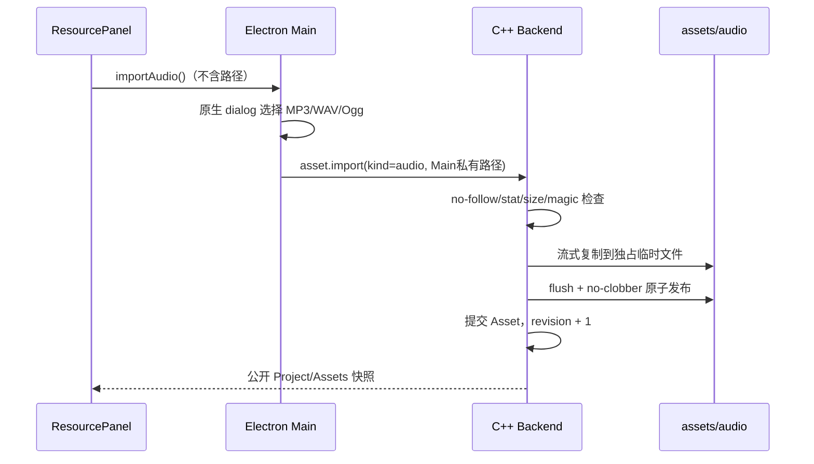

# 语音与背景音乐实现技术栈

> 本文描述音频功能的当前实现契约。总体架构与面试回答见
> [技术栈与面试讲解指南](./technical-stack-interview-guide.md)。

## 1. 产品目标

音频资源与图片、视频共享顶部“项目资源”区域，但按媒体类型分组显示。作者可以：

- 导入 MP3、WAV、Ogg 音频；
- 为每句对白选择一条人物语音；
- 在统一时间线中插入 BGM 节点；
- 在表单编辑器和 Blockly 中编辑同一份音频数据；
- 在正式游戏预览中听到循环 BGM 和单次对白语音；
- 将音频随项目文件夹安全保存并重新打开。

交互规则：

- `音频 +` 位于 `立绘 +` 旁边，它创建的是 BGM 时间线节点；
- 新建 BGM 节点默认是“停止 BGM”；
- 新建对白天然包含语音字段，但默认“无语音”；
- 音频资源可以拖到对白语音槽或 BGM 资源槽；
- 普通编辑预览不会自动播放，只有正式预览或明确点击试听才播放。

## 2. 技术栈

| 部分 | 技术栈 | 作用 |
| --- | --- | --- |
| 领域模型 | C++20、`std::variant`、`std::optional` | Dialogue 绑定语音，BgmNode 成为强类型时间线节点 |
| 持久化 | nlohmann/json、音频引入于 fileVersion v7 | 严格保存 `voiceAssetId` 和 BGM 节点；当前 Writer 为 v13 |
| 安全导入 | C++ OS 文件句柄、magic bytes、流式复制 | 验证 MP3/WAV/Ogg，拒绝链接、伪格式和覆盖 |
| 项目目录 | `assets/audio/`、Main 私有临时工作区 | 未保存项目也可导入，首次保存安全迁移 |
| 跨进程 | Electron IPC、contextBridge、JSONL | Renderer 只表达导入/绑定意图，不传路径 |
| 安全播放 | Electron `vn-asset://`、capability token、HTTP Range 语义 | `<audio>` 按需读取，Renderer 不获得文件路径 |
| 表单 UI | React 19、TypeScript 判别联合 | 对白语音选择器、BGM Inspector 和资源分组 |
| 图形化 UI | Blockly 13、自定义 Block、HTML Drag and Drop | 白色音频槽、BGM 积木和混合时间线拖动 |
| 正式预览 | TypeScript 纯状态机、两个 `HTMLAudioElement` | BGM 循环、voice 单次播放和生命周期清理 |
| 测试 | CTest、Vitest、真实 C++ JSONL 集成 | 覆盖模型、导入、Range、Blockly 和播放器状态 |

## 3. 为什么语音和 BGM 不能使用同一种节点

它们共享 `AssetType::audio`，但播放语义不同：

```text
Audio Asset
  ├── Dialogue.voiceAssetId   一句对白的一次性语音
  └── BgmNode.assetId         从时间线某位置开始持续的循环音乐
```

Asset 只描述文件 `{id,type,relativePath,displayName}`，不保存 voice/bgm 用途。
这样同一音频可以复用，资源层也不需要复制两套导入与存储逻辑。

### 3.1 对白语音

```cpp
struct Dialogue {
  std::string id;
  std::string speaker;
  std::string text;
  std::optional<std::string> voice_asset_id;
};
```

- `null` 表示无语音；
- 对白出现时从 0 播放一次；
- 点击进入下一条时立即停止；
- 语音自然结束不会自动推进剧情。

### 3.2 BGM 节点

```cpp
struct BgmNode {
  std::string id;
  std::optional<std::string> asset_id;
};
```

- 非 null：停止旧 BGM，从 0 循环播放新 BGM；
- null：明确停止当前 BGM；
- BGM 跨场景跳转持续，只有后续 BGM 节点才能更换或停止；
- 开始一次新预览时初始 BGM 为空。

```cpp
using SceneNode = std::variant<
    Dialogue,
    BackgroundNode,
    CharacterNode,
    SceneJumpNode,
    BgmNode>;
```

## 4. v7 文件格式

对白始终写出 `voiceAssetId`：

```json
{
  "id": "dialogue-id",
  "type": "dialogue",
  "speaker": "Alice",
  "text": "你好",
  "voiceAssetId": "voice-asset-id"
}
```

无语音时为 `null`。

BGM 节点：

```json
{
  "id": "bgm-node-id",
  "type": "bgm",
  "assetId": "bgm-asset-id"
}
```

停止 BGM：

```json
{
  "id": "bgm-stop-id",
  "type": "bgm",
  "assetId": null
}
```

音频在 v7 引入；当前 Writer 固定写 v13，Reader 读取 v1–v13。Reader 会把
v1–v6 Dialogue 迁移为 `voiceAssetId:null`；早期项目没有 BGM 节点。

## 5. C++ 命令与事务边界

新增命令：

```text
dialogue.setVoice {
  sceneId,
  nodeId,
  assetId: string | null
}

bgm.add {
  sceneId,
  afterNodeId?,
  beforeNodeId?
}

bgm.update {
  sceneId,
  nodeId,
  assetId: string | null
}
```

删除与重排继续复用：

```text
timeline.deleteMany
timeline.reorder
timeline.reorderMany
```

Core 先验证 Scene、Node、Asset 和类型，再提交候选 Aggregate。voice/BGM 只能
引用 `AssetType::audio`；引用图片、视频或不存在的 ID 必须失败并保持 Project、
revision 不变。相同值是成功 no-op，不增加 revision。

## 6. 音频安全导入



格式规则：

- MP3：允许可选 ID3v2 头，之后必须存在合法 MPEG audio frame；
- WAV：必须是 RIFF/WAVE，并包含合法 `fmt` 数据；
- Ogg：必须是 Ogg 容器且首个 codec packet 为 Vorbis 或 Opus；
- 单文件上限 512 MiB；
- 二进制永远不进入 JSONL、IPC 或 React state；
- 目标固定为 `assets/audio/<assetId>.<canonical-ext>`；
- 失败不提交 Asset、不增加 revision、不留下半文件。

## 7. 安全播放协议

公开接口：

```ts
window.vnAssets.getMediaUrl(assetId)
```

返回窗口和项目代际私有的 opaque URL：

```text
vn-asset://audio/<generation-token>/<asset-token>
```

URL 不包含绝对路径、项目相对路径或原始文件名。项目切换和窗口关闭会让旧
token 失效。

`<audio>` 可能请求部分内容，因此 protocol 必须支持：

- `HEAD` 和 `GET`；
- 普通 `200`；
- 单段 Range 的 `206`；
- 无效/多段 Range 的 `416`；
- `Accept-Ranges`、`Content-Range`、准确 `Content-Length`；
- `audio/mpeg`、`audio/wav`、`audio/ogg`；
- `Cache-Control: no-store` 与 `X-Content-Type-Options: nosniff`。

CSP 增加：

```text
media-src 'self' vn-asset:
```

## 8. 表单和 Blockly

资源条仍是一块区域，但内部按“图片 / 视频 / 音频”分组。图片保持缩略图，
音频显示类型图标和名称。

表单时间线工具区：

```text
[+ 背景]                         [立绘 +] [音频 +] [对白 +]
```

`音频 +` 与 `立绘 +` 相邻。新节点是 BGM 节点，默认停止 BGM。

对白 Inspector：

```text
人物：____
对白：____
语音：[无语音 ▼]
```

Blockly：

```text
对白  人物 [____]
      内容 [____________]
      语音 [ 白色音频槽 ]

切换 BGM [ 白色音频槽 ]
```

使用独立拖拽 MIME：

```text
application/x-vn-audio-asset-id
```

音频只能放进对白语音槽或 BGM 槽；拖到图片槽和普通空白处不会修改项目。

## 9. 正式预览播放器

`previewRuntime` 仍是纯函数，只保存期望状态：

```ts
type GamePreviewRuntime = {
  // 现有字段……
  bgmAssetId: string | null;
};
```

真实副作用放进 `usePreviewAudio`，内部持有两个播放器：

```text
BGM HTMLAudioElement    loop=true
Voice HTMLAudioElement  loop=false
```

规则：

- runtime 的 BGM ID 改变才重启 BGM，普通 React 重渲染不重播；
- Dialogue ID/voice ID 改变时停止旧语音并播放新语音；
- advance 先停止语音，再执行到下一对白；
- sceneJump 不清除 BGM；
- exit、finished、runtimeError 和 unmount 全部 pause、归零并清除 src；
- 异步 URL 返回前如果剧情已推进，旧请求不能开始播放；
- `audio.play()` rejection 会被隔离为非致命失败：当前保持静音并让剧情继续，后续可再增加可见提示。

## 10. 分阶段交付

1. 音频 Asset 导入、保存、打开和资源列表；
2. C++ voice/BGM 模型、音频 v7 格式演进和协议；
3. 表单对白语音与 BGM 节点；
4. Blockly 语音槽、BGM 积木和音频拖放；
5. capability URL、Range 与正式预览双播放器；
6. 全量安全、生命周期和跨模式回归测试。

## 11. 验收清单

1. 未保存项目可以导入 MP3/WAV/Ogg。
2. 保存、关闭、打开后音频 Asset 仍存在。
3. 新对白默认 `voiceAssetId:null`。
4. 对白可以绑定和清除语音。
5. `音频 +` 位于 `立绘 +` 旁，新 BGM 默认停止。
6. 音频资源拖入对白/BGM 白色槽后显示名称。
7. BGM 循环并跨场景跳转持续。
8. BGM null 停止音乐，下一条 BGM 替换旧音乐。
9. 下一句对白、退出、结束和错误都会停止当前语音。
10. 普通编辑预览不会自动播放。
11. 错误格式、超限、链接和目标碰撞导入失败且不改 revision。
12. capability URL 不能跨窗口、跨项目或读取任意路径。
13. Range、MIME、CSP 正确；播放失败时保持静音且不影响剧情推进。
14. 表单与 Blockly 操作同一份 C++ 快照。
15. CTest、Vitest、TypeScript、ESLint、Release build 和 package 全部通过。

## 12. 当前不做

- BGM 淡入淡出和节点级音量；
- 自动语音推进；
- 音效/SFX 节点；
- 音频波形和时间轴剪辑；
- 音频转码；
- 视频音轨联动。

这些功能应在 voice+BGM 基础闭环稳定后继续扩展。
