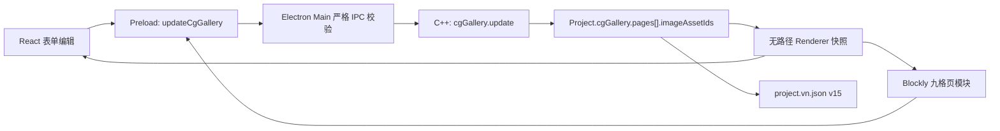
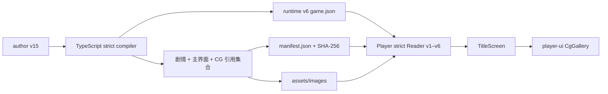

# CG 画廊实现说明

> 实现状态：已完成。作者项目当前使用 v15，导出为 runtime v6；Player
> 兼容 runtime v1–v6。v14/runtime v5 的扁平画廊会按顺序分块并补空槽，
> 更早版本会归一化为一张全空页面。

## 1. 用户体验

Editor 把 CG 画廊作为主界面之外的独立软件场景，而不是普通剧情 Scene。进入
Editor 后可以从场景选择器切换到“CG 画廊”，并使用两种等价的编辑方式：

- 图形化编辑：作者从 CG Toolbox 拖入一个大型“CG 画廊第 N 页”模块才会新增页面；
  每页固定 9 个白色图片下拉框，已提交页不能移动，且仅在保留至少一页时可删除；
- 表单编辑：通过“新增一页/删除本页”管理页面，在当前页 9 个明确槽位中选择图片或
  “无”；中央九宫格保留空位，点击非空缩略图可以查看大图；
- 资源面板：CG 模式只展示已导入素材，图片按钮不可点击/拖拽加入，防止绕过明确页槽；
- 完整预览：从主界面开始，打开 CG 画廊即可验证最终 Player 布局与媒体解析；普通
  剧情场景预览仍从当前 Scene 开始，不会强制回到主界面。

Player 主界面的固定按钮顺序为：

1. 开始游戏
2. 读取游戏
3. CG画廊
4. 选项
5. 退出游戏

CG 画廊始终至少一页、每页固定显示 9 个格位；空槽显示“无”，不会让后续图片前移。
有多页时可以使用“上一页/下一页”切换。点击非空缩略图显示完整大图，点击遮罩、关闭按钮或按 Esc 返回；
再次按 Esc 关闭画廊。图片 URL 只在当前页打开后按需解析，避免标题页启动时加载全部
CG。

## 2. 数据模型与不变量

作者项目和 Renderer 快照使用同一个稳定字段：

```json
{
  "cgGallery": {
    "pages": [
      {
        "imageAssetIds": [
          "opening-cg", null, "ending-cg",
          null, null, null,
          null, null, null
        ]
      }
    ]
  }
}
```

`pages` 顺序就是页码，每个 `imageAssetIds` 数组的索引就是格位。领域层、IPC、作者文件编译器和
Player Reader 会共同保证：

- `pages` 必须至少包含一页；
- 每页 `imageAssetIds` 必须精确包含 9 个 `string | null`；`null` 是持久化空槽；
- 所有非空 ID 在所有页面中全局唯一，并且必须指向现有 image Asset；
- 更新是整组原子操作，任意页、槽或 ID 无效时不会部分修改项目；
- 相同页面及槽位的重复更新是 no-op，不增加 revision；
- v14 扁平列表按原顺序每 9 张分块并用 `null` 补满，空列表变成一张全空页；
- v1–v13 作者项目直接迁移为一张全空页，下一次保存统一写 v15。

新增/删除页面和任一槽位的 Blockly/表单选择最终都转换为一次 `cgGallery.update`，因此表单与图形化
编辑不会形成两套数据源。

## 3. 编辑链路



Blockly 页和九个格位直接投影持久化页面结构。作者从 Toolbox 拖入新页模块时只在数组
末尾追加一张全空页；删除页会删除对应数组项，但最后一页受保护。选择“无”只把当前槽
设为 `null`，不会压缩后续槽；已在其它槽使用的图片不会再次出现在下拉选项中，因此不会
跨页重复。
已提交页模块不可移动，页码只由 `pages` 数组顺序产生，不建立第二套状态。

## 4. 导出与 Player 链路

作者 v14/runtime v5 曾首次增加扁平 CG 画廊；当前 author v15/runtime v6 改为固定页面：



runtime v6 的 `game.cgGallery.pages[].imageAssetIds` 保留作者创建的页面、槽位和空项。
Compiler 会把所有非空的 CG-only 图片也
加入 `referencedAssets`，所以即使图片没有在剧情节点或主界面背景中出现，也会被复制到
`.vngame/assets/images`、写入 manifest 并计算 SHA-256。缺失、重复或类型错误的 CG 引用
会在导出提交前失败，旧导出不会被替换。

当前 runtime v6 manifest 必须声明 `playerCompatibility: ">=6 <7"`；当前独立 Player
模板声明 `runtimeCompatibility: ">=1 <7"`，覆盖 runtime v1–v6。Player 会把 runtime v5
扁平列表按顺序每九张分块并补 `null`，把 runtime v1–v4 归一化为一张全空页；只有
runtime v6 才要求固定页面结构精确存在。

## 5. 完整实现流程

### 5.1 建立作者数据模型

1. C++ `CgGallery` 保存 `vector<CgGalleryPage>`；每个 Page 用固定长度 9 的
   `optional<string>` 数组表达图片或空槽；
2. 作者文件从 v14 升到 v15；v15 对 `cgGallery.pages[].imageAssetIds` 使用 exact-fields
   严格读取；v14 扁平数组按顺序 chunk + pad，v1–v13 生成一张全空页；
3. `validate_project()` 检查至少一页、非空 ID 全局唯一，严格 Reader/IPC 额外保证每页
   精确九槽；`validate_project_aggregate()` 再检查每个非空 ID 都存在且类型为 image；
4. `update_cg_gallery()` 先完整校验候选页面数组，再一次性替换权威值；失败不修改
   Project，相同页面与槽位不增加 revision。

### 5.2 贯通 Electron 命令边界

1. 共享协议增加 `cgGallery.update` 与 `updateCgGallery(pages)`；
2. Preload 只暴露这个窄业务方法，不暴露 `ipcRenderer` 或文件路径；
3. Main 检查方法名、参数 exact shape、至少一页、每页九槽、元素为 string/null 和重复 ID；
4. C++ 返回完整 Project 快照后，Main 再净化 `cgGallery`，Renderer 才更新 UI；
5. Renderer 会把热更新前仍留在 React 内存中的旧 Project 快照投影为一张全空页；如果开发
   环境仍运行旧 Main/Preload/Backend，写操作会显示需要完整重启的稳定错误，而不是
   解引用缺失字段或继续发送不受支持的请求。

### 5.3 建立独立 Editor 场景

CG 画廊使用保留 ID `vn-editor:cg-gallery`，与主界面一样属于 synthetic surface：

- 出现在主界面和剧情 Scene 之间的场景选择器中；
- 不写入 `project.scenes`，不能成为 SceneJump 目标；
- 项目打开后仍默认进入主界面，作者可手动切到 CG 画廊；
- 表单/Blockly 切换、切场景、保存、导出和预览前都会等待活动 CG 更新结束，避免快照
  重绘覆盖未完成操作。

### 5.4 实现表单编辑

表单左栏通过“新增一页/删除本页”管理页面，并保证最后一页不能删除；右栏固定显示当前
页九个 image Asset 下拉框，每项首选“无”。中央预览使用三列三行固定网格，空槽明确
显示“图片 N · 无”；点击非空缩略图打开 lightbox，Esc、关闭按钮或遮罩可以返回。
顶部资源栏在 CG 场景中只展示图片素材，按钮被禁用且不可拖拽，不再以点击方式直接加入。

### 5.5 实现 Blockly 投影

Blockly 不保存另一份页数据，而是把持久化 `pages` 投影为大页模块：

1. 每个持久化 Page 精确投影一个 `vn_cg_gallery_page`，不会因填满页面自动创造下一页；
2. CG Toolbox 提供页模块，作者拖入时在末尾手动追加一张全空页；
3. 每个页块包含 9 个白色 `FieldDropdown`；已选择图片从其它槽位选项中排除，缺失资源
   仍保留可识别的占位项；
4. 选择“无”只把当前槽保存为 `null`；其它槽已使用的图片会从当前下拉选项中排除；
5. 已提交页块不可移动；至少两页时可以删除某页，最后一页不能删除；页码始终来自数组顺序。

### 5.6 编译与导出

1. `AuthorProjectCompiler` 严格读取 author v15；
2. CG 所有非空槽图片进入 `referencedAssetIds`，并再次检查页数、槽数、缺失、重复和错误媒体类型；
3. 编译器生成 runtime v6 的 `game.cgGallery.pages[].imageAssetIds`，保留 `null` 空槽；
4. Runtime exporter 复制 CG-only 图片、计算 SHA-256、写入 manifest；
5. 整个 `.vngame` 或独立应用仍沿用 staging、复验和原子发布，任何 CG 错误都发生在
   commit 前，不会覆盖已有导出。

### 5.7 Player 读取与显示

1. Player Reader 接受 runtime v1–v6；v1–v4 补一张全空页，v5 扁平列表按序分块并补空；
2. runtime v6 必须精确包含至少一页、每页九槽的 `game.cgGallery`，并让所有非空 ID
   与 manifest 中的 image Asset 对应；
3. 正式 Player 的 `TitleScreen` 固定显示“开始游戏 / 读取游戏 / CG画廊 / 选项 /
   退出游戏”；Editor 整体预览显示同一菜单，但“读取游戏”只打开预览说明，不注入
   磁盘存档能力；
4. `CgGallery` 只解析当前页非空槽图片的 capability URL，不在标题页启动时加载全部 CG；
   页面仍固定渲染九格，空槽显示“无”；
5. Editor 完整预览与独立 Player 复用同一个 `TitleScreen` 和 `CgGallery`，避免两套行为
   或样式长期漂移。

## 6. 主要代码位置

| 模块 | 文件 |
| --- | --- |
| C++ 模型与原子更新 | [`engine/include/vnengine/model.hpp`](../engine/include/vnengine/model.hpp)、[`engine/src/core/project.cpp`](../engine/src/core/project.cpp) |
| v15 序列化与 v14 扁平迁移 | [`engine/src/backend/serialization.cpp`](../engine/src/backend/serialization.cpp) |
| C++ JSONL 命令 | [`engine/src/backend/backend.cpp`](../engine/src/backend/backend.cpp) |
| Electron 协议与 Preload | [`apps/editor/src/shared/engineProtocol.ts`](../apps/editor/src/shared/engineProtocol.ts)、[`apps/editor/src/preload.ts`](../apps/editor/src/preload.ts) |
| Editor 场景接线 | [`apps/editor/src/renderer/App.tsx`](../apps/editor/src/renderer/App.tsx)、[`startScreenScene.ts`](../apps/editor/src/renderer/features/start-screen/startScreenScene.ts) |
| CG 表单编辑 | [`CgGalleryFormEditor.tsx`](../apps/editor/src/renderer/features/cg-gallery/CgGalleryFormEditor.tsx) |
| CG Blockly 编辑 | [`cgGalleryBlocks.ts`](../apps/editor/src/renderer/features/cg-gallery/cgGalleryBlocks.ts)、[`CgGalleryBlocklyWorkspace.tsx`](../apps/editor/src/renderer/features/cg-gallery/CgGalleryBlocklyWorkspace.tsx) |
| v15→runtime v6 编译 | [`AuthorProjectCompiler.ts`](../apps/editor/src/main/export/AuthorProjectCompiler.ts) |
| Player v1–v6 Reader | [`runtimeBundleSchema.ts`](../apps/player/src/main/content/runtimeBundleSchema.ts) |
| 共享主界面与画廊 | [`TitleScreen.tsx`](../packages/player-ui/src/TitleScreen.tsx)、[`CgGallery.tsx`](../packages/player-ui/src/CgGallery.tsx) |

## 7. 技术栈与选择理由

| 层 | 技术 | 职责与选择理由 |
| --- | --- | --- |
| Editor UI | React 19、TypeScript | 管理 synthetic surface、表单交互、九宫格预览和 lightbox；组件状态适合处理分页与异步 URL |
| 图形编辑 | Blockly 13.1 | 用 Toolbox 手动增加固定九槽页模块，不让画布坐标成为业务数据 |
| 桌面边界 | Electron 43 Main/Preload IPC、`contextBridge` | 暴露窄命令、校验不可信 Renderer 参数，并隔离本机路径和 Node 能力 |
| 权威模型 | C++20、STL | 保存唯一业务状态、验证资源引用、执行原子更新和 revision/no-op 规则 |
| JSON 边界 | nlohmann/json、JSON Lines | 负责 v15 项目文件、v14 迁移与 Main↔C++ 请求/响应；不让 JSON 侵入 Core 领域模型 |
| 导出 | TypeScript strict parser、Node `fs`/streams、SHA-256 | 把 author v15 编译为 runtime v6，收集非空槽闭包资源并事务式发布 |
| Runtime DTO | `@vnengine/runtime` | 为 Editor 预览与 Player 提供平台无关的 `ProjectDocument`/`CgGalleryDocument` 契约 |
| 共享 UI | `@vnengine/player-ui`、React | Editor 完整预览与独立 Player 复用同一 `TitleScreen`/`CgGallery` |
| 媒体访问 | `vn-asset://`、`vn-game-asset://` capability 协议 | 按资源 ID 解析图片，不向 Renderer 暴露任意文件路径 |
| 测试 | Vitest、Node Test、CTest | 分别覆盖 React/Blockly/IPC/导出、发布工具和 C++ 领域/序列化 |

## 8. 验收重点

- 新项目和 v1–v13 项目至少有一张全空页，不能删除最后一页；
- v14/runtime v5 扁平列表按原顺序每九张分块，最后一页补 `null`；
- 每页始终精确九槽；中间“无”保留原位，不压缩后续图片；
- 表单按钮和 Blockly Toolbox 都只能手动新增页面，填满页面不会自动生成下一页；
- Blockly 下拉框只列图片，并排除已在其他格位选择的图片；
- ResourcePanel 在 CG 场景点击/拖拽图片不会直接加入画廊；
- 表单页/槽修改与 Blockly 修改都会同步到同一 C++ 快照；
- 完整预览和 Player 都固定九格分页，非空缩略图可放大，Esc 不会误退出整个 Editor 预览；
- 仅被 CG 引用的图片仍会出现在 runtime manifest 和导出媒体目录中；
- runtime v6 缺页、槽数错误、跨页重复 ID、缺失资源或非图片资源会被拒绝；
- author v15 保存/重开保持页面数量、每个槽位与空项。

## 9. 验证命令与结果

```bash
pnpm --dir apps/editor typecheck
pnpm --dir apps/editor lint
pnpm --dir apps/editor test
pnpm --dir packages/runtime test
pnpm --dir packages/player-ui typecheck
pnpm --dir apps/player typecheck
pnpm --dir apps/player lint
pnpm --dir apps/player test
```

本次 v15/runtime v6 固定页面实现的本机验收结果：

- C++ CTest：4/4；
- Editor Vitest：460 passed，1 skipped；
- Player Vitest：68/68；
- Player release-tools：14/14；
- Runtime：6/6；
- Editor、Player、Runtime 和 Player UI TypeScript 检查通过；
- Editor、Player ESLint 通过；
- `git diff --check` 对本功能文件通过（工作区原有 `.node-version` 尾部空行不属于本次改动）。

## 10. 开发运行注意事项

本功能同时修改 C++ backend、Electron Main/Preload 协议、Renderer 和 Player 模板。开发
模式的 Vite HMR 只能更新 Renderer，不能替换已经运行的 Main、Preload 或后端进程。
实现更新后必须完全退出并重新启动 Editor；仅刷新窗口可能得到“CG 画廊模块尚未加载”
的兼容提示。

Renderer 的 `useEngineProject` 会把 HMR 前保留下来的 pre-CG 快照补成一张全空页，完整预览
也对旧 session 使用相同回退。因此即使发生跨进程版本漂移，点击 CG 不会再卸载 React
根节点。根节点外还有 `RendererErrorBoundary`：其它未预料的渲染异常会显示不含内部
路径的恢复页面，而不是纯白屏。这个兼容层只保护开发中的内存快照；Main 对 v15 后端
响应和磁盘项目的严格验证没有放宽，真正编辑 CG 仍要求重新启动整套进程。
