<!-- 文件职责：记录人物立绘特效系统；关键内容：七类 sidecar 积木、运行时动画、暂停和快照。 -->

# 人物立绘特效实现

> 实现状态：已完成。当前作者项目为 Author v19，导出为 Runtime v9；桌面与 Web
> Player Reader 支持 runtime v1–v9。当前存档为 `GameRuntimeSnapshot v4`，受限兼容
> v1–v3。runtime v8 / snapshot v3 是“显示 CG”功能的历史里程碑，仍保留兼容读取，
> 但不再是当前 Writer/Exporter 的版本。

本文记录人物立绘侧挂特效从 Blockly、Editor IPC、C++ 权威模型、严格持久化、Runtime、
共享 Player UI、暂停/无障碍到 Desktop/Web 导出的完整实现。

## 1. 用户体验与设计边界

人物特效不是新的时间线节点，而是 `CharacterNode` 的可空侧挂值。这样可以明确表达：

> 当这一条人物立绘指令执行时，同时播放一次指定特效。

Blockly 的人物立绘积木右侧提供一个 typed value socket。作者从独立“特效”分类拖入一个
特效积木并连接到该插口；一个人物节点最多连接一个特效。特效可以：

- 从工具箱直接接到一个已有图片的人物节点；
- 在两个非清除人物节点之间拖动；
- 拖离插口或删除以清除；
- 直接修改时长、强度和进入方向。

空图片的“清除立绘”节点不能拥有特效。表单编辑器只读展示特效摘要，不提供另一套编辑
控件；表单舞台是静态预览，显示特效执行后的最终状态，不重复播放动画。正式 Editor
预览、桌面 Player 和 Web Player 才播放动画。

## 2. 七类特效

| 类型 | 作者字段 | 运行语义 | 最终状态 |
| --- | --- | --- | --- |
| `shake` | 时长、强度 | 水平往复震动 | 完全可见 |
| `jump` | 时长、强度 | 向上跳起并落回 | 完全可见 |
| `breathe` | 时长、强度 | 轻微缩放呼吸 | 完全可见 |
| `flash` | 时长、强度 | 透明度闪烁 | 完全可见 |
| `fadeIn` | 时长 | 从透明淡入 | 完全可见 |
| `fadeOut` | 时长 | 从可见淡出 | 透明但仍保留该人物层状态 |
| `slideIn` | 时长、强度、方向 | 从左/右/上/下滑入 | 完全可见 |

共同约束：

- `durationMs` 必须是安全整数，范围为 100–10000 毫秒；Blockly 以秒显示并在提交时
  转为整数毫秒；
- `intensity` 只能是 `subtle | normal | strong`；
- `direction` 只能是 `left | right | up | down`；
- 每种类型使用 exact-fields tagged union：缺字段、多字段或错误组合都会被拒绝；
- Author `mode:'clear'` 或 `mode:'show' + assetId:null` 时 `effect` 必须为 `null`；
  只有已选图的 show 节点可以拥有特效。

强度通过共享 Player UI 的 CSS 自定义属性映射为距离、缩放和闪烁幅度。当前 subtle / normal /
strong 的普通位移分别为 3% / 6% / 10%，滑入距离为 7.5% / 15% / 25%。这些数值是
表现层参数，不写入作者项目；项目只保存稳定的语义枚举。

## 3. 严格数据契约

### 3.1 TypeScript

```ts
type CharacterEffectIntensity = 'subtle' | 'normal' | 'strong';
type CharacterEffectDirection = 'left' | 'right' | 'up' | 'down';

type CharacterEffect =
  | {
      type: 'shake' | 'jump' | 'breathe' | 'flash';
      durationMs: number;
      intensity: CharacterEffectIntensity;
    }
  | {
      type: 'fadeIn' | 'fadeOut';
      durationMs: number;
    }
  | {
      type: 'slideIn';
      durationMs: number;
      intensity: CharacterEffectIntensity;
      direction: CharacterEffectDirection;
    };

type CharacterNodeBase = {
  id: string;
  type: 'character';
  slot: 'left' | 'center' | 'right';
  layer: number;
};

type CharacterNode = CharacterNodeBase & (
  | {
      mode: 'clear';
      assetId: null;
      position: null;
      effect: null;
    }
  | {
      mode: 'show';
      assetId: null;
      position: { x: number; y: number } | null;
      effect: null;
    }
  | {
      mode: 'show';
      assetId: string;
      position: { x: number; y: number } | null;
      effect: CharacterEffect | null;
    }
);
```

`@vnengine/runtime` 导出 effect union、100/10000 毫秒常量和 `isCharacterEffect`；
Editor shared 层在 Runtime Character DTO 外定义 Author-only mode union。投影时移除 mode，
未选图 show 被过滤，clear 才转换成 Runtime `assetId:null`。Editor IPC、Main 后端响应
净化、Runtime Reader 与 Player Reader 共用 effect 语义，避免各层维护近似校验。

### 3.2 C++

```cpp
enum class CharacterEffectType {
  shake, jump, breathe, flash, fade_in, fade_out, slide_in
};

struct CharacterEffect {
  CharacterEffectType type;
  int duration_ms;
  std::optional<CharacterEffectIntensity> intensity;
  std::optional<CharacterEffectDirection> direction;
};

struct CharacterNode {
  std::string id;
  CharacterNodeMode mode;
  std::optional<std::string> asset_id;
  CharacterSlot slot;
  int layer;
  std::optional<CharacterPosition> position;
  std::optional<CharacterEffect> effect;
};
```

C++ 用 optional 字段承载 tagged union，再由 Core aggregate validator、JSON Reader 和命令
入口共同保证不同 `type` 对应的精确字段组合。直接构造出的非法 C++ 值不能通过保存或
业务 mutation 边界。

## 4. Author v19、Runtime v9 与迁移

Author v18 首次要求人物节点精确包含 `effect`；即使没有特效也必须明确写 `null`。
当前 Author v19 还必须精确包含 `mode`：

```json
{
  "id": "hero-enter",
  "type": "character",
  "mode": "show",
  "assetId": "hero-image",
  "slot": "left",
  "layer": 1,
  "position": null,
  "effect": {
    "type": "slideIn",
    "durationMs": 650,
    "intensity": "normal",
    "direction": "left"
  }
}
```

迁移和防伪规则：

- C++ Reader 接受 Author v1–v19，Writer 固定写 v19；
- v1–v17 人物节点在内存中迁移为 `effect = null`；
- 旧版本若伪造 `effect` 字段，会因 exact fields 被拒绝，而不是偷偷启用新语义；
- v18 人物节点缺少 `effect` 同样拒绝；
- v1–v18 根据旧 `assetId` 推导 mode：非空迁移为 `show`，空值迁移为 `clear`；v19
  缺少、伪造或组合错误的 mode 会被拒绝；
- `show + assetId:null` 是可保存的待选图 Author 占位，Editor 预览把它当 no-op；
  TypeScript Compiler 会以稳定 `character-image-required` 错误拒绝导出，绝不把它
  误编译为 Runtime clear；
- `clear` 强制 `assetId`、`position`、`effect` 全为 `null`；
- TypeScript Compiler 直接严格编译 v14–v19；v1–v13 复用窗口 C++ Reader 已迁移、
  aggregate-validated 且由 manifest hash 绑定的 canonical 快照；
- Runtime v9 首次保存并执行人物特效；runtime v1–v8 人物节点由 Player Reader 补
  `effect: null`；
- runtime v8 / Author v17 仍作为“显示 CG”paired range 的历史版本保留兼容测试。

当前内容包 manifest 固定声明 `playerCompatibility: ">=9 <10"`；桌面和 Web Player
模板固定声明 `runtimeCompatibility: ">=1 <10"`，表示同一模板严格读取 runtime v1–v9。

## 5. IPC 与原子命令

普通人物更新继续使用：

```text
character.update {
  sceneId,
  nodeId,
  mode?,
  assetId,
  slot,
  layer,
  position
}
```

它不接受 `effect` 参数；省略 mode 时保留现有模式，更新非空图片、位置或层级时保留已有
特效。显式切换为 `clear` 时会在同一 mutation 中清空 assetId、position 和 effect；
把 show 的 assetId 改为 `null` 则形成待选图占位并清除 effect，但不会变成 clear。

特效使用两个窄命令：

```text
characterEffect.update {
  sceneId,
  nodeId,
  effect: CharacterEffect | null
}

characterEffect.move {
  sceneId,
  fromNodeId,
  toNodeId,
  effect: CharacterEffect
}
```

`characterEffect.move` 是一次原子业务操作，而不是 Renderer 连续发送“清 source”和“写
target”：

1. 查找 Scene、source 和 target；
2. 拒绝相同节点；
3. 严格校验完整 effect payload；
4. 确认 source 当前确实拥有完全相同的 effect；
5. 确认 target 不是清除立绘；
6. 最后才清 source 并写 target。

任一步失败都不改变 Project、revision 或两个节点。target 已有特效时，合法 move 会用
source 的完整特效覆盖它；Blockly UI 为降低误操作，会先拒绝把特效拖到已有特效的目标。

协议经过以下信任边界：

```mermaid
flowchart LR
  BLOCKLY["Blockly 右侧 value socket"] --> ACTION["authoring action"]
  ACTION --> PRELOAD["typed Preload API"]
  PRELOAD --> MAIN["Main exact invocation validator"]
  MAIN --> BACKEND["C++ JSONL Backend"]
  BACKEND --> CORE["C++ Core atomic mutation"]
  CORE --> RESPONSE["path-free Project snapshot"]
  RESPONSE --> SANITIZER["Main strict response sanitizer"]
  SANITIZER --> PROJECT["React authoritative projection"]
```



Main 会拒绝多余 IPC 字段和 malformed effect。后端返回的 Character 缺少 `effect`、使用
非法 union，或清除节点携带 effect 时，pending request 会立即失败并清除超时计时器，
不会出现“后端成功但 Main 丢响应，十秒后才超时”的问题。开发热更新期间若 Main/Preload
仍是旧模块，authoring action 会给出重启 Editor 的明确提示；旧 React 内存快照缺少
`effect` 时只在 HMR 边界补 `null`。

## 6. Blockly 投影与事件处理

“特效”工具箱分类包含七个 value block。人物积木通过
`CHARACTER_EFFECT_CONNECTION_TYPE` 只接受这组积木，避免对白、逻辑或图片积木误接。

投影规则：

- `CharacterNode.effect === null`：右侧插口为空；
- 非空 effect：创建确定类型的 value block，写入字段，并把 owner node ID 存入 block
  data；
- 清除人物节点没有特效插口语义，任何连接尝试都会恢复权威投影；
- 修改字段产生 `characterEffect.update`；
- 从一个人物拖到另一个人物产生 `characterEffect.move`；
- 拖离或删除产生 `characterEffect.update(..., null)`；
- 无效时长、非法目标、owner/payload 不匹配或后端失败都会重新投影，不在本地伪造成功。

时长字段以秒展示，默认值按特效类型设置；提交后统一使用整数毫秒。强度和方向是本地化
下拉框，切换 Editor 语言只原位替换标签，不改作者数据或重建工作区。

## 7. Runtime 与渲染语义

Runtime 自动执行 CharacterNode，并按 layer 维护 `RuntimeCharacterState`：

```ts
type RuntimeCharacterState = {
  nodeId: string;
  assetId: string;
  slot: CharacterSlot;
  layer: number;
  position: CharacterPosition | null;
  opacity: 0 | 1;
  effect: CharacterEffect | null;
  effectSequence: number;
};
```

- `effect` 是本次推进产生的瞬时展示事件；
- Runtime 还维护一个全局单调 `characterEffectSequence`；每次执行 `assetId` 非空的
  CharacterNode 都先递增它，再把新值写入该层的 `effectSequence`。同一 Repeat 迭代或
  再次到达同一节点也能通过 React key 重新播放，清除立绘和场景跳转都不会把全局计数归零；
- `fadeOut` 把最终 `opacity` 保持为 0，其余人物指令最终为 1；
- 后续同层 CharacterNode 替换该层，`assetId: null` 删除该层；
- 特效只改变人物视觉层，不停止、重建或重置正在播放的 BGM/voice/video；
- Runtime 会再次验证 effect，非法 runtime 数据进入安全错误状态。

共享 `VisualStage` 把位置和动画分到两层 DOM：外层 anchor 负责 slot、自定义百分比坐标
和 z-order，内层 image 负责动画 transform。这样 shake/slide/jump 不会覆盖自定义坐标的
`translate(-50%, -100%)`。

CSS 使用一次性 keyframes 和 `--character-effect-duration` 等自定义属性。共享舞台先等待
人物图片完成 load/decode，再挂载动画 image，避免网络或磁盘解码耗时吞掉动画开头。Editor
正式预览、Desktop Player 与 Web Player 复用同一 React 组件和样式，因此七类特效、层级和
失败占位语义一致。

## 8. 暂停、隐藏页面与 reduced motion

Player 将暂停菜单、存读档/选项等阻塞弹层、媒体阻塞状态和页面隐藏状态汇总为
`animationsPaused`。共享舞台在根节点写入 `data-character-animations-paused="true"`，
CSS 使用 `animation-play-state: paused` 保留当前动画进度；恢复后从同一进度继续，而不是
重新触发。

系统启用 `prefers-reduced-motion: reduce` 时，人物特效统一 `animation: none`。Runtime 仍
提交稳定的最终状态：普通/fadeIn/slideIn 为可见，fadeOut 为透明。因此减少动态效果不会
改变剧情、层级或存档语义。

表单时间线预览始终设置 `effect: null`、`effectSequence: 0`，只应用最终 opacity；它用于
检查某播放头位置的静态构图，不会因切换表单字段反复播放动画。

## 9. Snapshot v4 与保存/读取

`GameRuntimeSnapshot v4` 保存全局单调 `characterEffectSequence`，并在每个活动人物层保存
`opacity` 和该层最后一次分配到的 `effectSequence`，但不保存瞬时 `effect`。读取后恢复为：

```text
相同人物/层级/位置
+ 保存时的最终 opacity
+ 全局及各层一致的单调 effectSequence
+ effect = null
```

这能保留 fadeOut 后的透明状态，同时避免读档时无意重播 shake、jump 或 slideIn。Reader
受限接受 v1–v3 时，以活动人物层的最大序号迁移全局计数，保证 clear→loop 后的新 React key
仍严格递增；snapshot v3 是 CG 状态的历史版本。若旧快照无法证明人物特效执行后的最终
opacity，尤其项目场景已包含 v18 起的特效节点时，会 fail closed，而不是猜测画面状态。

## 10. Desktop、Web 与资源闭包

特效本身不引用新媒体，只复用 CharacterNode 的 image Asset，所以 runtime bundle 的资源
闭包算法不需要复制额外文件。Author v19 Compiler 会：

1. 严格解析 effect union 和清除节点不变量；
2. 把 StoryExtension 剥离，并保留 CharacterNode.effect；
3. 验证人物 `assetId` 指向 image；
4. 输出 Runtime v9；
5. 由 RuntimeBundleExporter 写 `>=9 <10` manifest；
6. Desktop 与 Web 模板用 `>=1 <10` 门禁读取同一 game.json。

Web Player 使用同源 CSS keyframes、Fullscreen API 和 IndexedDB Snapshot v4；Desktop
Player 使用 Electron Main 的原子存档。两者不复制人物特效状态机。

## 11. 实现流程与技术栈

| 阶段 | 技术 | 关键实现 |
| --- | --- | --- |
| 共享契约 | TypeScript 5.9 | discriminated union、严格 validator、公共 DTO |
| 领域模型 | C++20 | enum/optional、aggregate invariant、原子 update/move |
| 持久化 | nlohmann/json | Author v19 exact-fields、v1–v18 迁移与防伪 |
| IPC | Electron Main/Preload、JSONL | typed methods、参数白名单、response sanitizer、HMR 提示 |
| 图形化编辑 | Blockly 13 | typed value socket、七类 value block、owner ID、backend-first 事件 |
| 表单编辑 | React 19 | 只读摘要、最终状态静态预览 |
| Runtime | 纯 TypeScript reducer | effect event、effectSequence、opacity、循环重播 |
| 展示层 | React、CSS keyframes | anchor/image 分层、暂停、reduced-motion、Desktop/Web 共享 |
| 存档 | Snapshot v4 | 保存最终 opacity/sequence，读档不重播瞬时特效 |
| 导出 | Node streams、SHA-256、事务 staging | Author v19 → Runtime v9、Desktop/Web 兼容门禁 |

主要实现路径：

- `engine/include/vnengine/model.hpp`
- `engine/include/vnengine/project.hpp`
- `engine/src/core/project.cpp`
- `engine/src/backend/serialization.cpp`
- `engine/src/backend/backend.cpp`
- `packages/runtime/src/projectTypes.ts`
- `packages/runtime/src/characterEffect.ts`
- `packages/runtime/src/gameRuntime.ts`
- `packages/runtime/src/gameRuntimeSnapshot.ts`
- `packages/player-ui/src/VisualStage.tsx`
- `apps/editor/src/shared/engineProtocol.ts`
- `apps/editor/src/main/ipc/validateEngineInvocation.ts`
- `apps/editor/src/main/backend/backendResponse.ts`
- `apps/editor/src/main/export/AuthorProjectCompiler.ts`
- `apps/editor/src/renderer/features/block-editor/blocks/characterEffectBlock.ts`
- `apps/editor/src/renderer/features/block-editor/characterEffectBlockEvents.ts`
- `apps/player/src/renderer/GameScreen.tsx`
- `apps/player/src/renderer/styles/player.css`

## 12. 测试与验收

自动测试覆盖：

- 七种 union、100/10000 边界、非整数、缺字段、多字段、非法强度/方向；
- Author v1–v18 迁移、v17 伪造字段拒绝、v18 missing effect 拒绝、v18 effect
  round-trip、v19 mode 组合校验；
- update/no-op/clear 与 move source mismatch、空 source、清除 target、same-node；
- 所有失败路径 Project 和 revision 不变；
- Main invocation exact params、response sanitizer 和 malformed pending immediate reject；
- Preload/action/HMR 接线与业务错误不误判；
- Blockly 创建、字段更新、拖离、跨人物原子移动和失败回投影；
- Runtime 七类效果、Repeat 重播、fadeOut 最终 opacity；
- Snapshot v4 round-trip、v3 条件兼容和读档不重播；
- VisualStage 定位/动画分层、pause 与 reduced-motion CSS；
- Author v19 → Runtime v9 → Player strict Reader 的跨层集成；
- Desktop/Web exporter 与模板版本门禁。

推荐验证命令：

```sh
cmake --build engine/build --parallel
ctest --test-dir engine/build --output-on-failure
pnpm --dir packages/runtime test
pnpm --dir apps/editor typecheck
pnpm --dir apps/editor lint
pnpm --dir apps/editor exec vitest run
pnpm --dir apps/player typecheck
pnpm --dir apps/player exec vitest run
```

## 13. 相关文档

- [人物立绘基础实现](./character-portrait-implementation.md)
- [当前架构](./architecture.md)
- [独立游戏导出与 Player](./game-export-player.md)
- [Web Player ZIP 导出](./web-player-export.md)
- [Player 保存与读取](./save-load-implementation.md)
- [显示 CG Blockly（Author v17 / Runtime v8 / Snapshot v3 历史里程碑）](./cg-display-blockly-implementation.md)
