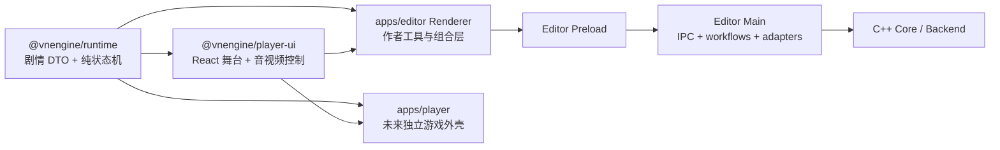

# 代码结构整理与解耦实施说明

> 本文记录“开始独立 Player 和游戏导出前”的代码整理。它既说明当前已经完成的
> 改动，也规定后续代码应遵守的依赖方向。游戏导出本身仍是下一阶段能力，详见
> [独立游戏导出与 Player 技术路线](./game-export-player.md)。

## 1. 为什么先整理结构

编辑器已经同时包含表单编辑、Blockly、项目文件事务、媒体导入、安全预览和正式
剧情预览。如果继续把 Player 和导出逻辑直接加进 `apps/editor`，会出现三个问题：

1. 独立 Player 为了复用剧情状态机，被迫依赖编辑器 IPC、Blockly 和文件保存代码；
2. 一个业务变化需要同时修改 UI、Electron Main 和 C++ 大文件，回归范围越来越大；
3. 单元测试无法在不启动 Electron 或 DOM 的情况下验证纯剧情逻辑。

因此本轮不改变项目协议和用户功能，而是先把“领域模型、运行时、播放器 UI、平台
适配器、文件系统安全实现”分开。

## 2. 目标依赖图



关键规则：

- `runtime` 不允许依赖 React、DOM、Node、Electron 或 `window`；
- `player-ui` 只依赖 React 和 `runtime`，媒体 URL 必须通过参数注入；
- Editor feature 只依赖 application port，不直接依赖具体 hook 或 Main；
- Renderer 不能导入 `electron`、Node API 或 `src/main`；
- Main 不能导入 Renderer；
- C++ Core 不依赖 JSON、Electron 或 Node。

## 3. 当前目录职责

```text
packages/
├── runtime/
│   └── src/
│       ├── projectTypes.ts       # 剧情公开 DTO 与判别联合
│       └── gameRuntime.ts        # 纯推进、跳转、选项与循环检测
└── player-ui/
    └── src/
        ├── VisualStage.tsx       # 背景、立绘和对白舞台
        ├── PreviewVideo.tsx      # 阻塞视频展示
        ├── previewAudioController.ts
        └── usePreviewAudio.ts

apps/editor/src/renderer/
├── application/
│   ├── authoringPorts.ts         # 编辑器 feature 使用的命令类型
│   ├── createAuthoringActions.ts # 命令映射，不感知 Electron
│   ├── editorMode.ts             # application 类型，不属于 Toolbar
│   ├── editorPlatformGateway.ts  # Preload API 的唯一 Renderer 适配器
│   └── editorMediaGateway.ts     # 图片/音视频 capability 的 Editor 适配器
├── features/                     # 表单、Blockly、资源和预览功能
├── hooks/useEngineProject.ts     # 跨进程状态与命令队列协调器
└── App.tsx                       # 组合 application port 与各 feature

apps/editor/src/main/
├── ipc/                          # 来源/参数校验与薄 IPC handler
├── project/
│   ├── ProjectFileWorkflow.ts    # open/save/create 编排与互斥
│   ├── ProjectPathPolicy.ts      # 项目根和固定 manifest 路径规则
│   ├── ProjectPublisher.ts       # Assets 优先、manifest 最后提交
│   └── ProjectStorageSession.ts  # 每窗口临时工作区生命周期
├── media/
│   ├── MediaFormat.ts            # 扩展名、MIME、大小策略
│   ├── MediaContentValidator.ts  # 图片、音频、视频内容签名
│   └── MediaRange.ts             # 单段 HTTP Byte Range
└── assets/AssetPreviewService.ts # capability 生命周期与安全文件响应

engine/src/backend/
├── asset_import.cpp/.hpp         # 安全打开、流式复制和 no-clobber 发布
└── media_sniffer.cpp/.hpp        # 与文件系统无关的媒体内容探测

engine/src/core/
├── project.cpp                   # 创建与 mutation
├── project_queries.cpp           # find_* 与节点 ID 查询
├── project_validation.cpp        # Project/Asset/Aggregate 验证
└── project_internal.hpp          # Core 内部共享的纯 helper
```

## 4. 已完成的整理

### 4.1 清理历史副本

仓库中带 ` 2.ts` / ` 2.tsx` 后缀的文件是功能演进前的重复快照。它们不仅让目录
难以阅读，还会被 TypeScript 纳入编译并造成重复或陈旧类型错误。本轮逐组比较后
删除了这些副本，没有把旧逻辑重新合并到正式文件。

### 4.2 抽取纯 Runtime

原来的 `previewRuntime.ts` 反向导入表单编辑器的 `TimelineCharacterState`，导致
“游戏运行时依赖作者工具”。现在剧情 DTO、`GameRuntime` 和推进 reducer 位于
`@vnengine/runtime`：

- 输入是只读 `ProjectDocument` 和运行状态；
- 输出是新的运行状态；
- 不访问浏览器、文件系统或 Electron；
- Editor 的旧路径仅保留兼容 re-export，避免一次性修改全部调用者。

这使未来 Player 可以直接复用与编辑器预览相同的背景、立绘、BGM、视频、跳转和
选项语义。

### 4.3 抽取 Player UI 原语

`VisualStage`、视频组件和双音轨控制器已经移到 `@vnengine/player-ui`。共享组件不再
调用 `window.vnAssets`，而是要求调用方注入：

```ts
type MediaUrlResolver = (assetId: string) => Promise<string | null>;
```

Editor 注入自己的 capability URL gateway；未来 Player 会注入只读游戏包的媒体
gateway。两边共享展示和生命周期，但不共享 Electron 权限。

### 4.4 建立 Renderer application ports

`EditorMode` 不再由 `Toolbar.tsx` 定义；Blockly 也不再从 `useEngineProject` 或
`ResourcePanel` 深层导入命令类型和拖拽常量。稳定的命令类型、编辑模式和资源拖拽
契约被提升到 application / feature contract 层，App 负责把实现接入 feature。

表单控制器现在接收 `FormEditorPort`，不再接收整个具体 Hook 类型，也不再调用
`window.vnEngine`。Editor Preload 的三个 API 被集中到 `EditorPlatformGateway`；
`useEngineProject` 支持注入 Gateway，测试可以使用内存实现。26 个编辑动作的映射被
拆到纯 `createAuthoringActions`，而串行队列、快照应用和错误翻译仍由 Hook 协调。

### 4.5 拆分 Main 媒体策略

原 `AssetPreviewService` 同时包含 capability、路径安全、格式策略、Magic 校验和
Range 解析。当前已把纯策略拆成 `main/media` 三个模块，服务本身只负责项目代际、
token 映射、安全文件句柄和响应编排。外部 API、MIME、状态码与安全行为保持不变。

### 4.6 拆分 C++ 媒体导入

原 `image_asset_import` 实际已经处理图片、视频和音频，名称和职责都不准确。当前：

- `asset_import` 负责文件系统、安全句柄、TOCTOU 检查、临时文件与原子发布；
- `media_sniffer` 负责纯字节格式探测；
- Backend 方法、错误语义和项目 revision 行为保持不变。

### 4.7 拆分 Main 项目工作流与发布事务

`registerProjectFileIpc` 现在只做可信 frame、请求形状、窗口 context 检查，然后调用
`ProjectFileWorkflow`。Workflow 负责 open/save/create/get-session 的应用编排；
`ProjectPathPolicy` 负责规范化路径和固定 `project.vn.json`；`ProjectPublisher` 负责
资源 no-clobber 复制、fsync、目标快照复验、manifest 最后原子发布和失败回滚。

`ProjectStorageSession` 因而只管理窗口私有临时工作区的生命周期，不再同时承担路径
命名与 400 多行发布算法。IPC/API、文件锁位置和保存提交点没有变化。

### 4.8 机械拆分 C++ Core

原 `project.cpp` 同时放置查询、验证和 mutation。当前公开 `project.hpp` 完全不变，
仅把 `find_*`/节点 ID 查询迁到 `project_queries.cpp`，把 Project、Asset 路径和
Aggregate 验证迁到 `project_validation.cpp`；`project.cpp` 保留创建与修改操作。

这一步没有修改判断顺序、错误文本或业务规则，并通过机械字符比对、Debug/Release
构建与全部 CTest 证明等价。后续若继续按领域拆 mutation，也应沿用相同方式。

## 5. Public API 与导入规则

Workspace package 只通过根 `src/index.ts` 暴露稳定符号。外部代码不应深层导入：

```ts
// 推荐
import { startGame, type ProjectDocument } from '@vnengine/runtime';

// 不推荐
import { startGame } from '../../../../packages/runtime/src/gameRuntime';
```

包内可以使用相对路径，且不要从自己的 `index.ts` 反向导入。公开入口应显式列出
导出项，避免一个 `export *` 意外扩大长期兼容面。

Editor 内部也遵守相同思想：跨 feature 使用 `ports.ts`、application contract 或
feature 根入口，不从另一个 feature 的具体组件文件读取常量。

## 6. 为什么使用 Port / Gateway

Port 描述业务需要什么，Gateway 描述当前平台如何完成它。例如共享播放器只要求
“按 Asset ID 取得媒体 URL”，并不知道 URL 来自 Editor 的 `vn-asset://`，还是未来
Player 的 `game-asset://`。

```text
Game/Player UI
  → MediaUrlResolver port
  → EditorMediaGateway 或 PlayerMediaGateway
  → Preload capability API
```

收益是：

- 单元测试可以传入 fake resolver，不需要伪造完整 `window.vnAssets`；
- Player 不会为了复用组件而获得编辑权限；
- Electron API 变化只影响 adapter，不影响纯 Runtime 和 UI 组件。

## 7. 边界自动检查

Editor ESLint 已加入以下规则：

- type-only 依赖必须使用 `import type`；
- 禁止 import cycle；
- Renderer 禁止导入 Node、Electron Main；
- Main 禁止导入 Renderer；
- Blockly 禁止深层依赖 `useEngineProject` 和 `ResourcePanel`；
- Runtime 兼容入口禁止反向依赖 form-editor。

后续应把 package 级规则放到仓库根 ESLint/依赖检查配置，并增加 TypeScript project
references。目标是让 `runtime` 在没有 DOM/Node types 的 tsconfig 下独立通过，而不是
仅靠代码审查维持边界。

## 8. 后续仍要继续拆分的部分

本轮不会为追求文件变小而一次性重写所有代码。以下是后续安全切片：

1. 继续把 `useEngineProject` 的 React state、串行 queue 与文件操作协调拆成小模块；
2. 继续按领域机械拆分 C++ mutation，但不在同一提交改变规则；
3. 为 `player-ui` 提供独立样式入口，再创建 `apps/player`；
4. 把 Player 的只读媒体服务与 Editor 的可编辑媒体服务分开；
5. 最后实现 runtime bundle 编译器和 Editor 导出按钮。

每一步只移动一个边界，不同时做协议升级和 UI 行为修改。

## 9. 验收方式

整理属于“结构变化、行为不变”，因此验收重点是已有测试原样通过：

```sh
fnm exec --using=24 pnpm --dir packages/runtime typecheck
fnm exec --using=24 pnpm --dir packages/player-ui typecheck
fnm exec --using=24 pnpm --dir apps/editor typecheck
fnm exec --using=24 pnpm --dir apps/editor lint
fnm exec --using=24 pnpm --dir apps/editor test
git diff --check
```

还要检查：

- `runtime` 源码没有 `window`、React、Electron、Node 或 DOM 类型；
- `player-ui` 没有 `window.vn*`；
- Renderer 没有导入 Main；
- Main/C++ 的媒体边界测试仍覆盖 Magic、Range、symlink、大小和 no-clobber；
- 编辑器预览与 Runtime reducer 的 golden tests 保持同一结果。

## 10. 面试时如何讲

可以用下面这段话概括：

> 我先把编辑器中的剧情状态机抽成无平台依赖的 TypeScript Runtime，再把视觉舞台和
> 音视频生命周期抽成通过媒体 Port 注入的 React Player UI。Electron Editor 只作为
> 一种平台 Adapter；Main 的媒体策略与 capability 编排、C++ 的格式探测与安全文件发布
> 也分别拆开。这样后续独立 Player 复用的是运行语义和 UI 原语，而不是复用编辑器的
> IPC、Blockly 或写权限。
