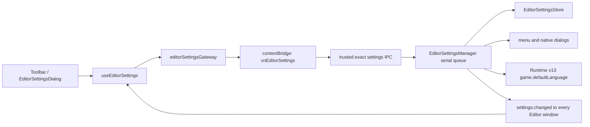

<!-- 文件职责：记录 Editor 本地化系统；关键内容：设置存储、多窗口同步、catalog、Blockly 与原生菜单。 -->

# Editor 中英文切换实现

> 实现状态：Editor 顶栏“导出”旁已提供“设置”，可在简体中文和 English 之间切换。
> 语言是 Editor 的全局本地偏好，不进入 Author v22 或 Player 设置；当前导出
> Runtime v13 会把导出时 Main 权威值写入 v12 引入的 `game.defaultLanguage`。

## 1. 用户行为

- 点击顶栏“设置 / Settings”打开设置弹层；
- “界面语言 / Interface language”提供 `中文` 与 `English`；
- 选择后当前窗口立即预览，Main 写入成功后向所有 Editor 窗口广播；
- 写入失败时恢复 Main 最近确认的语言，并显示当前语言下的稳定错误；
- 下次启动先读取设置，读取完成前只显示中性的品牌加载页，避免中文界面闪现后再切英文；
- 原生应用菜单、项目打开/保存位置、资源导入和导出对话框使用同一份 Main 权威语言；
- 导出 Runtime Bundle、独立应用或 Web ZIP 时，Main 把该权威语言固化为 Runtime v13
  `game.defaultLanguage`；Renderer 导出 payload 不包含可伪造的语言字段；
- 作者填写的项目名、游戏标题、自定义场景名、角色名、对白、Choice 文本和素材名始终
  保持原文；为兼容历史工程，只有精确匹配所在序号的旧默认 `场景 N` 会在英文 Editor
  中显示为 `Scene N`。新项目首场景和后续新建场景都会把当前语言的默认名明确传给
  C++，已存储的英文名称不会在中文界面被反向改写。

## 2. 设置模型与磁盘格式

[`editorSettingsProtocol.ts`](../apps/editor/src/shared/editorSettingsProtocol.ts) 定义独立设置：

```ts
type EditorSettings = {
  settingsVersion: 1;
  language: 'zh-CN' | 'en-US';
};
```

默认语言是 `zh-CN`。Renderer 更新时只能发送精确的
`{ language: 'zh-CN' | 'en-US' }` patch，不能发送路径、版本或未知字段。

Main 把 exact V1 文档写入：

```text
app.getPath('userData')/
└── editor-settings/
    ├── settings.json
    └── settings.json.bak
```

```json
{
  "format": "vn-engine-editor-settings",
  "settingsVersion": 1,
  "settings": { "language": "zh-CN" }
}
```

[`EditorSettingsStore.ts`](../apps/editor/src/main/settings/EditorSettingsStore.ts) 使用 0700 目录、
0600 临时文件、`O_EXCL`、`O_NOFOLLOW`、文件大小上限、单硬链接检查、`fsync`、备份和
rename 发布。主文件损坏时尝试备份；两者都不可用时安全回退中文。路径和原始文件异常只
写 Main 诊断，Renderer 只收到 `settings-storage-unavailable` 或 `settings-invalid`。

这套设置不会提升 Author v22，也不会让 C++ Backend 感知语言。
Runtime v12 仅在 Editor Main 导出边界增加 `game.defaultLanguage`；Author 文本原样保留。

## 3. 进程与同步链路



[`EditorSettingsManager.ts`](../apps/editor/src/main/settings/EditorSettingsManager.ts) 串行执行读取和
写入。成功写入后先更新 Main 权威值，再重建应用菜单并广播无路径快照。每个 BrowserWindow
仍拥有独立 C++ Project 会话，但共享这一项 Editor 偏好。

[`registerEditorSettingsIpc.ts`](../apps/editor/src/main/ipc/registerEditorSettingsIpc.ts) 只接受可信
Editor 主 frame、仍存在的窗口上下文和 exact invocation。Preload 仅暴露：

```ts
getSettings(): Promise<EditorSettingsReadResult>;
updateSettings(patch: EditorSettingsPatch): Promise<EditorSettingsWriteResult>;
onChanged(listener: (settings: EditorSettings) => void): () => void;
```

[`useEditorSettings.ts`](../apps/editor/src/renderer/hooks/useEditorSettings.ts) 使用 generation 防止
跨窗口竞态：如果较新的 `settings:changed` 已到达，旧的首次读取、旧的成功响应或旧的失败
回滚都不能覆盖它。组件卸载时会移除精确 listener。

## 4. React 本地化层

[`editorLocalization.tsx`](../apps/editor/src/renderer/i18n/editorLocalization.tsx) 保存完整、同构的
中英文 typed catalog；`EditorI18nProvider` 通过 React Context 提供当前 `language` 与
`labels`。`App` 不使用 `key={language}`，因此切换语言不会重建项目、表单草稿、预览会话或
Blockly Workspace。`<html lang>` 会同步更新。

当前目录覆盖：

- 顶栏、导出和设置；
- 新建项目、资源条、场景与时间线；
- 表单 Inspector、主界面和 CG 画廊；
- 游戏预览、错误恢复页和状态提示；
- 普通剧情、主界面、CG 三套 Blockly 固定标签、Tooltip、下拉选项和 Toolbox 分类。

已有异步操作通过 `labelsRef` 在完成时读取最新语言。导出结果提示不会保留上一种语言的
已翻译副本；已经打开的引擎错误弹窗会在关闭或下一次操作后使用新语言。无法安全映射的
底层中文异常在英文界面会降级为稳定英文错误，避免把本机诊断或混合语言直接显示给用户。

## 5. Blockly 不重建策略

Blockly 的 Block 定义注册在模块级，不能靠卸载 React 组件重新注册。各 block 模块因此维护
当前 catalog，并提供 `apply...Localization()`：

1. 新积木在 `init()` 时读取当前 labels；
2. 已有积木只原位更新静态 `FieldLabel`、Tooltip 和 Dropdown 的显示文本；
3. Toolbox 通过 `workspace.updateToolbox()` 更新分类；
4. 更新期间关闭 Blockly Events，避免语言切换被误判成作者编辑；
5. speaker、dialogue text、Choice text、主界面 title、资源 ID、节点 ID 和连接关系都不改；
6. 语言不进入 Scene 快照投影 effect 的依赖，因此不会 `workspace.clear()` 或丢失聚焦草稿。

主界面和 CG 的固定工作区采用相同方法：保留既有 block ID/页面/素材选择，只替换静态文案。

## 6. 原生界面语言

[`editorNativeLabels.ts`](../apps/editor/src/main/i18n/editorNativeLabels.ts) 是 Main-only catalog。
Main 每次打开原生对话框前读取当前权威语言，用于：

- File/Edit 菜单及 Undo、Redo、Cut、Copy、Paste、Select All；
- 打开项目与选择首次保存位置；
- 导入图片、音频、视频；
- 导出 `.vngame`、Web ZIP 和独立 macOS ZIP；
- 未命名/未保存窗口标题。

Renderer 不把 language 作为原生操作的参数，因此不可信页面不能伪造另一套文案，也不会
出现 Renderer 乐观语言与 Main 已确认语言不一致的问题。
同一原则用于导出：`ExportGameWorkflow` 在 Main 取得语言快照，与已保存
Author v22 一起编译为 Runtime v13，不信任 Renderer 中可能尚未确认的预览值。

## 7. 弹层与无障碍

`EditorSettingsDialog` 使用 `role="dialog"`、`aria-modal="true"`：

- 打开后聚焦语言选择框；
- Tab / Shift+Tab 在弹层内循环；
- 保存中禁止关闭和重复提交；
- Esc 和点击背景关闭；
- 关闭后仅在触发按钮仍连接、可用且不处于 `inert` 时恢复焦点。

设置与导出入口互斥，同一时刻只保留一个有效模态层。Renderer 恢复边界在英文设置首次
加载后也能显示英文，不依赖语言切换后的副作用时序。

## 8. 技术栈与验证

| 层 | 技术 | 作用 |
| --- | --- | --- |
| UI | React 19、TypeScript 5.9、Context、HTML/CSS | 设置弹层、typed catalog、原地重渲染 |
| 图形编辑 | Blockly 13.1 | 原位更新字段、Tooltip、Dropdown 与 Toolbox |
| 桌面边界 | Electron 43、contextBridge、IPC | trusted frame、窄设置 API、多窗口广播、原生菜单/对话框 |
| 存储 | Node `fs/promises`、`randomUUID` | exact JSON、nofollow、备份和原子发布 |
| 测试 | Vitest、jsdom、TypeScript、ESLint | 协议、Store、Manager、IPC、竞态、焦点、组件和 Blockly 回归 |

核心自动化覆盖：

- exact V1、非法语言/未知字段拒绝；
- 设置文件 round-trip、备份恢复和 symlink fail-closed；
- Manager 串行写入与广播；
- Preload exact listener 注册/移除；
- stale read/success/failure 不覆盖较新跨窗口事件；
- 设置按钮位于导出旁、焦点陷阱、Esc 与恢复焦点；
- 中英文 catalog、React shell 和三套 Blockly 投影；
- 切语言后 workspace/block 与作者字段保持不变；
- 中英导出分别写入 Runtime v13 `defaultLanguage`，并且该值只来自 Main 权威设置；
- TypeScript、ESLint 和 Editor 全量 Vitest。

常用命令：

```sh
fnm exec --using=24 pnpm --dir apps/editor test
fnm exec --using=24 pnpm --dir apps/editor typecheck
fnm exec --using=24 pnpm --dir apps/editor lint
git diff --check
```

## 9. 开发态 Main / Preload 版本漂移

Electron Forge Vite 可以热更新 Renderer，但正在运行的 Main 与已载入的 Preload 不一定同步
获得新 IPC。若 Renderer 已显示语言设置，而旧进程尚未注册
`vn-editor-settings:request`，保存必然无法成功。

Renderer 会把“Preload API 缺失”和该 channel 的“No handler registered”精确分类为
`EditorSettingsRestartRequiredError`。此时设置弹层禁用语言选择，并提示完整退出、重新启动
Editor；它不会把版本漂移误报成磁盘写入失败，也不会自动退出而使未保存项目丢失。全新启动
后仍使用正常的 Main-owned Store 与 IPC，不走 Renderer 本地降级存储。
