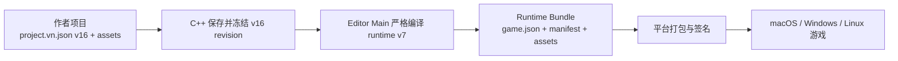
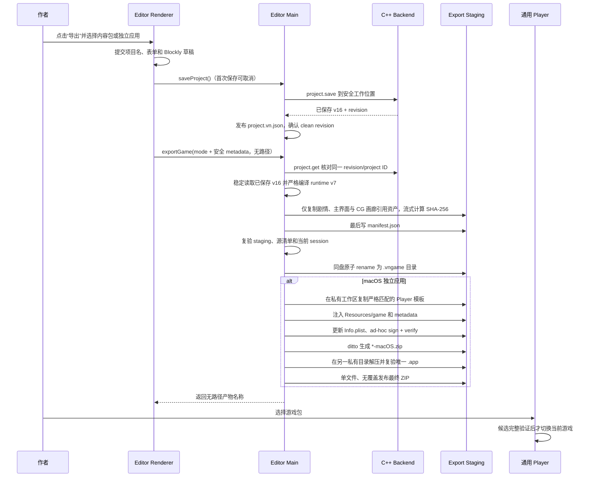
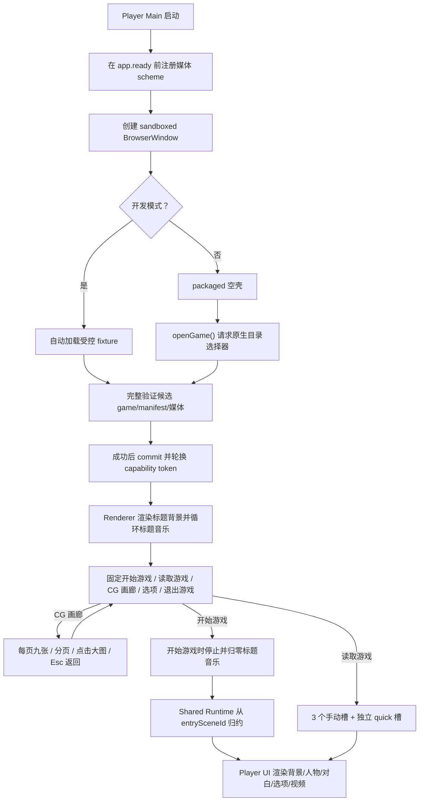

# 独立游戏导出与 Player 技术路线

> 本文既是实现记录，也是后续开发设计和面试讲解材料。截至 2026-08-25，
> **阶段 0–5 已完成**：Editor 可以导出 runtime v7 `.vngame` 目录包，通用
> Player 可以选择并运行它；macOS Editor 还可以通过内置的当前架构 Player 模板，
> 在私有工作区事务式组装并签名每款游戏的 `.app`，再导出只包含该应用的
> `*-macOS.zip`。阶段 6 的多平台 GitHub Actions、签名、
> 公证和发布门禁代码已经落地，但仓库文件不能代替 GitHub 上的受保护 Environment、
> Ruleset 和真实凭据配置，也还没有在 GitHub runner 与干净机器上完成一次正式验收。
> 因此不能把“流水线存在”描述成“公开发行已验证”。
> `.vngame` 双击文件关联和干净机器发行验收也仍未完成。

相关现状可先阅读：

- [当前架构](./architecture.md)
- [游戏顺序预览](./game-preview-runtime.md)
- [项目文件夹存储与媒体资源](./project-folder-storage.md)
- [技术栈与面试讲解指南](./technical-stack-interview-guide.md)
- [选项分支实现](./choice-branch-implementation.md)
- [逻辑 Blockly 实现](./logic-blockly-implementation.md)

## 1. 先回答核心问题：是不是要再做一个软件

可以把它理解为“同一仓库里的第二个桌面应用”，但不是在编辑器里再嵌套一层
软件，也不是把当前预览从头重写一遍。推荐结构是：

```text
同一个仓库
├── Editor          编辑项目、导入资源、校验并发起导出
├── Shared Runtime  解释并执行剧情时间线
├── Player UI       渲染背景、立绘、对白、选项和视频
└── Player          脱离编辑器运行导出的游戏
```

当前预览已经完成了“执行剧情”的核心语义；第一版独立 Player 已补齐独立启动、
只读内容加载、安全媒体服务、可配置独立标题/背景/音乐的标题页、暂停/结束界面和错误页。
正式 Player 标题页固定按“开始游戏 / 读取游戏 / CG 画廊 / 选项 / 退出游戏”提供五个入口；
Editor 整体预览不注入存档能力。画廊每页九张，
支持分页、点击放大和 Esc 返回。开发模式自动读取仓库内
受控 fixture。packaged Player 有两种互斥模式：通用空壳由玩家主动选择 Editor
导出的目录包；embedded Player 在启动时严格加载 `Resources/game`，并隐藏“打开
其他游戏”入口。

推荐的代码目录是：

```text
apps/
├── editor/                  # 编辑器、v16 保存和 runtime bundle 导出
└── player/                  # 独立只读 Electron Player

packages/
├── runtime/                 # 纯 TypeScript 剧情状态机与共享类型
└── player-ui/               # React 舞台、音频、视频和选项组件

engine/                      # C++20 领域模型、v16 校验、revision 与保存
```

当前 [pnpm-workspace.yaml](../pnpm-workspace.yaml) 已包含 `apps/*` 和 `packages/*`；
`@vnengine/runtime`、`@vnengine/player-ui` 和只读 `apps/player` 已落地。Player
没有链接 Editor IPC，也不启动 C++ 编辑后端；v16 → runtime v7 的严格编译和文件
事务位于 Editor Main，而不是 C++ Core 或 Player Renderer。

## 2. 当前编辑器预览与独立 Player 的区别

| 对比项 | 当前编辑器正式预览 | 独立 Player |
| --- | --- | --- |
| 启动入口 | 编辑器里的播放按钮 | 独立 `.app`、`.exe` 或 Linux 应用 |
| 剧情来源 | 当前窗口的 C++ Project 权威快照 | 导出后冻结的只读 runtime bundle |
| 生命周期 | 退出预览后回到编辑器 | 自定义标题背景/音乐、游戏、暂停/结束、退出应用 |
| 媒体服务 | 编辑器 `AssetPreviewService` | Player 自己的只读媒体协议服务 |
| Preload API | 编辑、作者项目保存、导入和预览等多组 API | 只暴露加载/换包、申请资源 URL、固定槽存读与退出应用 |
| C++ 后端 | 每个编辑器窗口启动一个可修改 Project 的子进程 | MVP 不需要携带编辑后端，只消费冻结数据 |
| 文件权限 | 可以选择项目和导入源文件 | 只读游戏内容包；玩家进度只写 `userData` 下的固定槽 |
| 发布形式 | VN Engine Editor | 某一款具体游戏或通用 VN Player |

当前运行核心已经迁到
[packages/runtime](../packages/runtime)，Editor 的
[previewRuntime.ts](../apps/editor/src/renderer/features/game-preview/previewRuntime.ts)
仅保留兼容导出；
React 会话在
[useGamePreview.ts](../apps/editor/src/renderer/features/game-preview/useGamePreview.ts)，
共享舞台和媒体控制器已经迁到
[packages/player-ui](../packages/player-ui)，编辑器画面入口仍是
[GamePreview.tsx](../apps/editor/src/renderer/features/game-preview/GamePreview.tsx)。
独立窗口、只读内容加载、Player 专属媒体服务、Runtime Bundle 导出、通用换包与
macOS 独立应用 ZIP 导出均已实现并通过本机自动测试。正式发布仍受平台证书、GitHub
protected Environments/Rulesets、Environment Secrets、GitHub runner 和干净机器
验收约束。

### 2.1 当前 Player 的只读 API

Preload 只公开窄业务方法：

```ts
window.vnPlayer.loadGame();
window.vnPlayer.openGame();
window.vnPlayer.getMediaUrl(assetId);
window.vnPlayer.listSaveSlots();
window.vnPlayer.saveGame(slotId, snapshot);
window.vnPlayer.loadGameSlot(slotId);
window.vnPlayer.quickSave(snapshot);
window.vnPlayer.quickLoad();
window.vnPlayer.quitGame();
```

`loadGame()` 读取当前已激活会话；`openGame()` 不接受路径，只请求 Main 打开原生
`openDirectory` 选择器；`getMediaUrl()` 只接受 Asset ID；`quitGame()` 发送无参数、
来源受校验的请求，由 Main 调用 Electron `app.quit()`。存档 API 只接受固定槽位和
严格 `GameRuntimeSnapshot v2`（并受限兼容无逻辑旧 v1），路径和游戏身份由 Main 决定。剧情 DTO 和公开资源 DTO
可以进入 Renderer，路径、大小、hash 和 capability token 始终留在 Main。Player
没有作者项目保存、导入、Renderer 指定路径或 C++ mutation API。

### 2.2 哪些语义必须原样复用

当前 Project Writer 写 `fileVersion: 16`，Reader 支持 v1–v16。v10 的
`project.startScreen` 保存可空的背景图片和音乐 Asset ID；v11 新增与项目名独立的
主界面标题。读取 v1–v9 时两项媒体迁移为 `null`，读取 v1–v10 时标题从
`project.name` 迁移。它是项目级标题页配置，不是剧情节点。C++ 作者模型还在 v12
加入没有运行行为的 `StoryExtensionNode`；v13 为人物节点加入可空百分比坐标；v14
首次以扁平 `project.cgGallery.imageAssetIds` 加入画廊。v15 改为
`project.cgGallery.pages[].imageAssetIds`：至少一页、每页精确九个 `string | null`，
所有非空图片 ID 跨页唯一；它不是剧情节点。v16 新增变量 Set/Change、条件 AST 与
If/Else/Repeat paired markers。Compiler 会剥离延伸，runtime v7 执行以下节点类别：

导出不会要求旧项目先另存升级：v14–v16 磁盘文件仍由 TypeScript Compiler 直接严格解析；
v1–v13 则复用当前窗口 C++ Reader 已迁移和校验的 canonical v16 快照，同时继续从原文件
读取并严格校验 Asset 私有路径记录。源 manifest SHA、当前 revision、Project/Asset 对账与
导出期间稳定性检查仍全部保留，因此兼容迁移不会改写源项目，也不会放宽未来版本或畸形文件。
旧文件若仍包含 scene-level 初始人物，则会明确拒绝导出并要求改成 Character 时间线节点，
不会在迁移时静默丢弃人物状态。

1. `Dialogue`：对白停顿点，可选绑定一次性语音；
2. `BackgroundNode`：切换背景或显式进入无背景；
3. `CharacterNode`：设置、替换或清除人物层；
4. `SceneJumpNode`：显式跳转到目标场景；
5. `BgmNode`：开始、替换或停止循环 BGM；
6. `VideoNode`：有资源时阻塞播放，空节点跳过；
7. `ChoiceNode`：有选项时阻塞等待选择，空节点跳过。
8. `VariableSetNode` / `VariableChangeNode`：设置或数值增减剧情变量；
9. `LogicIfNode` / `LogicElseNode` / `LogicEndIfNode`：严格配对并执行一个条件分支；
10. `LogicRepeatNode` / `LogicEndRepeatNode`：以显式循环栈执行固定次数循环。

`StoryExtensionNode` 只决定 Blockly 分段位置，拥有稳定 ID 并参与作者时间线的移动与
删除，但不会进入 Player。

独立 Player 的第一条兼容规则是：同一份剧情在编辑器预览和 Player 中必须得到
相同结果。例如场景结束时不能按数组顺序隐式进入下一场；场景跳转和选项跳转
都会载入目标初始背景、清空旧人物并保留 BGM；视频自然结束或按 Enter 后继续。
标题音乐则只属于 Player 标题页：进入剧情、换包或卸载标题页时停止并归零，不与
时间线 BGM 共用控制器。

模型定义可对照
[model.hpp](../engine/include/vnengine/model.hpp) 和
[projectTypes.ts](../apps/editor/src/shared/projectTypes.ts)。

## 3. 三层产物：作者项目、运行时内容包、平台应用

完整导出不应该把 `project.vn.json` 原样塞进 Player。推荐明确区分三层：



### 3.1 作者项目

作者项目是当前编辑器继续读写的格式：

```text
我的项目/
├── project.vn.json          # vn-engine-project，当前 fileVersion: 16
└── assets/
    ├── images/
    ├── audio/
    └── videos/
```

它服务于编辑过程，包含可继续修改的项目数据。版本迁移由 C++ Reader 负责，Player
不需要理解 v1–v16 的所有作者格式。

Editor 把“主界面”作为排在场景 1 之前的软件托管 synthetic scene：它有固定的
Blockly 根积木；根字段可编辑独立游戏标题，内部固定包含“背景图片”和“背景音乐”
两个子积木，但不会写入
`project.scenes`。真正持久化的是项目级 `project.startScreen`。新建、打开或启动
Editor 后默认进入该编辑入口；标题、资源选择和拖放最终调用 C++
`startScreen.update`，由 Core 原子校验标题及图片/音频类型并更新 revision。

Editor 还提供独立的“CG 画廊”synthetic scene，同样不会写入 `project.scenes`。
表单通过“新增一页/删除本页”和每页九个下拉框明确编辑槽位；Blockly 只有在作者从
CG Toolbox 拖入大模块时才新增页面。空项选择“无”并保存为 `null`，资源面板点击不再
自动加入图片。两种编辑方式最终都通过 `cgGallery.update` 原子替换完整 `pages`；C++
会校验至少一页、每页精确九槽、所有非空 ID 跨页唯一且引用图片。

普通剧情过长时，作者可从 Toolbox 主动插入带稳定 ID 的“延伸”，作为下一横向分页
向下开放的页首；作者修改白色数字字段时会原子移动该页整段并重新编号。显式场景跳转
也会直接终止当前段。延伸从作者 v12 起保存在项目中，数字由时间线顺序投影而不单独持久化，
但表单会隐藏它，Compiler 会在生成 runtime bundle 前剥离它，Player 不会执行该节点。

剧情逻辑则从 author v16 起保存在权威时间线中。If/Else 与 Repeat 使用隐藏 paired
markers，Blockly 将其投影为 C 形积木；变量、分支、循环和 marker 都会进入 runtime v7。
结构、值域、原子编辑与存档契约见[逻辑 Blockly 实现](./logic-blockly-implementation.md)。

### 3.2 Runtime Bundle

Runtime Bundle 是一次导出的不可变、平台无关内容包。当前 `.vngame` **严格是目录
包**，不是单个 ZIP 文件，也不是已经注册到操作系统的 document package：

```text
MyGame.vngame/
├── game.json
├── manifest.json
└── assets/
    ├── images/
    ├── audio/
    └── videos/
```

`game.json` 只保存 Player 真正需要的只读标题配置和剧情快照；`manifest.json` 保存
构建身份、兼容版本和每个被剧情、主界面或 CG 画廊非空槽引用文件的完整性信息。当前运行格式单独使用
`runtimeVersion: 7`，不要把它和作者项目 `fileVersion: 16` 绑定：

```json
{
  "format": "vn-engine-runtime",
  "runtimeVersion": 7,
  "game": {
    "id": "project-id",
    "title": "我的游戏",
    "entrySceneId": "scene-id",
    "startScreen": {
      "title": "自定义主界面标题",
      "backgroundAssetId": "title-background-asset-id",
      "musicAssetId": "title-music-asset-id"
    },
    "cgGallery": {
      "pages": [
        {
          "imageAssetIds": [
            "cg-image-asset-id", null, null,
            null, null, null,
            null, null, null
          ]
        }
      ]
    }
  },
  "scenes": [
    {
      "schemaVersion": 1,
      "id": "scene-id",
      "name": "场景 1",
      "backgroundAssetId": null,
      "nodes": []
    }
  ]
}
```

当前 `manifest.json` 形状：

```json
{
  "format": "vn-engine-runtime-manifest",
  "manifestVersion": 1,
  "buildId": "opaque-build-id",
  "projectId": "project-id",
  "sourceRevision": 42,
  "runtimeVersion": 7,
  "playerCompatibility": ">=7 <8",
  "createdAt": "2026-08-20T00:00:00.000Z",
  "files": [
    {
      "assetId": "title-background-asset-id",
      "type": "image",
      "displayName": "背景.png",
      "path": "assets/images/title-background-asset-id.png",
      "mime": "image/png",
      "bytes": 123456,
      "sha256": "0123456789abcdef0123456789abcdef0123456789abcdef0123456789abcdef"
    },
    {
      "assetId": "title-music-asset-id",
      "type": "audio",
      "displayName": "标题音乐.mp3",
      "path": "assets/audio/title-music-asset-id.mp3",
      "mime": "audio/mpeg",
      "bytes": 654321,
      "sha256": "abcdef0123456789abcdef0123456789abcdef0123456789abcdef0123456789"
    },
    {
      "assetId": "cg-image-asset-id",
      "type": "image",
      "displayName": "CG-01.webp",
      "path": "assets/images/cg-image-asset-id.webp",
      "mime": "image/webp",
      "bytes": 234567,
      "sha256": "123456789abcdef0123456789abcdef0123456789abcdef0123456789abcdef0"
    }
  ]
}
```

Player Reader 同时支持 runtime v1–v7。v1 的 `game` 没有 `startScreen`，加载后
补空媒体和 `game.title`；v2 严格读取背景/音乐两字段并以 `game.title` 补标题；
v3 对 `game.startScreen` 的标题、背景、音乐三个字段使用 exact-fields 校验；v4 为
人物节点加入可空百分比坐标；v5 首次以扁平 `cgGallery.imageAssetIds` 加入画廊；
v6 改为 `cgGallery.pages[].imageAssetIds` 固定九槽结构；v7 加入变量与配对逻辑节点。
runtime v5 会保持原顺序、
每九张分块并以 `null` 补满；runtime v1–v4 加载后统一得到一张全空页。历史
v1/v2/v3/v4/v5 分别要求 `">=1 <2"`、`">=2 <3"`、`">=3 <4"`、`">=4 <5"`
和 `">=5 <6"`，历史 v6 要求 `">=6 <7"`；当前 v7 manifest 要求 `">=7 <8"`。
Player 模板声明 `runtimeCompatibility: ">=1 <8"`，明确覆盖七代
内容，而不是把模板兼容范围误写成单一 bundle 的 manifest 范围。

运行包中绝不能出现源文件绝对路径、项目目录绝对路径或 capability token。
Capability URL 必须在 Player 每次启动时重新生成。

### 3.3 平台应用

当前“每个游戏一个应用”由 Player 程序与 Runtime Bundle 组合而成：

```text
Player 程序代码（app.asar）
+ Electron 运行时
+ Resources/game/（game.json、manifest、媒体）
= 某个独立游戏
```

通用 packaged Player 不内嵌 fixture 或作者游戏，启动后让用户选择外部
`.vngame`。单游戏应用则把同一份经过验证的 bundle 注入 `app.asar` 外的
`Resources/game`；Player 检测到该目录后进入 embedded 模式。macOS Editor 本地
导出始终在私有工作区先注入，再更新 `Info.plist`、执行 ad-hoc 签名；随后用
`ditto` 生成 `*-macOS.zip`，在另一私有目录解压并严格复验唯一 `.app`。Windows/Linux
以及带正式品牌图标的产物，由对应平台 runner 用同一 metadata 重新运行 Forge；
不能修改一份已经正式签名的应用。

## 4. 推荐总体调用链



Renderer 只能表达导出模式以及应用名、严格 `x.y.z` 版本和 reverse-DNS
Application ID，不能传目标目录、模板位置、项目根、资源相对路径或源文件路径。
输出名称和位置来自 Main 的原生 `showSaveDialog`；Player Renderer 的 `openGame()`
同样不传路径，目录来自 Player Main 的原生选择器。

当前实现入口：

- [Editor 导出编排](../apps/editor/src/main/export/ExportGameWorkflow.ts)
- [v16 → runtime v7 严格编译](../apps/editor/src/main/export/AuthorProjectCompiler.ts)
- [staging 与原子发布](../apps/editor/src/main/export/RuntimeBundleExporter.ts)
- [独立应用事务组装](../apps/editor/src/main/export/StandaloneApplicationExporter.ts)
- [Player 模板严格 Reader](../apps/editor/src/main/export/StandalonePlayerTemplate.ts)
- [Player bundle 会话](../apps/player/src/main/content/PlayerBundleSession.ts)
- [Player bundle Reader](../apps/player/src/main/content/PlayerBundleLoader.ts)
- [Player 最小 IPC 契约](../apps/player/src/shared/playerProtocol.ts)

## 5. MVP 导出流程

第一版先完成平台无关的 `.vngame` 目录包和通用 Player 打开流程。`.vngame` 仍严格是
目录包；macOS 独立应用 ZIP、正式签名、公证及多平台发布是不同验收项。

### 5.1 冻结一次一致的项目版本

1. Renderer 提交项目名、表单字段和活动 Blockly 字段；
2. 等待当前 Engine mutation Promise 队列排空；
3. 调用既有项目保存流程；首次保存时先选择项目目录，取消则不开始导出；
4. C++ 写出权威 v16，Main 发布完成后得到 `hasStorage=true`、`isDirty=false` 且
   `savedRevision===revision`；Main 同时对这次实际发布的精确 manifest bytes 计算
   SHA-256，只保存在窗口级文件会话中，不暴露给 Renderer；
5. Renderer 发送无路径 `exportGame()`，Main 再强制检查相同条件并用 `project.get`
   核对内存 Project 和已保存 revision；
6. Main 稳定读取磁盘 `project.vn.json`，先核对保存时的可信 SHA-256，再由 TypeScript
   `AuthorProjectCompiler` 严格编译 runtime v7；这里**没有新增 C++ export 命令**；
7. `FileOperationCoordinator` 在 Main 侧串行化保存、编辑命令、导入和导出；导出结束前
   还会复查源清单及 session 未变化；
8. `sourceRevision` 写入 manifest，之后的编辑只会影响下一次导出。

当前版本不直接导出未保存项目。点击“导出”会主动经过保存流程，而不是从临时
工作区绕过 v16 提交边界。

### 5.2 导出前预检

以下问题应阻止导出：

- 入口场景不存在；
- 场景、节点、选项或 Asset ID 重复；
- 场景跳转或选项目标不存在；
- 节点引用的 Asset 不存在或媒体类型不匹配；
- 主界面标题为空，或背景/音乐引用不存在、分别不是 image/audio；
- CG 画廊没有页面、任一页不是精确九槽、非空引用跨页重复、不存在或不是 image；
- manifest 相对路径包含绝对路径、`..`、反斜杠或目录逃逸；
- 源文件缺失，不是普通文件，是 symlink/junction/reparse point，或读取中发生变化；
- 扩展名、magic bytes、声明 MIME 不一致；
- 文件超过上限，目标空间不足，或者目标目录不可安全写入；
- Runtime Bundle 版本与 Player 模板不兼容；
- 输出目录位于源项目内部，可能造成递归复制；
- 同名最终产物已存在且用户未明确选择新名字。

以下情况在当前语义中合法，不会阻止导出；当前还没有单独的 warning UI：

- 从入口场景无法到达的场景；
- 空 `VideoNode` 或空 `ChoiceNode`（当前语义是合法并自动跳过）；
- 没有对白或选择可停留的自动跳转循环；
- 未被任何剧情节点、主界面或 CG 画廊引用的资源（不会被复制进 runtime bundle）；
- 未超过硬上限、但体积较大的媒体或游戏包；
- 缺少图标、作者、版本或版权信息；
- 应用未签名或未公证。

当前导入器验证的是容器和 magic bytes，不会完整解码媒体。因此 MP4/WebM、
MP3/WAV/Ogg “通过导入”不等于其内部编码一定能在所有目标系统的 Chromium 中播放。
正式发布前应增加媒体探测或目标平台播放测试；若加入 FFmpeg 转码，必须同时处理
体积、耗时、许可和失败回滚。

### 5.3 staging 事务

导出不能直接向最终目录逐个覆盖文件。Runtime Bundle 当前使用同父目录 staging：

```text
选择最终目标
  → 在目标父目录取得操作系统 advisory lock
  → 在同一父目录创建随机 staging 兄弟目录
  → 严格读取已保存 v16 并写 runtime v7 game.json
  → 仅对剧情、主界面与 CG 画廊引用媒体使用稳定句柄流式复制并计算 SHA-256
  → flush/fsync 文件与目录
  → 最后生成 manifest.json
  → 从磁盘重新打开，校验 JSON、大小和 hash
  → 重新读取源清单并复查 frozen revision
  → 原子 rename 为最终目录（仅目标尚不存在时）
```

独立 macOS 应用多一层发布事务。它不会在用户选择的 Desktop、iCloud 或其他
FileProvider 目录里直接组装和签名 Electron 应用：

```text
取得最终 *-macOS.zip 目标的操作系统 advisory lock
  → 在系统临时目录创建权限为 0700 的私有工作区
  → 在私有工作区生成 Runtime Bundle、复制 Player、注入内容并完成 ad-hoc 签名
  → `ditto -c -k --keepParent --norsrc --noextattr --noacl --noqtn <应用.app> <私有归档.zip>`
  → 在另一权限为 0700 的私有目录执行
    `ditto -x -k --norsrc --noextattr --noacl --noqtn <归档.zip> <复验目录>`
  → 确认解压根目录只有预期 `.app`，并严格检查应用树与 embedded 内容
  → 对解压后的应用再次执行 `codesign --verify --deep --strict`
  → 稳定读取并核对 ZIP 的文件身份、大小和 SHA-256
  → 目标父目录创建随机隐藏 publishing 目录，目录内使用普通文件名 `archive.zip`
  → 核对目标仍不存在后，无覆盖发布为最终 `*-macOS.zip`
```

这样签名后的应用树从组装、归档到解压验签始终留在私有目录；Desktop、iCloud 或
其他 FileProvider 只会看到一个 ZIP 普通文件，不再有机会在导出过程中遍历并修改
`.app` 内部的 FinderInfo、ResourceFork 或其他扩展属性。这里不接受用户提供的任意
ZIP：归档只能由已经通过安全树检查和签名验证的私有 `.app` 生成，生成后立即固定
SHA-256；复验再要求解压根目录精确只有预期应用，并拒绝应用树中的逃逸链接、硬链接
与非常规文件。这些约束共同封住 ZIP 路径逃逸/替换边界。隐藏状态只落在 publishing
目录，不会通过硬链接传播给普通文件名的 ZIP。发布目录、目录内的 `archive.zip`、
最终 ZIP 和私有工作区都记录身份；失败回滚只删除仍属于本次事务的对象，不会覆盖
既有同名文件，也不会误删后来出现在同一路径的文件。

以上解决的是目标独立应用的交付边界；若源项目本身位于 FileProvider，macOS 仍可能在
保存后异步附加 `com.apple.provenance` 等扩展属性，只改变
文件 `ctime` 而不改变内容。导出遇到这种 ctime-only 波动时，会完整重开并重读最多
三次；只有每次内容都匹配“保存时记录的 manifest SHA-256”才继续。源媒体和 Player
模板没有对应的保存时可信摘要，因此仍保持严格 ctime 校验；同 inode、同大小、伪造
mtime 的字节改写也会被拒绝。生成中的 staging 文件则只按已知 JSON bytes 或资源
SHA-256 做有限复验。

macOS 使用继承文件描述符的 `lockf` 内核锁，Linux 使用同类 `flock`，Windows
使用由目标文件身份派生的 Named Pipe owner。锁的真相是操作系统持有状态，不是
隐藏文件是否存在：Main 被强制结束时，操作系统会随文件描述符或 Named Pipe 关闭
而自动释放锁；下一次同名导出可立即复用遗留的锁载体，不使用 PID、文件年龄或
超时猜测。正常结束则在仍持锁时核对 inode，先删除自己的锁路径，再释放系统锁，
因此旧 owner 收尾不会误删后继进程的锁。

这样失败时只清理本次随机 staging，不截断旧导出物，也不删除用户的任意目录。
当前明确拒绝覆盖同名目标，也拒绝导出到源项目内部。可捕获失败会清理本次 staging
和锁；强制终止时系统锁自动释放，遗留 staging 使用新 UUID 隔离；
已有项目、已有内容包及未引用源资源不会被修改。无法证明归属的历史 staging 不会被
通配扫描或自动删除，但 UUID 隔离保证它不会阻塞后续导出。

### 5.4 Runtime Bundle 验收

内容包完成必须同时满足：

- `game.json` 能被严格 Reader 读取，未知字段和坏枚举按版本策略处理；
- runtime v7 的 `game.startScreen` 恰好包含独立标题和两个可空资源 ID，且背景/音乐
  分别引用 image/audio；这些文件也必须出现在 manifest；
- `game.cgGallery.pages` 至少一页，每页 `imageAssetIds` 精确九项 `string | null`；所有
  非空 ID 跨页唯一且引用 image，每个被引用 CG 文件都必须出现在 manifest，空槽和
  未被引用资源不会产生文件记录；
- `entrySceneId`、普通剧情和 v7 逻辑节点引用完整；paired markers、嵌套、变量与
  Repeat 值域必须通过严格校验；
- 每个 manifest 文件只对应一个安全相对路径；
- 文件实际大小和 SHA-256 与 manifest 一致；
- 没有绝对路径、临时 token、编辑器 revision 状态或本机用户名泄漏；
- 用通用 Player 打开后能够从入口场景运行到第一个阻塞点；
- 导出失败时原项目和已有导出物保持不变。

## 6. 独立 Player 的运行链

Player 不启动 Blockly、项目编辑 C++ Backend 或文件导入服务。当前启动和换包流程：



候选 bundle 会在临时对象中完成 exact fields、版本、ID/引用、路径、MIME、Magic
Bytes、大小和 SHA-256 校验。只有全部成功后，`PlayerBundleSession` 才更新当前游戏并
让媒体服务轮换 generation token；旧 URL 随即失效。取消、坏 hash 或过新版本不会
破坏已经打开的旧游戏；若此前没有游戏，则维持 empty/error 页面并允许重新选择。

Player 可以分成两层状态：

- App Shell：`loading`、`title`、`inGame`、`paused`、`fatalError`；
- 剧情 Runtime：沿用当前 `playing`、`playingVideo`、`choosing`、`finished`、
  `runtimeError`。

正式 Player 标题页固定按“开始游戏 / 读取游戏 / CG 画廊 / 选项 / 退出游戏”纵向显示。
“读取游戏”会列出当前游戏的手动槽和快速槽；Editor 整体预览显示该入口，但只弹出
预览说明且不会访问 Player 用户数据。CG 画廊按
`pages` 顺序每页固定显示九格，空槽显示“无”，提供上一页/下一页并可点击非空缩略图查看大图；
Esc 会先关闭大图，再关闭画廊返回标题页。通用 Player 的“打开其他游戏”和标题
音乐开关位于“选项”，embedded Player 不显示换包入口。“退出游戏”通过受校验 IPC
调用 Main 的 `app.quit()`，在 macOS 也会结束应用，而不只是关闭 BrowserWindow。

标题音乐使用标题页专属循环 `<audio>`；开始剧情、成功换包或组件卸载都会 pause 并
把 `currentTime` 归零，因此不会泄漏到剧情 BGM。Chromium 仍可能因 autoplay policy
拒绝首次自动播放；标题页保持可交互，玩家可在“选项”中关闭再开启音乐，以用户手势
重试。Escape 在剧情中进入暂停菜单，而不是像编辑器预览那样直接“返回编辑器”。

### 6.1 共享 Runtime 的边界

`packages/runtime` 已保持纯函数和平台无关：

- 不依赖 React、Electron、Node 文件系统或 DOM；
- 输入是冻结后的 Project/Runtime DTO 和玩家动作；
- 输出是新的 Runtime 状态；
- 不直接播放音频、创建 URL 或修改磁盘；
- 保留当前跳转、空节点、循环检测和阻塞节点语义；
- 同一组 reducer 测试同时约束 Editor 预览和 Player。

现有 `previewRuntime.ts` 已成为兼容导出，Editor 与 Player 直接复用共享包。若未来
需要原生/WASM Runtime、复杂变量或跨语言存档，再为同一行为
规范提供 C++ 实现；MVP 不必为了“独立”而立刻重写已经验证的 TypeScript 状态机。

### 6.2 `player-ui` 的边界

`packages/player-ui` 已负责可复用的 React 展示与媒体副作用：

- 背景、人物分层和对白框；
- 固定高度、按数量重排位置的 Galgame 选项；
- BGM 与 voice 两条独立 `HTMLAudioElement` 通道；
- 阻塞式 `HTMLVideoElement`、自然结束和 Enter 跳过；
- 标题页与 CG 画廊九宫格、分页、大图层和 Esc 两级返回；
- capability URL 的异步申请、竞态取消和组件卸载清理；
- 键盘、鼠标、焦点与基本可访问性。

Editor 可以给它套“退出预览”外壳，Player 可以给它套“暂停菜单”外壳；剧情画面
与媒体生命周期仍共享，避免修复只落在其中一端。

## 7. Player 媒体协议与安全边界

当前编辑器的
[AssetPreviewService.ts](../apps/editor/src/main/assets/AssetPreviewService.ts)
提供了安全原则；Player 已使用独立的 `PlayerMediaService`，没有复用编辑器项目
切换和临时工作区权限。两端遵守相同安全要求，但媒体探测仍有重复实现；后续应抽取
共享测试向量和更多无状态校验代码，防止规则漂移。

Player 当前使用独立 scheme：

```text
vn-game-asset://<bundle-generation-token>/<opaque-asset-token>
```

不要把 `assetId`、相对路径或绝对路径直接拼进 URL。Player Main 在验证 bundle
后建立 `opaque token → 已验证文件记录` 的内存映射，Renderer 只能申请短期能力 URL。

协议至少应满足：

- 在 `app.ready` 之前注册为 `standard`、`secure`、`stream`；
- 不启用 `bypassCSP`、CORS、Service Worker 或通用 Fetch 能力；
- CSP 只在 `img-src`/`media-src` 放行该 scheme；
- 图片支持安全 `GET`；
- 音频和视频支持 `HEAD`、完整 `GET` 和单段 Range；
- 正确返回 `200`、`206`、`416`、`Content-Type`、`Content-Length`、
  `Content-Range`、`Accept-Ranges: bytes`、`nosniff` 和 `no-store`；
- 打开前后验证文件仍是 bundle 根下的普通文件，拒绝链接和路径逃逸；
- 成功加载新游戏时轮换 token，使旧 URL 失效；候选失败或取消时保留旧 token；
- Renderer 只收到面向玩家的无路径提示；底层诊断可留在本机 Main 日志，但不得
  自动上传或跨 IPC 返回。

Player BrowserWindow 应继续保持 `contextIsolation: true`、
`nodeIntegration: false`、`sandbox: true`，禁止外部导航和新窗口。Preload 只暴露
具名只读方法，Main 对 IPC 来源和参数进行运行时校验。

当前 packaged Renderer 仍从 `file://.../app.asar` 启动，因此暂时保留 Electron 的
file protocol 兼容 Fuse。后续应增加只服务 `app.asar` 静态文件的安全 app scheme，
完成可见页面回归后再关闭该 Fuse；不能在仍使用 `file://` 时盲目关闭并接受白屏风险。

## 8. 当前操作方式与两种发布路线

### 8.1 从 Editor 导出

1. 打开需要测试的项目，点击顶部“导出”；
2. 在导出弹层选择产物类型：`.vngame 内容包` 或 `独立游戏应用`；
3. 独立应用模式填写应用名、严格三段版本（例如 `1.0.0`）和 reverse-DNS
   Application ID（例如 `com.example.story`）。本地模板使用默认图标；正式自定义
   图标由平台 CI 注入；
4. Editor 提交当前表单/Blockly/项目名草稿并保存项目。若项目从未保存，先在原生
   对话框创建项目目录；取消保存会终止导出；
5. Main 再弹出原生保存对话框。目标必须不存在且不能位于源项目内部；Renderer
   不传入或获得路径；
6. 内容包模式得到 `.vngame` 目录，不要手动改成 JSON 或 ZIP；
7. 当前 packaged macOS Editor 得到 `<安全应用名>-macOS.zip`。ZIP 根目录精确包含
   一个同架构的 `<应用名>.app`；应用包含只读 `Contents/Resources/game`，使用模板
   默认图标和 ad-hoc 签名，适合本机/内部测试，不等于 Developer ID 正式发行；
8. Windows/Linux 的独立游戏不是由 macOS Editor 后处理可执行文件，而是调用
   `player-game-build.yml`，在目标平台重新构建并注入正式 metadata、图标和签名。

### 8.2 用通用 Player 打开

1. 启动 packaged `VN Engine Player`，初始页不会内嵌开发 fixture；
2. 点击“选择游戏包”，在原生目录选择器中选择整个 `MyGame.vngame` 目录；
3. 验证成功后进入标题页，可点击“开始游戏”、“读取游戏”或打开“CG 画廊”；
4. 标题页固定按“开始游戏 / 读取游戏 / CG 画廊 / 选项 / 退出游戏”排列；
   “读取游戏”列出当前游戏的 3 个手动槽和快速槽。画廊每页固定九格，
   空槽显示“无”，并支持分页、点击放大和 Esc 返回。通用 Player 可在“选项”中点击
   “打开其他游戏”，候选无效或取消时已经打开的游戏保持可用；
5. runtime v3–v7 会显示作者配置的独立标题与背景并循环标题音乐；runtime v5–v7
   还读取作者 CG 选择，其中 v5 扁平列表会迁移为固定页，runtime v1–v4 得到一张空页。
   runtime v1/v2 会把 `game.title`
   作为标题回退，v1 同时使用空媒体配置。

开发命令 `pnpm --dir apps/player start` 会自动加载仓库 fixture，便于开发 Player UI；
它不代表 packaged Player 会携带 fixture。

macOS 目前不能通过双击 `.vngame` 自动唤起 Player，也没有 UTI/document package
关联。目录包与 `openDirectory` 的交互必须先稳定，文件关联安排在后续阶段。

### 8.3 通用 Player + 外部 `.vngame`

```text
VN Player.app
MyGame.vngame
```

通用 Player 可以打开不同内容包。编辑器本地只需安全导出 Runtime Bundle，不需要
在玩家电脑上运行 pnpm、CMake 或编译器。这条路线最适合 MVP 和内部测试，也避免
为了更换游戏内容去修改 Player 应用本体。最终是否做到“测试者无需任何开发工具”，
仍要以 packaged Player 的干净机器验证为准。

### 8.4 每款游戏一个独立应用 ZIP（已实现，发行验证仍有边界）

```text
My Game-macOS.zip
└── My Game.app/
```

macOS Editor 内置由 generic Player 生成的、平台和架构严格匹配的模板。Main 先在
系统私有工作区生成 Runtime Bundle，再安全复制模板、注入固定 `Resources/game` 与
`vn-game-application.json`，更新 `Info.plist` 并完成 ad-hoc 签名。通过
`codesign --verify --deep --strict` 后，Main 用带 `--keepParent` 及禁用资源叉、扩展
属性、ACL 和 quarantine 复制的 `ditto` 参数生成私有 ZIP；随后解压到另一私有目录，
要求根目录精确只有目标 `.app`，复核 metadata/embedded 内容并再次严格验签。通过
复验的 ZIP 才会复制到目标父目录的随机隐藏 staging 目录，并以普通文件名
`archive.zip` 保存，再通过同目录硬链接进行原子、无覆盖提交；已有同名目标或发布
竞态都会失败，而不会覆盖用户文件。FileProvider 即使把 staging 目录标为隐藏，也
不会把该标志传播到独立的 ZIP 文件 inode。

因此 Desktop、iCloud 或其他 FileProvider 只接触最终 ZIP 文件，不再直接遍历签名后
的 `.app` 树。FileProvider 问题不再要求作者把本地独立导出改存 Downloads；但 ZIP
内部仍只是 ad-hoc 签名应用，只适合本机或内部测试。面向外部用户仍需要 Developer ID、
Hardened Runtime、公证和真实干净机器 Gatekeeper 验收。

本地组装不会把 Electron 应用内部整套可执行文件和 Helper 全部改名。它自定义外层
`.app` 产物名，以及 `CFBundleDisplayName`、`CFBundleIdentifier`、
`CFBundleShortVersionString` 和 `CFBundleVersion`；内部 `CFBundleName` 与
`CFBundleExecutable` 保持模板值 `VN Engine Player`，从而继续匹配预构建的
`VN Engine Player Helper*`。这是本地模板后处理的明确边界，不应描述成“应用内部
已经完全品牌化重命名”。正式 Forge 构建则在打包前使用同一 metadata 生成整套平台
应用。

`*-macOS.zip` 是传输和交付容器，不是 Player 的运行格式。用于 Steam 时通常先解压，
再通过 Steamworks/SteamPipe 把 `.app` 目录树作为 depot 内容上传；不要把 ZIP 本身
当作 Steam 可直接启动的游戏。`.vngame` 则继续保持目录包，由通用 Player 的原生目录
选择器打开，与这里的独立应用 ZIP 是两种不同产物。

多平台正式产物使用可复用的
[`player-game-build.yml`](../.github/workflows/player-game-build.yml)：调用方提供已验证
bundle artifact、应用名、`x.y.z` 版本、Application ID 和可选制品前缀；对应输入名
依次是 `bundle_artifact_name`、`product_name`、`version`、`app_bundle_id` 和
`artifact_prefix`。各平台 runner
在签名前用 Forge 重新注入内容、metadata 和图标。该 workflow 强制需要完整证书与
图标 Environment Secrets，没有 unsigned fallback，也不接受 caller 传入或继承签名
Secrets。它已经实现并接受静态/本机测试，但尚未用真实凭据在 GitHub runner 上完成
正式执行。

### 8.5 Player 模板与应用 metadata 契约

macOS Editor 消费的模板位于 packaged resources 的
`player-templates/darwin-<arch>`，结构为 exact manifest 加一个未注入游戏的 payload：

```text
darwin-arm64/
├── player-template.json
└── payload/
    └── VN Engine Player.app/
```

manifest 声明 format/version、`platform`、`arch`、Player 版本、runtime compatibility、
payload 根、应用入口以及以下固定相对路径：

```text
Contents/Resources/game
Contents/Resources/vn-game-application.json
Contents/Info.plist
```

当前模板的 `runtimeCompatibility` 必须精确为 `">=1 <8"`，表示模板内 Player 兼容
runtime v1–v7。它与 runtime v7 bundle manifest 的
`playerCompatibility: ">=7 <8"` 是两个不同方向的契约，不能互换。

Editor 写入的 `vn-game-application.json` 只含 format/configVersion、`productName`、
`version`、`appBundleId`、默认图标标记、runtime build ID 和 Player 版本，不含源项目、
模板或输出绝对路径。三项作者输入与 Forge 构建变量是一一对应的：

| 导出弹层 | Forge/CI |
| --- | --- |
| 应用名称 | `VN_PLAYER_PRODUCT_NAME` |
| `x.y.z` 版本 | `VN_PLAYER_VERSION` |
| Application ID | `VN_PLAYER_APP_BUNDLE_ID` |
| 已验证 bundle | `VN_PLAYER_EMBEDDED_GAME_DIR`（绝对且 basename 必须为 `game`） |
| 正式平台图标 | `VN_PLAYER_ICON_PATH` |

这保证 Editor 本地模板组装和 CI 原生重建不会发展成两套 metadata 规则。
但“一套 metadata 规则”不表示两条路径做相同程度的二进制改名：Editor 本地路径遵守
上一节的 Helper 兼容边界；formal workflow 从源码运行 Forge，才能在签名前生成完整
平台 metadata 与品牌图标。

## 9. 打包、签名与 CI

`apps/player` 已有独立的 Electron Main、Preload、Renderer、Forge 配置和
`package.json`，不要复用 Editor 的菜单、Blockly、C++ 编辑后端或导入 IPC。
现有 Editor 打包配置可参考
[forge.config.ts](../apps/editor/forge.config.ts)，但 Player 的资源目录、产品名和
maker 配置应独立。

仓库现有三条流水线：

| Workflow | 触发方式 | 真实职责 | 当前验证边界 |
| --- | --- | --- | --- |
| [`player-ci.yml`](../.github/workflows/player-ci.yml) | PR、main、手动 | 三平台测试、通用/embedded 内部包、macOS Player 模板及 packaged Editor 模板检查 | 产物明确标记 internal；macOS 仅 ad-hoc，Windows/Linux 未正式签名 |
| [`player-game-build.yml`](../.github/workflows/player-game-build.yml) | `workflow_call` | 从外部 `.vngame` artifact 构建每游戏三平台正式候选包 | job 绑定 `game-release` Environment；缺证书、图标或 Apple 公证 Secret 即失败；尚未用真实凭据在 GitHub runner 执行 |
| [`player-release.yml`](../.github/workflows/player-release.yml) | `player-v*` tag | 构建、签名、公证通用 Player，核对完整 release set 后发布 | job 绑定 `player-release` Environment；preflight 缺任一 Secret 即停止；仓库当前没有一次真实正式发布证明 |

流水线采用的 matrix：

| Runner | 架构 | 产物 | 发布前要求 |
| --- | --- | --- | --- |
| macOS 15 | arm64 | notarized `.app` 的 ZIP | Developer ID 签名、Hardened Runtime、公证、stapling、Gatekeeper 校验和真实 Mach-O 架构校验 |
| Windows latest | x64 | 应用目录 ZIP | Authenticode 签名、时间戳、PE 架构/metadata 校验；干净机仍要补安装与 SmartScreen 验收 |
| Ubuntu latest | x64 | 应用目录 ZIP | ELF 架构、内容和品牌图标校验；发行版兼容与桌面安装仍属干净机验收 |

原生平台包在对应平台 runner 上构建，不假设一台 Mac 能可靠生成和验证所有系统
产物。当前正式流水线步骤是：

```text
锁定依赖
  → TypeScript/ESLint/Vitest
  → CTest 与导出集成测试
  → 严格验证输入 metadata 与下载的 Runtime Bundle artifact
  → 在签名前通过 Forge 注入 bundle、metadata 和平台图标
  → 验证 embedded Player 不再暴露换包入口
  → 平台签名与公证
  → 验证签名、内容和平台产物
  → 收集 SHA-256、build receipt 与制品
  → 仅在全部平台成功后创建完整 release
```

三条 workflow 使用的第三方 Action 都固定到完整 commit SHA，checkout 关闭
`persist-credentials`。普通 `player-ci.yml` 只产出 `internal` 制品；正式通用 Player
只接受严格 `player-v<version>` tag，并在创建 draft 前、创建后和公开前复核远端 tag
object identity 与 peeled commit。发布脚本只回滚本次创建的 draft release ID，拒绝
覆盖已有 Release。

通用 Player 的最终公开资产集合恰好包含三平台 ZIP、`release-set.json`、
`SHA256SUMS` 和 `SHA256SUMS.asc`。其中 `SHA256SUMS` 覆盖三份 ZIP **以及最终的**
`release-set.json`，`SHA256SUMS.asc` 是该校验清单的 GPG detached signature；上传到
draft 后，workflow 会重新下载全部远端资产，逐文件核对 SHA-256、复验 GPG 签名和
整个 checksum manifest，全部通过才公开。

### 9.1 上线前必须完成的 GitHub 外部配置

以下设置不存储在 Git 仓库里，workflow YAML 也不能替代它们。第一次正式发布前，
仓库管理员必须在 GitHub `Settings` 中逐项完成并留下可审计记录：

| 外部对象 | 必须配置的策略 |
| --- | --- |
| `main` branch Ruleset | 禁止 force push/删除，要求 PR、必要 review 与 `player-ci` 等 required status checks；只允许获授权维护者合并 |
| `refs/tags/player-v*` tag Ruleset | 限制创建者，禁止更新、force-move 和删除；tag 一旦指向获批 commit 就不得复用 |
| `player-release` protected Environment | 配置 required reviewers，并把 deployment refs 限制为受保护的 `player-v*` tags；未通过审批不得读取发行凭据或进入正式发布 jobs |
| `game-release` protected Environment | 配置 required reviewers，并把 deployment refs 限制为受保护的 `main`；拒绝任意 feature branch 调用正式签名。若未来改用专用游戏发行 tag，必须先新增同样不可变的 tag Ruleset，再单独审批放行该模式 |
| GitHub Releases | 启用 immutable releases，或使用等价的组织/仓库规则禁止替换已发布资产、移动/复用 tag 和删除正式 Release |

两个 Environment 都应启用“阻止自行审批”（若组织方案支持），reviewer 应是独立的
发行维护者。Environment deployment rules 与 tag Ruleset 必须同时配置：workflow 中
的多次 tag identity 复核属于纵深防御，不能代替 GitHub 服务端的不可变规则。

签名、图标、公证和 GPG 私钥只能存放为 **Environment Secrets**，不能改成 repository
Secrets，也不能由 reusable workflow caller 通过 `secrets: inherit` 或参数传入：

| Environment | 必需 Secrets |
| --- | --- |
| `game-release` | `MACOS_CERTIFICATE_BASE64`、`MACOS_CERTIFICATE_PASSWORD`、`MACOS_SIGNING_IDENTITY`、`APPLE_ID`、`APPLE_APP_SPECIFIC_PASSWORD`、`APPLE_TEAM_ID`、`WINDOWS_CERTIFICATE_BASE64`、`WINDOWS_CERTIFICATE_PASSWORD`、`PLAYER_ICON_ICNS_BASE64`、`PLAYER_ICON_ICO_BASE64`、`PLAYER_ICON_PNG_BASE64` |
| `player-release` | 上述 11 项，再加 `RELEASE_GPG_PRIVATE_KEY_BASE64`、`RELEASE_GPG_PASSPHRASE`、`RELEASE_GPG_FINGERPRINT` |

Secrets 只在审批后的 Environment job 中解析，不能写入仓库、Runtime Bundle、构建
回执或普通 CI artifact。正式轮换证书、图标或 GPG key 时，也要走同一 Environment
审批与审计流程。

### 9.2 当前实现与上线验收的分界

workflow 文件、验证/签名脚本、完整 release-set gate 和上述 Environment 绑定都已
实现；这只证明代码路径存在。当前仍缺少的验收证据是：在 GitHub 上实际配置两个
protected Environments、reviewers、deployment rules、不可变 tag/release 规则和真实
Environment Secrets 后，使用 GitHub runners 完成一次无降级 formal run，并在干净
机器上验证安装、启动、图片/音频/视频、退出和卸载。完成这些之前，公开说法必须是
“阶段 6 流水线实现完成，正式发行尚未验收”。

### 9.3 正式构建的操作步骤

每游戏三平台构建由同一次调用方 workflow 先上传一个经过验证的 `.vngame` artifact，
再以 job 级 reusable workflow 调用执行；caller 只传非敏感 metadata，不传 Secrets：

```yaml
jobs:
  signed-game:
    uses: ./.github/workflows/player-game-build.yml
    with:
      bundle_artifact_name: my-game-runtime
      product_name: My Game
      version: 1.0.0
      app_bundle_id: com.example.mygame
      artifact_prefix: my-game
```

该 job 到达 `game-release` Environment 后等待 required reviewer；获批后才读取该
Environment 的 11 项签名/图标 Secrets，并在三个 runner 上生成 release-candidate
artifacts。调用者不能使用 `secrets: inherit` 绕过这个边界。

通用 Player formal release 的操作顺序是：

1. 先完成 [GitHub 外部配置](#91-上线前必须完成的-github-外部配置)，并在测试凭据
   流程中确认 Environment reviewers、deployment rules 与 tag Ruleset 确实会阻断
   未获批运行；
2. 把 `apps/player/package.json` 的严格 `x.y.z` 版本与待发布 commit 合并到受保护
   `main`，等待 required checks 全绿；
3. 由获授权维护者创建一次性的 `player-v<x.y.z>` tag，使其指向该已批准 commit；
   tag 必须与 package version 完全一致，不能移动旧 tag 重试；
4. `player-release.yml` 被触发后，由 required reviewer 审批 `player-release`
   Environment；preflight、三平台签名构建和 publish gate 依次执行；
5. workflow 先创建本次 ID 对应的 draft，上传并重新下载校验完整 release set，最后
   才将同一个 draft 公开；任一 gate 失败都不会发布部分平台集合；
6. 发布后在独立干净机器下载三平台 ZIP、`release-set.json`、`SHA256SUMS` 和
   `SHA256SUMS.asc`，复验 GPG/checksum，再完成安装、启动、媒体、退出和卸载验收。

若步骤 3 之后发现问题，应修复代码并发布新版本/tag；不要移动既有 `player-v*` tag，
也不要替换已公开 Release 的资产。

下面只针对直接生成裸 `.app` 的通用 Player Forge 内测，不是 Editor 的每游戏本地
导出。Forge 输出仍建议定向到非 iCloud/FileProvider 同步目录，避免 Finder 扩展属性
在签名后污染 `.app`；Editor 每游戏导出已经用私有应用树和 ZIP 隔离这一边界：

```sh
VN_PLAYER_OUT_DIR=/private/tmp/vn-player-out \
  fnm exec --using=24 pnpm --dir apps/player package
codesign --verify --deep --strict \
  "/private/tmp/vn-player-out/VN Engine Player-darwin-arm64/VN Engine Player.app"
```

## 10. 需要掌握的技术能力

| 能力 | 在该功能中的作用 | 面试说明重点 |
| --- | --- | --- |
| TypeScript 判别联合与纯状态机 | 执行普通剧情、变量、配对控制节点、阻塞态和跳转 | 运行逻辑可测试且不依赖 UI |
| React Hooks 与组件设计 | 舞台、标题页、暂停页、错误页 | 状态机与副作用分离 |
| Electron Main/Preload/IPC | 文件权限、窗口和最小 API | Renderer 无 Node 权限，边界双重校验 |
| Node 文件系统与流 | staging、复制、hash、fsync | 大文件不整体读入内存，失败可回滚 |
| C++20 领域模型与保存 | 提交权威 v16 和冻结 revision | 导出复用既有保存边界，不伪造第二份 Project |
| TypeScript 严格编译器 | 已保存 v16 → runtime v7 | 独立版本、exact fields、逻辑结构、固定 CG 槽位、ID/引用和资源类型校验 |
| 手写严格 Runtime Reader | Player 校验 game/manifest/媒体 | 候选先验证后 commit，旧会话不被失败输入破坏 |
| 自定义 Protocol 与 HTTP Range | 安全加载本地图片、音频、视频 | 不暴露 `file://` 和绝对路径 |
| Web Audio/HTML Media | 标题音乐、剧情 BGM、voice、视频生命周期 | 用户手势、相互隔离、ended、暂停和竞态清理 |
| SHA-256 与事务性文件发布 | 完整性、可复验导出和故障恢复 | manifest 最后提交，产物非半成品 |
| 严格 Player 模板契约 | macOS Editor 本地生成 `*-macOS.zip` | exact manifest、platform/arch、唯一 `.app`、默认图标、固定 `Resources/game` |
| Electron Forge | 平台应用和安装包 | 构建时 metadata、asar、extraResource 和签名前内容注入 |
| 代码签名与供应链 | Gatekeeper、SmartScreen、发布可信度 | 内容必须先注入，再签名和公证 |
| GitHub Actions 可复用 workflow | 每游戏三平台构建与通用 Player 发布 | protected Environment、无 unsigned fallback、完整 release set 与 GPG checksum signature |
| Vitest、CTest、Forge/CDP smoke | reducer、导出、协议和本机产物 | 区分单测、本机产物验证与干净机器发布验证 |

### 面试中的 30 秒回答

> 编辑器预览和独立游戏不是两套剧情实现：Editor 与 Player 共用纯 TypeScript
> Runtime 和 React Player UI。导出前，Renderer 先提交草稿并经过既有 C++ 保存链
> 固定 v16 与 revision；之后 Editor Main 严格读取磁盘 v16，在事务 staging 中编译
> runtime v7，只复制剧情、主界面与 CG 画廊非空槽引用媒体并计算 SHA-256，最后原子 rename；
> `.vngame` 始终
> 是目录包。独立应用先在系统私有工作区组装和 ad-hoc 签名，再用 `ditto` 生成
> `*-macOS.zip`；Main 会在另一私有目录解压，确认根目录只有唯一 `.app`、内容不变且
> deep/strict 签名仍有效，最后把 ZIP 作为单个普通文件无覆盖发布。这样 FileProvider
> 只接触 ZIP，不直接接触应用树。通用 Player
> 的 Renderer 只请求原生目录选择，不接触路径；Main 完整验证候选后才切换会话并
> 轮换 capability token。独立应用模式在 macOS 使用严格匹配当前架构的 Player
> 模板，注入 `Resources/game`，只更新 ZIP 内 `.app` 的外层名称、显示名、ID 和版本后
> 再 ad-hoc 签名并复验；内部 Electron Helper 命名保持 generic。包含 ad-hoc 签名
> `.app` 的 ZIP 只适合本机/内部测试；正式 Windows/Linux 与品牌图标
> 则由可复用 GitHub Actions 在目标 runner 上重新构建。流水线代码已完成，但受保护
> Environment、真实凭据 runner 执行和干净机器发布尚未实际验收。

### 为什么不直接复制当前预览页面

> 当前页面能执行剧情，但它的启动、项目快照、媒体 URL、退出行为和错误处理都
> 依赖编辑器。直接复制会让 Editor 与 Player 很快产生两套语义。抽离纯 Runtime
> 和 Player UI 后，Editor Play Mode 与导出游戏由同一批测试约束，独立 Player
> 只新增安全加载和桌面应用生命周期。

## 11. 分阶段开发与 Definition of Done

### 阶段 0：冻结运行规范（已完成）

工作：把七类节点、输入规则、场景边界、音频/视频和错误语义写成可执行测试。

DoD：

- `packages/runtime` 自己拥有可执行契约测试；
- 背景、人物、BGM、语音、空/非空 Video、空/非空 Choice、显式跳转、场景结束、
  重复对白 occurrence 和无对白跳转循环都有明确期望；
- 阶段 0 当时冻结的是 authoring v9 与 runtime v1；当前已经升级为 authoring v16、
  runtime v7，并保持两个版本号彼此独立。历史上 authoring v13/runtime v4 曾加入
  人物自定义百分比坐标，v14/runtime v5 首次加入扁平 CG 画廊，v15/runtime v6
  再升级为作者显式创建的固定九槽页面；authoring v16/runtime v7 加入变量和配对逻辑。

### 阶段 1：抽离 `packages/runtime` 和 `packages/player-ui`（已完成）

工作：移动纯状态机、共享 DTO、舞台和媒体控制器，Editor 保留薄适配层。

DoD：

- `packages/runtime` 不依赖 React、Electron、Node 或 DOM；
- Editor 的背景、立绘、对白、BGM、语音、视频、跳转和选择行为不变；
- Editor 和 Runtime 共用同一套测试，没有复制的 reducer；
- 开发模式、生产 typecheck、Vitest、CTest 和 Editor 打包仍通过。

### 阶段 2：创建独立 `apps/player`（MVP 已完成）

工作：用固定 fixture 建立 Player Main/Preload/Renderer、安全窗口和错误页。

DoD：

- 不启动 C++ 编辑后端，不暴露作者项目保存、导入或任意文件读取 API；玩家进度只能
  通过固定槽位的窄 IPC 写入 `userData`；
- 能在没有 Editor 的情况下打开 fixture 并执行全部七类节点；
- 标题页点击后音频可播放，视频和选择阻塞语义正确；
- 损坏 fixture 显示明确错误而不是白屏或崩溃；
- 阶段 2 曾用 `Resources/game` fixture 验证只读 Player；阶段 4 已把 packaged
  Player 改成不内嵌游戏的通用空壳，fixture 只在开发模式自动加载。

当前 runtime v7 bundle 由两个严格 JSON 文件和媒体目录组成；Player 兼容 runtime v1–v7：

```text
MyGame.vngame/
├── game.json
├── manifest.json
└── assets/{images,audio,videos}/
```

Player Main 会在开发 fixture 激活前，或用户所选候选包 commit 前，验证 exact
fields、版本、全局 ID、场景/资源引用、安全相对路径、MIME/扩展名/Magic Bytes、
实际大小和 SHA-256，并拒绝 symlink、hardlink、路径逃逸和读取中变化。图片使用有界
`GET`，音视频支持 `GET/HEAD` 和单段 Range。

### 阶段 3：实现 Runtime Bundle 导出（已完成）

工作：阶段 3 最初复用 C++ v9 保存边界并实现 v9→runtime v1；当前同一架构已升级为
C++ v16→runtime v7 编译、staging 事务、manifest 和无路径 Renderer 导出入口，仍不
新增 C++ export 命令。

DoD：

- 点击导出前提交草稿、等待 Engine queue、保存项目并冻结 clean revision；
- Main 再读取已保存 v16 并核对 Project ID/revision，Renderer 不获得任何路径；
- 生成 `game.json`、`manifest.json` 和仅包含剧情/主界面/CG 画廊引用资产的媒体目录；
- 每个文件大小、MIME 和 SHA-256 可复验；
- 同父目录内核 advisory lock、staging、fsync、源复查和原子 rename 覆盖成功路径；
- 导出进程被强制终止后，内核自动释放锁，同名目标无需 TTL 即可再次导出；
- 中途故障不会修改源项目或已有目标，并清理本次 staging；
- Editor 全量测试及“Editor 导出 → Player 严格读取”跨端集成验证均已通过。

### 阶段 4：通用 Player + `.vngame` 目录选择（已完成）

工作：packaged 空壳、原生 `openDirectory`、候选先验证后 commit、失败保留旧会话，
以及成功换包后的 token 轮换。操作系统文件关联不属于本阶段。

DoD：

- `openGame()` 不接受 Renderer 路径，只由 Main 原生选择 `.vngame` 目录；
- 取消、坏 hash、过新版本或其他候选错误保留旧游戏；无旧游戏时维持 empty/error；
- 成功切换后旧 capability URL 失效，同一 Player 可继续选择另一个游戏；
- 开发模式自动加载 fixture，packaged 产物明确不含 `Resources/game`；
- 当前 Mac 本机已验证 arm64 ZIP 生成、解压后
  `codesign --verify --deep --strict`（ad-hoc 签名完整性）和空壳 DOM；
  这不等于干净设备离线测试、Developer ID 正式签名或 Apple 公证；
- macOS 双击、UTI/document package 关联延后实现。

### 阶段 5：每款游戏一键生成独立应用（已完成）

工作：导出弹层提供内容包/独立应用两种模式；macOS Editor 使用 packaged resources
内当前平台与架构的 generic Player 模板，在系统私有事务目录中注入 bundle 和
metadata 并重新签名，再用 `ditto` 生成 ZIP、私有解压验签，最后以单个普通文件
无覆盖发布。embedded Player 启动后自动读取固定内容并禁用换包。

DoD：

- 应用名称、严格 `x.y.z` 版本和 Application ID 来自导出配置；macOS 本地组装明确
  使用模板默认图标，自定义图标由正式 CI 注入；
- macOS 本地只自定义 ZIP 内的外层 `.app` 名、`CFBundleDisplayName`、ID 和版本；内部
  `CFBundleName`/`CFBundleExecutable` 保持 `VN Engine Player` 以匹配 Electron Helper；
- 应用内部不包含 Editor、Blockly 或作者项目绝对路径；
- 模板 exact fields、platform/arch、注入路径、symlink/hardlink 和现有目标均严格校验；
- 内容注入和 `Info.plist` 更新发生在 ad-hoc 签名前，签名后立即执行 deep/strict 验证；
- 输出名称严格以 `-macOS.zip` 结尾，ZIP 解压根目录精确包含唯一预期 `.app`；
- 独立应用使用私有组装/签名、`ditto` ZIP、私有解压内容与签名复验；目标侧
  FileProvider 只接触一个 ZIP 普通文件，不直接接触 `.app` 树；
- 发布前稳定核对 ZIP 身份、大小和 SHA-256，并以同目录硬链接做原子无覆盖提交；
- 失败按身份回滚私有工作区、publishing 目录和其中的已知 ZIP，不递归删除未知文件，
  也不覆盖既有目标；本机测试覆盖内容加载、启动模式、归档/解压复验和事务故障点；
- ZIP 内 `.app` 仍使用模板默认图标和 ad-hoc 签名，只适合本机/内部测试；公开发行
  仍需正式证书、公证和干净机器验收。

### 阶段 6：多平台 CI 与正式发布（流水线实现完成，正式执行待外部配置与验收）

工作：macOS/Windows/Linux runner、签名、公证、制品、完整 release set 和版本发布
流程。通用 Player 正式发布与每游戏 embedded build 使用独立 workflow。

DoD：

- 已实现三平台 matrix、严格输入验证、证书/图标 materialization、签名前注入、签名、
  notarization、SHA-256、GPG checksum signature、build receipt、artifact 收集和全平台
  release gate；最终 `SHA256SUMS` 同时覆盖三平台 ZIP 与 `release-set.json`；
- 通用 Player 缺少任一 Secret 时在 preflight 停止；每游戏 workflow 缺材料时在
  materialization/signing gate 停止；两者都不生成 unsigned 正式替代品；
- **尚未满足的发布 DoD**：完成 [GitHub 外部配置](#91-上线前必须完成的-github-外部配置)，
  在 GitHub runner 以真实 Environment Secrets 完成一次 macOS Developer ID + 公证、
  Windows Authenticode、Linux 包验证，并在干净机器执行 smoke；
- 在上述真实执行通过前，只能称“发布流水线实现完成”，不能称“正式多平台发行完成”。

## 12. 当前边界与暂不承诺的能力

截至 2026-08-25，仓库的真实边界是：

- 已有 Editor 内正式预览和独立 `apps/player`；两者复用同一 Runtime/Player UI；
- Editor 默认进入软件托管的主界面 synthetic scene；固定 Blockly 根结构配置
  `project.startScreen` 的独立标题、图片和音乐，但不污染 `project.scenes`；
- CG 画廊是另一个独立 synthetic scene；表单手动新增/删除页面，Blockly 从 Toolbox
  拖入大模块才新增页面；每页固定九个可为“无”的槽位，持久化为
  `project.cgGallery.pages[].imageAssetIds`，非空图片 ID 跨页唯一；资源面板点击不直接加入；
- Editor 导出入口、严格 v16→runtime v7 编译器、只复制剧情/主界面/CG 非空槽引用资产的 staging 发布事务
  已完成并通过导出→Player 严格读取集成测试；
- Player Reader 兼容 runtime v1–v7；v7 manifest 使用 `">=7 <8"`，Player 模板使用
  `">=1 <8"`；runtime v5 扁平画廊会按序分块并补空槽，v1–v4 得到一张空页；
  开发 fixture 继续作为 v3 向后兼容样本，Editor 当前导出使用 v7；
- 已有图片 PNG/JPEG/WebP、音频 MP3/WAV/Ogg、视频 MP4/WebM 的安全导入；
- Editor 使用 `vn-asset://`；Player 使用隔离的 `vn-game-asset://` capability，
  音视频均支持单段 Range；
- Player 有独立 Forge 配置、标题页、暂停页、结束页和错误页；标题页渲染自定义背景、
  循环播放独立标题音乐并固定显示“开始游戏 / 读取游戏 / CG 画廊 / 选项 / 退出游戏”；
  读取入口、3 个手动槽、独立快速槽和游戏内操作栏已接通；画廊每页固定九格，
  空槽显示“无”，并支持分页、点击放大和 Esc 返回；通用与 embedded 两种
  packaged 启动模式已有测试。当前本机验证属于 internal/ad-hoc，不是 Developer ID
  正式签名或 Apple 公证；
- packaged Player 不携带 fixture；通过原生目录选择器打开 `.vngame`，候选失败不
  覆盖旧游戏，成功后轮换媒体 token；
- `.vngame` 当前是目录包，不是 ZIP，也没有 macOS 双击/UTI 文件关联；
- macOS packaged Editor 能导出每游戏 `*-macOS.zip`，内含唯一使用模板默认图标和
  ad-hoc 签名的 `.app`，适合内部测试；目标 FileProvider 不直接接触应用树。
  Windows/Linux 及正式品牌产物必须由目标平台 workflow 构建；
- Player 已支持本地手动保存/读取与快速保存/读取；存档使用独立版本化快照、按游戏内容
  指纹隔离并写入用户数据目录，完整流程见 [Player 保存与读取](./save-load-implementation.md)；
- 当前 Esc 暂停会停止音频，恢复后 BGM/voice 从头开始；游戏内底栏、暂停页、结束页和
  运行错误页统一使用“返回标题”，只有标题页的“退出游戏”才通过 Main 的 `app.quit()`
  收口 macOS 应用进程生命周期；
- 开发 fixture 覆盖七类节点，但不携带真实二进制媒体；正式导出前还需补 packaged
  图片/音频/视频端到端用例；
- Player 与 Editor/C++ 的媒体探测现在行为对齐但仍有重复实现，后续应抽取共享
  测试向量，防止三份校验规则漂移；
- 已有变量、If/Else 和固定 Repeat；尚无复合表达式、任意脚本、历史回看、自动播放、
  逐字显示、媒体转码或自动更新；
- `player-ci.yml`、`player-game-build.yml` 和 `player-release.yml` 已实现，但 protected
  Environments、不可变 tag/release 规则、真实凭据 GitHub runner 执行和干净机器 smoke
  尚无完整验收记录；
- macOS/Windows 的公开发行仍需要真实签名、公证/时间戳及干净机器验证。

当前下一里程碑不再是补导出代码，而是发布验收：

> 按 [GitHub 外部配置](#91-上线前必须完成的-github-外部配置)建立保护边界，在对应
> GitHub runner 完整执行通用 Player release 和
> embedded game build，核验 Developer ID/公证、Authenticode/时间戳、Linux 制品、
> GPG 签名的 checksums、`release-set.json` 与 build receipts，并在干净机器测试安装、
> 启动、音视频、退出和卸载。
> `.vngame` 双击关联、存档删除/跨版本迁移和云同步等产品能力仍是独立后续需求；
> 本地手动保存/读取与快速槽已经完成。
