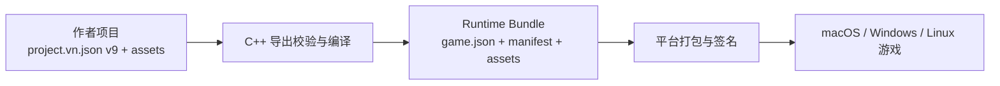
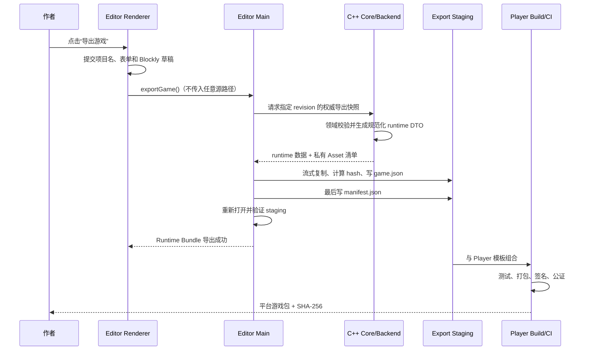
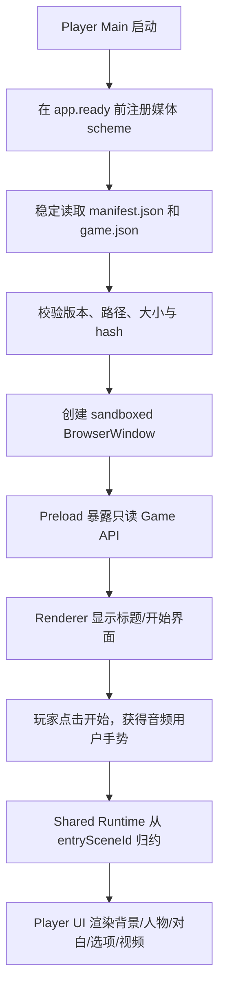

# 独立游戏导出与 Player 技术路线

> 本文既是后续开发设计，也是面试讲解材料。它描述的是**计划中的独立游戏
> 导出能力**，不是已经完成的功能。当前仓库已经能把编辑器封装为桌面应用，
> 也已经能在编辑器内部完整预览现有剧情，但还没有独立 Player、运行时内容包或
> “导出游戏”按钮。

相关现状可先阅读：

- [当前架构](./architecture.md)
- [游戏顺序预览](./game-preview-runtime.md)
- [项目文件夹存储与媒体资源](./project-folder-storage.md)
- [技术栈与面试讲解指南](./technical-stack-interview-guide.md)
- [选项分支实现](./choice-branch-implementation.md)

## 1. 先回答核心问题：是不是要再做一个软件

可以把它理解为“同一仓库里的第二个桌面应用”，但不是在编辑器里再嵌套一层
软件，也不是把当前预览从头重写一遍。推荐结构是：

```text
同一个仓库
├── Editor          编辑项目、导入资源、校验并发起导出
├── Shared Runtime  解释并执行剧情时间线
├── Player UI       渲染背景、立绘、对白、选项和视频
└── Player          脱离编辑器运行导出的游戏
```

当前预览已经完成了“执行剧情”的核心语义；独立 Player 需要补齐的是独立启动、
只读内容加载、安全媒体服务、开始/暂停/结束界面、错误页以及平台打包外壳。

推荐的代码目录是：

```text
apps/
├── editor/                  # 当前编辑器
└── player/                  # 新增：独立 Electron Player

packages/
├── runtime/                 # 新增：纯 TypeScript 剧情状态机与共享类型
└── player-ui/               # 新增：React 舞台、音频、视频和选项组件

engine/                      # 现有 C++20 领域模型、校验和导出编译器
```

当前 [pnpm-workspace.yaml](../pnpm-workspace.yaml) 只包含 `apps/*`。创建共享包时需要
再加入 `packages/*`，并让 Editor 和 Player 都从同一共享包导入运行逻辑。

## 2. 当前编辑器预览与独立 Player 的区别

| 对比项 | 当前编辑器正式预览 | 独立 Player |
| --- | --- | --- |
| 启动入口 | 编辑器里的播放按钮 | 独立 `.app`、`.exe` 或 Linux 应用 |
| 剧情来源 | 当前窗口的 C++ Project 权威快照 | 导出后冻结的只读 runtime bundle |
| 生命周期 | 退出预览后回到编辑器 | 开始界面、游戏、暂停/结束、退出应用 |
| 媒体服务 | 编辑器 `AssetPreviewService` | Player 自己的只读媒体协议服务 |
| Preload API | 编辑、保存、导入和预览等多组 API | 只暴露加载游戏与申请资源能力 URL |
| C++ 后端 | 每个编辑器窗口启动一个可修改 Project 的子进程 | MVP 不需要携带编辑后端，只消费冻结数据 |
| 文件权限 | 可以选择项目和导入源文件 | 只能读取自己的游戏内容包 |
| 发布形式 | VN Engine Editor | 某一款具体游戏或通用 VN Player |

当前运行核心在
[previewRuntime.ts](../apps/editor/src/renderer/features/game-preview/previewRuntime.ts)，
React 会话在
[useGamePreview.ts](../apps/editor/src/renderer/features/game-preview/useGamePreview.ts)，
画面入口在
[GamePreview.tsx](../apps/editor/src/renderer/features/game-preview/GamePreview.tsx)。
它们目前仍依赖 Editor 的类型、组件和资源 API，因此还不能单独打包运行。

### 2.1 哪些语义必须原样复用

当前 Project Writer 写 `fileVersion: 9`，Reader 支持 v1–v9。C++ 的
`SceneNode` 是以下七种类型：

1. `Dialogue`：对白停顿点，可选绑定一次性语音；
2. `BackgroundNode`：切换背景或显式进入无背景；
3. `CharacterNode`：设置、替换或清除人物层；
4. `SceneJumpNode`：显式跳转到目标场景；
5. `BgmNode`：开始、替换或停止循环 BGM；
6. `VideoNode`：有资源时阻塞播放，空节点跳过；
7. `ChoiceNode`：有选项时阻塞等待选择，空节点跳过。

独立 Player 的第一条兼容规则是：同一份剧情在编辑器预览和 Player 中必须得到
相同结果。例如场景结束时不能按数组顺序隐式进入下一场；场景跳转和选项跳转
都会载入目标初始背景、清空旧人物并保留 BGM；视频自然结束或按 Enter 后继续。

模型定义可对照
[model.hpp](../engine/include/vnengine/model.hpp) 和
[projectTypes.ts](../apps/editor/src/shared/projectTypes.ts)。

## 3. 三层产物：作者项目、运行时内容包、平台应用

完整导出不应该把 `project.vn.json` 原样塞进 Player。推荐明确区分三层：



### 3.1 作者项目

作者项目是当前编辑器继续读写的格式：

```text
我的项目/
├── project.vn.json          # vn-engine-project，当前 fileVersion: 9
└── assets/
    ├── images/
    ├── audio/
    └── videos/
```

它服务于编辑过程，包含可继续修改的项目数据。版本迁移由 C++ Reader 负责，Player
不需要理解 v1–v9 的所有历史格式。

### 3.2 Runtime Bundle

Runtime Bundle 是一次导出的不可变、平台无关内容包。建议第一版以目录形式生成，
验证稳定后再增加 ZIP 或自定义 `.vngame` 容器：

```text
MyGame.vngame/
├── game.json
├── manifest.json
└── assets/
    ├── images/
    ├── audio/
    └── videos/
```

`game.json` 只保存 Player 真正需要的只读剧情快照；`manifest.json` 保存构建身份、
兼容版本和每个文件的完整性信息。建议为运行格式单独定义
`runtimeVersion: 1`，不要把它和作者项目 `fileVersion: 9` 绑定：

```json
{
  "format": "vn-engine-runtime",
  "runtimeVersion": 1,
  "game": {
    "id": "project-id",
    "title": "我的游戏",
    "entrySceneId": "scene-id"
  },
  "scenes": []
}
```

建议的 `manifest.json` 形状：

```json
{
  "format": "vn-engine-runtime-manifest",
  "manifestVersion": 1,
  "buildId": "opaque-build-id",
  "projectId": "project-id",
  "sourceRevision": 42,
  "runtimeVersion": 1,
  "playerCompatibility": ">=1 <2",
  "createdAt": "2026-08-14T00:00:00.000Z",
  "files": [
    {
      "assetId": "asset-id",
      "type": "image",
      "path": "assets/images/asset-id.png",
      "mime": "image/png",
      "bytes": 123456,
      "sha256": "..."
    }
  ]
}
```

运行包中绝不能出现源文件绝对路径、项目目录绝对路径或 capability token。
Capability URL 必须在 Player 每次启动时重新生成。

### 3.3 平台应用

平台应用由 Player 程序与 Runtime Bundle 组合而成：

```text
Player 程序代码（app.asar）
+ Electron 运行时
+ Resources/game/（game.json、manifest、媒体）
= 某个独立游戏
```

大媒体文件应位于 `app.asar` 外的只读 Resources 目录，便于流式读取和 Range
响应。游戏内容必须在代码签名**之前**放入最终应用；对已经签名的 `.app` 或
`.exe` 再注入资源会破坏签名。

## 4. 推荐总体调用链



Renderer 只能表达“导出”和用户选择的目标目录，不能构造项目根、资源相对路径
或源文件路径。真实路径仍由 Main、项目存储会话和 C++ 的可信边界掌握，这与
当前保存/导入设计一致。

## 5. MVP 导出流程

第一版建议只完成“当前 macOS 架构上的内部测试包”，但数据和边界从一开始就按
跨平台设计。

### 5.1 冻结一次一致的项目版本

1. 提交项目名、表单字段和活动 Blockly 字段；
2. 等待当前 Engine mutation Promise 队列排空；
3. 获取 C++ 最新权威快照和 `revision`；
4. 导出期间由窗口级协调器阻止打开、保存、导入和第二次导出；
5. 把本次 `sourceRevision` 写入 manifest；
6. 后续编辑只能影响下一次导出，不能改变正在生成的包。

最简单的 MVP 可以要求项目先保存，再允许导出。当前架构也可以在后续支持未保存
项目导出：资源已经位于窗口私有临时工作区，只需让 Main 从同一 Storage Session
冻结并复制资源，而不是要求 Renderer 获得路径。

### 5.2 导出前预检

以下问题应阻止导出：

- 入口场景不存在；
- 场景、节点、选项或 Asset ID 重复；
- 场景跳转或选项目标不存在；
- 节点引用的 Asset 不存在或媒体类型不匹配；
- manifest 相对路径包含绝对路径、`..`、反斜杠或目录逃逸；
- 源文件缺失，不是普通文件，是 symlink/junction/reparse point，或读取中发生变化；
- 扩展名、magic bytes、声明 MIME 不一致；
- 文件超过上限，目标空间不足，或者目标目录不可安全写入；
- Runtime Bundle 版本与 Player 模板不兼容；
- 输出目录位于源项目内部，可能造成递归复制；
- 同名最终产物已存在且用户未明确选择新名字。

以下问题建议作为警告，不应擅自改变当前运行语义：

- 从入口场景无法到达的场景；
- 空 `VideoNode` 或空 `ChoiceNode`（当前语义是合法并自动跳过）；
- 没有对白或选择可停留的自动跳转循环；
- 未被任何节点引用的资源；
- 单个媒体或整个游戏包体积过大；
- 缺少图标、作者、版本或版权信息；
- 应用未签名或未公证。

当前导入器验证的是容器和 magic bytes，不会完整解码媒体。因此 MP4/WebM、
MP3/WAV/Ogg “通过导入”不等于其内部编码一定能在所有目标系统的 Chromium 中播放。
正式发布前应增加媒体探测或目标平台播放测试；若加入 FFmpeg 转码，必须同时处理
体积、耗时、许可和失败回滚。

### 5.3 staging 事务

导出不能直接向最终目录逐个覆盖文件。推荐事务是：

```text
选择最终目标
  → 在同一文件系统创建随机 staging 兄弟目录
  → 写规范化 game.json 临时文件
  → 用稳定文件句柄流式复制每个媒体，同时计算 SHA-256
  → flush/fsync 文件与目录
  → 最后生成 manifest.json
  → 从磁盘重新打开，校验 JSON、大小和 hash
  → 运行 Player smoke test
  → 原子 rename 为最终目录（仅目标尚不存在时）
```

这样失败时只清理本次随机 staging，不截断旧导出物，也不删除用户的任意目录。
如果需要“覆盖导出”，更安全的第一版是生成带版本号的新目录；之后再设计带备份和
恢复的 replace 事务。

### 5.4 Runtime Bundle 验收

内容包完成必须同时满足：

- `game.json` 能被严格 Reader 读取，未知字段和坏枚举按版本策略处理；
- `entrySceneId` 和七类节点引用完整；
- 每个 manifest 文件只对应一个安全相对路径；
- 文件实际大小和 SHA-256 与 manifest 一致；
- 没有绝对路径、临时 token、编辑器 revision 状态或本机用户名泄漏；
- 用开发版 Player 打开后能够从入口场景运行到第一个阻塞点；
- 导出失败时原项目和已有导出物保持不变。

## 6. 独立 Player 的运行链

Player 不应启动 Blockly、项目编辑 C++ Backend 或文件导入服务。推荐启动流程：



Player 可以分成两层状态：

- App Shell：`loading`、`title`、`inGame`、`paused`、`fatalError`；
- 剧情 Runtime：沿用当前 `playing`、`playingVideo`、`choosing`、`finished`、
  `runtimeError`。

开始界面的真实点击是必要的，因为浏览器通常要求用户手势后才允许音频播放。
正式 Player 中 Escape 应进入暂停菜单，而不是像编辑器预览那样直接“返回编辑器”。

### 6.1 共享 Runtime 的边界

`packages/runtime` 应保持纯函数和平台无关：

- 不依赖 React、Electron、Node 文件系统或 DOM；
- 输入是冻结后的 Project/Runtime DTO 和玩家动作；
- 输出是新的 Runtime 状态；
- 不直接播放音频、创建 URL 或修改磁盘；
- 保留当前跳转、空节点、循环检测和阻塞节点语义；
- 同一组 reducer 测试同时约束 Editor 预览和 Player。

第一阶段可以把现有 `previewRuntime.ts` 与共享类型移动到这里，并在 Editor 留下
薄适配层。若未来需要原生/WASM Runtime、复杂变量或跨语言存档，再为同一行为
规范提供 C++ 实现；MVP 不必为了“独立”而立刻重写已经验证的 TypeScript 状态机。

### 6.2 `player-ui` 的边界

`packages/player-ui` 负责可复用的 React 展示与媒体副作用：

- 背景、人物分层和对白框；
- 固定高度、按数量重排位置的 Galgame 选项；
- BGM 与 voice 两条独立 `HTMLAudioElement` 通道；
- 阻塞式 `HTMLVideoElement`、自然结束和 Enter 跳过；
- capability URL 的异步申请、竞态取消和组件卸载清理；
- 键盘、鼠标、焦点与基本可访问性。

Editor 可以给它套“退出预览”外壳，Player 可以给它套“暂停菜单”外壳；剧情画面
与媒体生命周期仍共享，避免修复只落在其中一端。

## 7. Player 媒体协议与安全边界

当前编辑器的
[AssetPreviewService.ts](../apps/editor/src/main/assets/AssetPreviewService.ts)
已经实现了值得复用的安全原则，但它包含编辑器项目切换和临时工作区语义，不能
直接把整个类原封不动搬过去。应抽取公共的只读文件校验、MIME、Range 和响应逻辑，
再实现 Player 专用服务。

建议使用独立 scheme，例如：

```text
vn-game-asset://<bundle-generation-token>/<opaque-asset-token>
```

不要把 `assetId`、相对路径或绝对路径直接拼进 URL。Player Main 在验证 bundle
后建立 `opaque token → 已验证文件记录` 的内存映射，Renderer 只能申请短期能力 URL。

协议至少应满足：

- 在 `app.ready` 之前注册为 `standard`、`secure`、`stream`；
- 不启用 `bypassCSP`、CORS、Service Worker 或通用 Fetch 能力；
- CSP 只在 `img-src`/`media-src` 放行该 scheme；
- 图片支持安全 `GET`；
- 音频和视频支持 `HEAD`、完整 `GET` 和单段 Range；
- 正确返回 `200`、`206`、`416`、`Content-Type`、`Content-Length`、
  `Content-Range`、`Accept-Ranges: bytes`、`nosniff` 和 `no-store`；
- 打开前后验证文件仍是 bundle 根下的普通文件，拒绝链接和路径逃逸；
- 加载新游戏、重启会话或退出时轮换 token，使旧 URL 失效；
- 错误只返回面向玩家的安全提示，日志不泄漏完整本机路径。

Player BrowserWindow 应继续保持 `contextIsolation: true`、
`nodeIntegration: false`、`sandbox: true`，禁止外部导航和新窗口。Preload 只暴露
具名只读方法，Main 对 IPC 来源和参数进行运行时校验。

## 8. 两种发布路线

### 8.1 通用 Player + 外部 `.vngame`（推荐先做）

```text
VN Player.app
MyGame.vngame
```

已签名的通用 Player 打开不同内容包。编辑器本地只需安全导出 Runtime Bundle，
不需要在用户电脑上安装 pnpm、CMake、编译器或签名证书。这条路线最适合 MVP、
内部测试和快速迭代，也不会因为注入新游戏内容而破坏 Player 签名。

### 8.2 每款游戏一个独立应用（最终产品体验）

```text
My Game.app / My Game.exe
```

CI 在签名前把 Runtime Bundle、名称、版本和图标注入 Player 模板，然后重新完成
平台打包、签名和验证。这才是真正的一键独立游戏，但不能靠已安装编辑器随意修改
一份已经签名的 Player 模板来完成。

## 9. 打包、签名与 CI

`apps/player` 应有自己的 Electron Main、Preload、Renderer、Forge 配置和
`package.json`，不要复用 Editor 的菜单、Blockly、C++ 编辑后端或导入 IPC。
现有 Editor 打包配置可参考
[forge.config.ts](../apps/editor/forge.config.ts)，但 Player 的资源目录、产品名和
maker 配置应独立。

推荐 CI matrix：

| Runner | 架构 | 产物 | 发布前要求 |
| --- | --- | --- | --- |
| macOS | arm64、x64（或 universal） | `.app` + ZIP/DMG | Developer ID 签名、Hardened Runtime、公证和 stapling |
| Windows | x64 | Squirrel/MSIX/ZIP | 代码签名、安装/卸载和 SmartScreen 实机测试 |
| Linux | x64 | `.deb`、`.rpm` 或 AppImage | 发行版兼容、桌面入口和依赖检查 |

原生平台包应在对应平台 runner 上构建，不假设一台 Mac 能可靠生成和验证所有系统
产物。CI 典型步骤是：

```text
锁定依赖
  → TypeScript/ESLint/Vitest
  → CTest 与导出集成测试
  → 生成固定 fixture 的 Runtime Bundle
  → Player package/make
  → 启动最终包 smoke test
  → 注入正式 metadata/icon
  → 平台签名与公证
  → 验证签名和安装
  → 发布安装包、SHA-256、版本说明
```

证书、notarization 密钥和时间戳服务凭据只放 CI Secret，不能进入仓库或导出包。
内部测试可以先发未签名 ZIP，但必须明确说明 Gatekeeper/SmartScreen 提示；公开
发行应以签名、公证和干净机器测试作为发布门槛。

## 10. 需要掌握的技术能力

| 能力 | 在该功能中的作用 | 面试说明重点 |
| --- | --- | --- |
| TypeScript 判别联合与纯状态机 | 执行七类节点、阻塞态和跳转 | 运行逻辑可测试且不依赖 UI |
| React Hooks 与组件设计 | 舞台、标题页、暂停页、错误页 | 状态机与副作用分离 |
| Electron Main/Preload/IPC | 文件权限、窗口和最小 API | Renderer 无 Node 权限，边界双重校验 |
| Node 文件系统与流 | staging、复制、hash、fsync | 大文件不整体读入内存，失败可回滚 |
| C++20 领域模型 | 权威快照、引用校验、规范化导出 | 作者格式和业务不变量只有一份真相 |
| JSON Schema/手写严格 Reader | runtime/manifest 版本演进 | 作者 v9 与 runtime v1 独立升级 |
| 自定义 Protocol 与 HTTP Range | 安全加载本地图片、音频、视频 | 不暴露 `file://` 和绝对路径 |
| Web Audio/HTML Media | BGM、voice、视频生命周期 | 用户手势、ended、暂停和竞态清理 |
| SHA-256 与事务性文件发布 | 完整性、可复验导出和故障恢复 | manifest 最后提交，产物非半成品 |
| Electron Forge | 平台应用和安装包 | `package` 与 `make`、asar 与 extraResource |
| 代码签名与供应链 | Gatekeeper、SmartScreen、发布可信度 | 内容必须先注入，再签名和公证 |
| CI/CD 多平台矩阵 | 各系统真实构建和验收 | 不把跨平台支持等同于“代码里有 if” |
| Vitest/CTest/Electron E2E | reducer、导出、协议、最终包 | 从纯函数到真实产物分层测试 |

### 面试中的 30 秒回答

> 编辑器预览和独立游戏不是两套剧情实现。我会先把当前 TypeScript 纯状态机与
> React 舞台抽成 `runtime` 和 `player-ui`，让 Editor 与独立 Electron Player
> 共用。导出时 C++ 从当前 v9 作者项目生成独立版本的只读 runtime bundle，Main
> 在 staging 目录流式复制媒体、计算 SHA-256，并在最后提交 manifest。Player
> 不带 Blockly 和可修改项目后端，只通过 capability protocol 与 Range 安全读取
> bundle。最终由各平台 CI 组合 Player 和内容，再签名、公证并产出安装包。

### 为什么不直接复制当前预览页面

> 当前页面能执行剧情，但它的启动、项目快照、媒体 URL、退出行为和错误处理都
> 依赖编辑器。直接复制会让 Editor 与 Player 很快产生两套语义。抽离纯 Runtime
> 和 Player UI 后，Editor Play Mode 与导出游戏由同一批测试约束，独立 Player
> 只新增安全加载和桌面应用生命周期。

## 11. 分阶段开发与 Definition of Done

### 阶段 0：冻结运行规范

工作：把七类节点、输入规则、场景边界、音频/视频和错误语义写成可执行测试。

DoD：

- Editor 当前预览的 reducer 测试全部通过；
- 空 Video/Choice、场景结束、跳转循环和坏引用都有明确期望；
- 文档明确 authoring `fileVersion: 9` 与未来 `runtimeVersion: 1` 不相等。

### 阶段 1：抽离 `packages/runtime` 和 `packages/player-ui`

工作：移动纯状态机、共享 DTO、舞台和媒体控制器，Editor 保留薄适配层。

DoD：

- `packages/runtime` 不依赖 React、Electron、Node 或 DOM；
- Editor 的背景、立绘、对白、BGM、语音、视频、跳转和选择行为不变；
- Editor 和 Runtime 共用同一套测试，没有复制的 reducer；
- 开发模式、生产 typecheck、Vitest、CTest 和 Editor 打包仍通过。

### 阶段 2：创建独立 `apps/player`

工作：用固定 fixture 建立 Player Main/Preload/Renderer、安全窗口和错误页。

DoD：

- 不启动 C++ 编辑后端，不暴露保存、导入或任意文件读取 API；
- 能在没有 Editor 的情况下打开 fixture 并执行全部七类节点；
- 标题页点击后音频可播放，视频和选择阻塞语义正确；
- 损坏 fixture 显示明确错误而不是白屏或崩溃；
- 打包后的 Player 在没有 Node、pnpm、CMake 的干净机器上启动。

### 阶段 3：实现 Runtime Bundle 导出

工作：增加 C++ 导出快照/预检、Main staging 事务、manifest 和 Editor 导出入口。

DoD：

- 点击导出前会提交草稿并冻结一个 revision；
- 生成 `game.json`、`manifest.json` 和完整媒体目录；
- 每个文件大小、MIME 和 SHA-256 可复验；
- 中途注入任一失败，源项目与旧导出物不变且不留下半成品；
- Renderer 从未获得绝对资源路径；
- 生成的 bundle 能被 Player 重新打开并通过 smoke test。

### 阶段 4：通用 Player + `.vngame` 内部测试

工作：内容包选择/关联、版本兼容提示、跨项目 token 失效和测试发布说明。

DoD：

- 同一 Player 能分别打开两个游戏且资源能力不串用；
- bundle 损坏、版本过新、资源 hash 不一致时拒绝启动；
- macOS Apple Silicon 首个测试 ZIP 可在干净设备离线运行；
- 测试者不需要安装编辑器或任何开发工具。

### 阶段 5：每款游戏一键生成独立应用

工作：把 bundle、名称、版本和图标注入未签名 Player build，再完成平台签名。

DoD：

- 最终应用名称、图标和版本来自导出配置；
- 应用内部不包含 Editor、Blockly 或作者项目绝对路径；
- 签名后不再修改应用内容；
- 最终包通过安装、启动、音视频、退出和卸载 smoke test。

### 阶段 6：多平台 CI 与正式发布

工作：macOS/Windows/Linux runner、签名、公证、制品和版本发布流程。

DoD：

- 每个平台由对应 runner 构建并在对应系统验证；
- 所有正式产物带版本、校验值和可追踪 build ID；
- macOS 签名/公证验证、Windows 签名验证和 Linux 安装测试通过；
- 发布失败不会把部分平台产物标记为完整版本。

## 12. 当前边界与暂不承诺的能力

截至本文编写时，仓库的真实边界是：

- 已有 Editor 内正式预览，但没有 `apps/player`；
- 已有 v9 作者项目与七类时间线节点，但没有 runtime bundle 格式；
- 已有图片 PNG/JPEG/WebP、音频 MP3/WAV/Ogg、视频 MP4/WebM 的安全导入；
- 已有 Editor 专用 `vn-asset://` capability 与单段 Range；
- 已有 Electron Forge 的 Editor 平台 maker 配置，但没有 Player Forge 配置；
- 已经可以封装“编辑器桌面应用”，还不能导出“独立游戏桌面应用”；
- 当前预览会话不保存游戏进度，也没有独立开始菜单或暂停菜单；
- 还没有变量、条件表达式、存档/读档、历史回看、自动播放、快进、逐字显示、
  音量设置、媒体转码或自动更新；
- Windows/Linux 代码路径不等于已完成实机发布验证；
- macOS/Windows 的公开发行仍需要正式签名流程。

因此第一版合理目标不是一次完成商业发行平台，而是：

> 在当前 macOS Apple Silicon 开发机上，从一个已保存的 v9 项目导出只读 Runtime
> Bundle，并由独立 Player 完整执行现有七类节点；测试者无需安装 Editor、Node、
> pnpm、CMake 或 C++ 编译器即可离线运行。之后再把同一内容包接入多平台 CI、
> 独立游戏外壳和正式签名。

这个边界能先验证最重要的架构判断：编辑器预览与最终游戏是否真正共享一套运行
语义，以及导出过程能否在失败时保持项目和旧产物完整。
