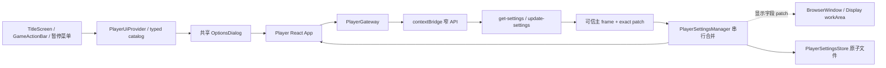

<!-- 文件职责：记录 Player 选项系统；关键内容：语言、音量、窗口模式、持久化与媒体同步。 -->

# Player 选项系统实现

> 实现状态：正式 Player 已提供持久化界面语言、音量与显示设置。标题页、游戏内操作栏和暂停菜单
> 进入同一个选项弹层；Editor 的标题页预览复用相同组件，但只在当前预览内保存设置，
> 不读写 Player 用户数据，也不能改变 Editor 窗口。

## 1. 当前用户体验

选项弹层包含：

- 界面语言：简体中文与 English；
- 主音量、背景音乐、语音和视频四条 0–100% 滑杆；
- 窗口/全屏模式；
- 小、中、大三档窗口尺寸；
- 恢复默认；
- 通用 Player 的“打开其他游戏”入口。

正式 Player 可以从标题页“选项”、游戏内底栏“选项”或暂停菜单“选项”进入同一套
设置。切换语言会立即更新标题菜单、游戏操作栏、选项、存读档、CG 画廊、视频状态与
无障碍文案，但不会翻译作者编写的标题、场景名、对白、说话人或 Choice。拖动音量时会
立即试听；一次键盘调整、指针松开或控件失焦后才提交持久化，
避免把滑杆的每个中间刻度都写入磁盘。提交失败会回滚到 Main 最近确认的设置并显示
稳定错误，成功响应则以 Main 返回的完整设置为准。“恢复默认”也走相同的持久化链。

打开选项时会拦截剧情推进、Choice、视频完成和底栏操作。标题音乐或剧情 BGM 不会
因为打开选项而从头播放，玩家可以直接听到音量调整结果；正在播放的视频会暂停，
人物立绘特效的 CSS animation 也会暂停，关闭选项后从原位置继续。

## 2. 版本与数据边界

选项是 Player 外壳的本地偏好，不属于作者项目、导出内容或剧情存档：

- 作者项目固定写 `fileVersion: 22`，Reader 支持 v1–v22；
- 导出内容为 runtime v13，Player 兼容 runtime v1–v13；Runtime v11 仍是图片缩放的历史里程碑；
- 游戏进度使用独立的 `GameRuntimeSnapshot v5` 和 `saveVersion: 1`，并受限兼容旧 v1–v4；
- Player 设置当前写 `settingsVersion: 2`，Reader 严格迁移旧 v1；
- Runtime v12 必须有 `game.defaultLanguage`，v1–v11 迁移为 `zh-CN`；
- 首次启动、无设置或旧 v1 设置没有持久语言时，桌面与 Web Player 使用当前包默认；
- 当前 v2 设置中已保存的玩家语言优先，切换 `.vngame` 不会用新包覆盖它。

[`playerProtocol.ts`](../apps/player/src/shared/playerProtocol.ts) 保留旧
`PlayerSettingsV1`，并把当前设置定义为 `PlayerSettingsV2` / `PlayerSettings`：

```ts
type PlayerSettingsV2 = {
  settingsVersion: 2;
  language: 'zh-CN' | 'en-US';
  masterVolume: number;
  bgmVolume: number;
  voiceVolume: number;
  videoVolume: number;
  windowMode: 'windowed' | 'fullscreen';
  windowSizePreset: 'small' | 'medium' | 'large';
};
```

| 字段 | 默认值 | 规则 |
| --- | --- | --- |
| `settingsVersion` | `2` | 固定版本，不允许 Renderer 修改 |
| `language` | 静态回退 `"zh-CN"`；有效首次值来自当前包 | 只允许简体中文或 English；已持久玩家值优先 |
| `masterVolume` | `1` | 有限数，范围 0–1 |
| `bgmVolume` | `1` | 有限数，范围 0–1 |
| `voiceVolume` | `1` | 有限数，范围 0–1 |
| `videoVolume` | `1` | 有限数，范围 0–1 |
| `windowMode` | `"windowed"` | 只允许窗口或全屏 |
| `windowSizePreset` | `"medium"` | 只允许 small、medium、large |

完整设置和磁盘文档都执行 exact-fields 校验；多余字段、缺失字段、`NaN`、无穷大、
越界音量和未知枚举都会被拒绝。Reader 仅接受精确旧 v1（唯一缺少 `language`），在
内存中补中文作为安全回退，但将语言来源标为 `default`，因此加载游戏后仍采用
包默认。Writer 和 IPC 只接受、写出精确 v2。未来改变语义时必须再次提升版本，不能
静默改变 v2。

## 3. 完整调用链



Renderer 启动时并发请求设置与游戏；两者完成前不挂载标题媒体或游戏画面。
`PlayerSettingsReadResult.languageSource` 为 `default` 时投影当前包的 `defaultLanguage`，
为 `stored` 时保留玩家语言；无论请求返回先后都不会闪现错误语言。这也避免已静音的
用户仍短暂听到默认 100% 音量。弹层中的本地预览先更新 React 状态，提交时只生成相对
最近确认值的非空 patch。Main 合并 patch、持久化、按 patch 字段决定是否应用窗口后返回
完整权威设置。

Web 的 `stored` 只表示玩家明确选择过的同域语言：偏好按项目 ID 和包默认语言隔离。
全局 `settings-v2` 仍承载音量等值，但其历史 `language` 字段不再被解释为显式选择；只改
音量或全屏也不会把当前包默认语言塞进 patch。这样同一 origin 上的新英文导出不会被旧
中文包的站点数据覆盖，同时玩家对当前游戏的明确选择仍能跨刷新保留。

这里还有一层 Main-owned 的窗口激活门。`attachWindow()` 只给隐藏窗口应用安全的窗口
尺寸，并为该窗口建立 activation gate；Renderer 发出的 `get-settings` / `update-settings`
会等待这个 gate。Main 等 `loadURL()` 完成后调用 `activateWindow()`，应用持久化的窗口或
全屏状态，在成功、失败或超时路径都释放 gate，最后才 `show()`。因此保存的全屏设置不会
先闪出一个窗口模式画面，Renderer 也不会在显示状态尚未确定时挂载并播放媒体。

### 3.1 技术栈与代码落点

| 层 | 技术 | 主要文件与职责 |
| --- | --- | --- |
| 共享界面 | React 19、TypeScript 5.9、Context、HTML/CSS | `localization.ts` 提供强类型中英 catalog；`PlayerUiProvider.tsx` 原地切换 Context；`OptionsDialog.tsx` 提供弹层与语言选择 |
| 媒体 | `HTMLAudioElement`、`HTMLVideoElement` | `mediaVolume.ts`、`previewAudioController.ts`、`PreviewVideo.tsx` 只更新现有媒体音量，保留播放位置 |
| Player 状态 | React hooks、epoch/ref latch | `apps/player/src/renderer/App.tsx` 负责读取门、即时预览、提交/回滚、原生窗口状态刷新和多弹层互斥 |
| 进程边界 | Electron 43、contextBridge、IPC | `preload.ts`、`playerGateway.ts`、`registerPlayerIpc.ts` 暴露并校验窄设置 API |
| 窗口控制 | Electron `BrowserWindow`、`screen` / `Display` | `PlayerSettingsManager.ts` 串行同步设置、workArea 与原生全屏，并管理窗口 activation gate |
| 本地存储 | Node `fs/promises`、`crypto.randomUUID` | `PlayerSettingsStore.ts` 严格迁移 v1、读取/写入 exact v2、执行备份恢复和原子发布 |
| 退出协调 | Electron `before-quit`、Promise 队列 | `PlayerSettingsQuitCoordinator.ts` 阻止重复退出绕过最后一次设置 flush |
| 验证 | Vitest、jsdom、Node Test、TypeScript、ESLint | 覆盖协议、IPC、文件安全、窗口时序、Renderer/Editor 交互与响应式布局 |

## 4. Preload 与 IPC 安全边界

[`preload.ts`](../apps/player/src/preload.ts) 只暴露：

```ts
getSettings(): Promise<PlayerSettingsReadResult>;
updateSettings(patch: PlayerSettingsPatch): Promise<PlayerSettingsWriteResult>;
```

`PlayerSettingsPatch` 是至少包含一个可变字段的窄 patch；它不能包含
`settingsVersion`、本机路径、自定义宽高或未知字段。`get-settings` 的 `params` 必须为空，
`update-settings` 的 `params` 必须精确只有 `patch`。

[`registerPlayerIpc.ts`](../apps/player/src/main/ipc/registerPlayerIpc.ts) 在路由前同时检查：

1. 请求来自当前 Player 的可信主 frame；
2. invocation 顶层与 `params` 都是 exact fields；
3. patch 非空、字段在白名单内，所有值满足 v2 约束；
4. `event.sender.id` 对应仍存在的 Player 窗口上下文。

设置不依赖当前是否已经加载游戏，因此通用 Player 的空页面也能读取默认偏好。Renderer
不能选择设置文件位置，也不能直接调用 Electron 窗口 API。

## 5. Main-owned 原子存储

[`PlayerSettingsStore.ts`](../apps/player/src/main/settings/PlayerSettingsStore.ts) 把设置写到：

```text
app.getPath('userData')/
└── settings/
    ├── settings.json
    └── settings.json.bak
```

磁盘文档是独立 envelope：

```json
{
  "format": "vn-engine-player-settings",
  "settingsVersion": 2,
  "settings": {
    "language": "zh-CN",
    "masterVolume": 1,
    "bgmVolume": 1,
    "voiceVolume": 1,
    "videoVolume": 1,
    "windowMode": "windowed",
    "windowSizePreset": "medium"
  }
}
```

写入流程为：

1. 只接受规范化绝对存储根，并创建 0700 设置目录；
2. 以随机名称、`O_EXCL`、`O_NOFOLLOW` 和 0600 权限创建临时文件；
3. 写完整 JSON 并 `fsync`；
4. 安全检查既有主文件和备份均为普通、单硬链接文件；
5. 既有主文件先原子 rename 为固定 `.bak`；
6. 临时文件再原子 rename 为 `settings.json`；
7. 非 Windows 平台尽力同步目录项。

旧 v1 文档会完整保留音量和窗口字段，并补 `language: "zh-CN"` 进入内存；下一次成功
提交只写 v2。发布新主文件前失败会恢复旧主文件。读取优先使用主文件；主文件损坏时尝试最后一个完整
备份，两者都不可用时返回不可变默认值。Reader 拒绝 symlink、非普通文件、多硬链接、
超过 16 KiB 的文件和读取过程中发生变化的文件。原始异常与绝对路径只进入 Main 本地
诊断，Renderer 只收到不含路径的稳定错误。

## 6. Main-owned 窗口管理

[`PlayerSettingsManager.ts`](../apps/player/src/main/settings/PlayerSettingsManager.ts) 是窗口
与设置的权威协调者。三档尺寸指的是内容区：

| 预设 | 内容区尺寸 |
| --- | --- |
| `small` | 960 × 600 |
| `medium` | 1280 × 800 |
| `large` | 1600 × 1000 |

同一档位还决定 Player 的界面字号基准，而不是只改变原生窗口尺寸：

| 预设 | Player 根字号 |
| --- | --- |
| `small` | 14px |
| `medium` | 16px |
| `large` | 18px |

Renderer 在稳定的 `.player-app` 根节点写入
`data-player-window-size-preset`，CSS 再把该值映射为
`--player-ui-font-base`。标题、菜单、存读档、选项、CG、对白框和游戏内操作栏的字号层级
统一使用 `em` 或以 `em` 为边界的 `clamp()`，因此切换预设会让整套文字按比例变化，
但不会用 React `key` 重挂剧情或媒体组件。标题页已有的 AutoFit 会根据字号变化重新测量，
小窗口中仍保证全部按钮可见。

窗口模式与尺寸有以下规则：

- Main 用当前窗口 bounds 找到对应 Display，并以其 `workArea` 为上限；
- 预设放不下时按同一比例缩小，同时计入窗口 frame 尺寸，避免超出任务栏或 Dock 后的
  可用区域；
- 调整内容区后把整个窗口居中到该 `workArea`；
- 全屏时保留已选尺寸，返回窗口模式后再应用；
- 全屏时也继续使用已选预设对应的 14/16/18px 字号，不根据全屏显示器尺寸再次放大；
- 启动阶段只先调整隐藏窗口尺寸；`loadURL` 完成后、窗口 `show()` 前才激活持久化全屏，
  并在激活完成前阻塞该窗口的设置 IPC，避免 macOS 原生全屏转换阻塞页面加载或闪出
  窗口模式首帧；
- 只有 patch 自身包含 `windowMode` 或 `windowSizePreset` 时才重新应用窗口几何。纯音量
  patch 仍会持久化并返回权威设置，但不会缩放、居中或覆盖用户手动调整的窗口位置；
- 原生 `enter-full-screen` / `leave-full-screen` 事件会反写当前权威模式，因此用户用系统
  按钮退出全屏后，再改音量也不会被旧 Renderer 状态重新拉回全屏；
- 选项弹层打开期间，Renderer 会在窗口 `focus` / `resize` 后以 50 ms 防抖重新读取
  Main 权威值；只有没有本地编辑、没有提交进行中且 epoch 仍匹配时才接受结果。因此
  macOS 绿色按钮和系统全屏快捷键的结果会显示在仍打开的选项弹层中，也不会覆盖滑杆
  正在预览的值；
- 全屏转换最多等待 5 秒。若原生事件丢失，Manager 复核真实窗口状态、释放串行队列并
  保持 Player 可继续操作；
- 所有读取、patch 合并、窗口应用和持久化按队列串行执行，并始终基于最新值合并，避免
  并发滑杆或原生窗口事件产生 lost update；
- Player 退出时 Main 会先等待已接受的最后一次设置写入完成。退出协调器区分
  `running / flushing / flushed` 三种状态；flush 期间重复出现的 `before-quit` 仍全部
  `preventDefault()`，最终退出事件才执行一次清理，因此不能绕过队列尾部的写入。

## 7. 音量与媒体生命周期

共享 [`mediaVolume.ts`](../packages/player-ui/src/mediaVolume.ts) 统一计算有效音量：

```text
effectiveVolume = clamp(masterVolume) × clamp(channelVolume)
```

映射关系为：

- 标题页循环音乐：`masterVolume × bgmVolume`；
- 剧情 BGM：`masterVolume × bgmVolume`；
- 对白语音：`masterVolume × voiceVolume`；
- 剧情视频：`masterVolume × videoVolume`。

音量改变只更新现有 `HTMLAudioElement.volume` 或 `HTMLVideoElement.volume`。标题音乐的
播放 effect 与音量 effect 分离；剧情音频控制器仍以 Asset ID 和 Runtime sequence 识别
音轨；视频也把 source/playback effect 与 volume effect 分离。因此调节音量不会重建
媒体元素、重新申请 capability URL 或把 `currentTime` 归零。真正切换音轨、开始新对白、
进入新视频、换游戏包或卸载标题页时，原有清理语义保持不变。

## 8. React 交互与无障碍

共享 [`OptionsDialog.tsx`](../packages/player-ui/src/OptionsDialog.tsx) 是 `role="dialog"`、
`aria-modal="true"` 的模态层，并实现：

- 打开时聚焦第一个可用控件；
- Tab / Shift+Tab 只在弹层内循环；
- 捕获阶段处理 Esc 并阻止事件穿透到暂停、画廊或剧情快捷键；
- busy/loading 期间禁止关闭和重复提交；
- 关闭后把焦点恢复到打开选项的按钮；
- pointer/click 不冒泡到游戏舞台；
- 小高度窗口中卡片在模态层内滚动，操作项不会被裁掉。

[`localization.ts`](../packages/player-ui/src/localization.ts) 用完整的 `PlayerUiLabels` 类型约束
中英文目录；[`PlayerUiProvider.tsx`](../packages/player-ui/src/PlayerUiProvider.tsx) 通过 React
Context 提供当前语言。语言改变只更新 Context 和 `<html lang>`，不会用 locale 作为 React
`key`，因此不会重建剧情、音视频、快进、CG 页、存档确认或焦点状态。异步视频错误只保存
稳定错误码，渲染时再读取当前语言，切换后不会残留旧语言错误。

Renderer 不把已经翻译好的提示写进 React state。Load、Open、Save 与 Settings 边界只返回
13 个受类型约束的 `PlayerErrorCode`；本地成功提示保存 typed key 与槽位参数，所有文本都在
当前 render 中翻译。因此设置请求回滚、迟到的存档请求或较晚完成的内容包请求跨过语言切换
时，也不会留下另一种语言的旧字符串。底层异常、绝对路径与原始系统错误不会进入 Renderer。

存档列表同样不持久化“等待选择”等界面文案。Main 与 Web 只返回
`dialogue / progress / choosing / playing-video / finished` 五种结构化摘要；对白的作者文本
原样保留，状态文案和说话人分隔符由当前语言在渲染时生成。已经打开的存档窗口切换语言后
会立即重译，而不会重新读取或重挂游戏状态。

`App.tsx` 在选项打开时阻塞故事交互，但不把 BGM 控制器标记为暂停；这使玩家既不会
误推进剧情，又能实时试听主音量/BGM。打开选项也会取消当前快进，关闭后不会自行恢复；
“选项”和“快进”都已经正式启用。

Player 还用同步 ref/latch 统一管理 CG 画廊、存档窗口、打开内容失败窗口和选项弹层。
标题页的 `TitleScreen` 会在打开/关闭自己的 CG 画廊时同步通知上层，因此即使多个按钮在
同一个事件循环 tick 内被触发，也只能打开最先接受的一个模态层。底层标题操作、剧情、
暂停/结束菜单会进入 `inert` 并配合 `aria-hidden`，页面中只保留一个有效
`aria-modal="true"`。关闭选项、存档、CG 画廊或 CG 大图后，焦点会恢复到仍存在且可用的
原触发按钮；CG 大图的 Esc 先关闭大图，再次 Esc 才退出画廊。

## 9. Editor 预览边界

Editor 的完整标题页预览复用 `TitleScreen` 和 `OptionsDialog`。当上层没有注入正式
Player 的 `onOpenOptions` 时，`TitleScreen` 创建一份仅属于该组件生命周期的默认设置：

- 滑杆仍可即时试听当前标题音乐；
- 语言可以在当前预览生命周期内切换，默认中文；
- 不调用 `window.vnPlayer`、不访问 `userData`，关闭预览后不会保存；
- 窗口模式和窗口尺寸控件保持禁用，并明确提示“仅在正式 Player 中应用”；
- 不会调整 Editor BrowserWindow，也不会把该预览设置写入 Author v22 或
  Runtime v13；正式导出的包默认另由 Editor Main 权威语言决定。

这样 Editor 能预览正式选项样式和媒体效果，但不会意外获得 Player 的本地持久化或窗口
控制权限。

## 10. 测试矩阵

| 层 | 主要测试 | 覆盖重点 |
| --- | --- | --- |
| 协议/Preload | `registerPlayerIpc.test.ts`、`playerPreload.test.ts` | trusted frame、exact invocation、非空 patch、稳定错误码、未知字段/路径/自定义尺寸拒绝、调用转发 |
| 设置文件 | `playerSettingsStore.test.ts`、`webStorage.test.ts` | v1→v2 迁移、v2 round-trip、Web 通用设置迁移、项目+包默认语言分域、显式偏好与音量更新隔离、未来版本/损坏回退、备份恢复、symlink 与路径拒绝 |
| 窗口协调 | `playerSettingsManager.test.ts` | activation gate、三档尺寸、workArea 缩放/居中、纯音量不改窗口、原生模式同步、并发 patch、5 秒超时、销毁窗口与退出 flush |
| 退出协调 | `playerSettingsQuitCoordinator.test.ts` | flush 期间的重复退出均被阻止、失败只写本地诊断、最终清理只执行一次 |
| Player Renderer | `playerRenderer.test.tsx` | 设置加载门、中英即时切换与失败回滚、异步错误和结构化存档摘要按当前语言重译、作者剧情状态不重置、标题与剧情有效音量、原生全屏刷新、焦点恢复、Esc/busy、CG/存档/选项同 tick 互斥 |
| 共享本地化 | `playerUiLocalization.test.tsx` | typed catalog、Context 默认中文、Title/操作栏/存档/CG/Video 中英翻译、日期 locale、异步错误即时重译 |
| 共享媒体 | `previewAudioController.test.ts` 及视频组件回归 | 音量更新、暂停恢复、同一音轨不重置播放位置、视频事件隔离 |
| 响应式标题 | `titleScreenAutoFit.test.ts`、`startScreenResponsiveStyle.test.ts` | 小窗口等比缩放、低高度滚动、标题操作不被裁切 |
| 字号预设 | `playerTypographyScale.test.ts`、`playerRenderer.test.tsx` | small/medium/large 根字号、全屏沿用预设、切换时剧情/立绘/Choice DOM 不重挂 |
| Editor 预览 | `gamePreviewChoice.test.tsx` | 共享选项弹层可打开、窗口控件禁用、没有 Player 持久化能力 |

常用验证命令：

```sh
fnm exec --using=24 pnpm --dir apps/player test
fnm exec --using=24 pnpm --dir apps/player typecheck
fnm exec --using=24 pnpm --dir apps/player lint
fnm exec --using=24 pnpm --dir packages/player-ui typecheck
fnm exec --using=24 pnpm --dir apps/editor test
fnm exec --using=24 pnpm --dir apps/editor typecheck
git diff --check
```

只回归选项相关路径时可运行：

```sh
fnm exec --using=24 pnpm --dir apps/player exec vitest run \
  tests/unit/playerSettingsStore.test.ts \
  tests/unit/playerSettingsManager.test.ts \
  tests/unit/playerSettingsQuitCoordinator.test.ts \
  tests/unit/registerPlayerIpc.test.ts \
  tests/unit/playerPreload.test.ts \
  tests/unit/playerRenderer.test.tsx \
  tests/unit/playerUiLocalization.test.tsx \
  tests/unit/playerMediaVolume.test.tsx \
  tests/unit/titleScreenAutoFit.test.ts
fnm exec --using=24 pnpm --dir apps/editor exec vitest run \
  tests/unit/gamePreviewChoice.test.tsx \
  tests/unit/startScreenResponsiveStyle.test.ts \
  tests/unit/previewAudioController.test.ts \
  tests/unit/previewVideo.test.tsx
```

## 11. 当前限制

- 当前没有文字速度、自动播放速度、语音单独角色音量、静音快捷键或音效（SFX）通道；
- 窗口尺寸只允许三档安全预设，不接受 Renderer 自定义宽高；
- 设置是本机 Player 级偏好，不按游戏隔离，也没有云同步；
- 语言只翻译 Player 外壳；作者标题、场景名、对白、说话人、Choice 与资源显示名保持原文，
  当前不提供作者内容的多语言字段或机器翻译；
- 全屏使用 Electron/操作系统的原生全屏语义，没有无边框窗口模式；
- Editor 只提供内存预览，不模拟持久化或真实窗口变更。
