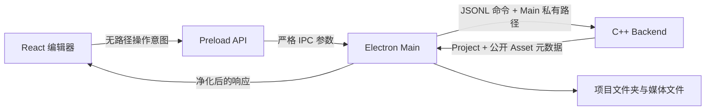
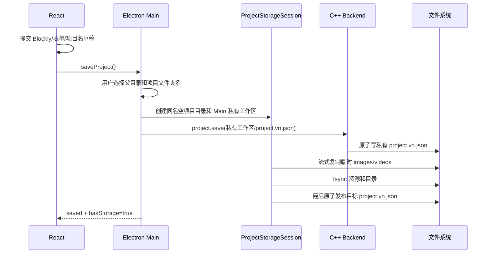
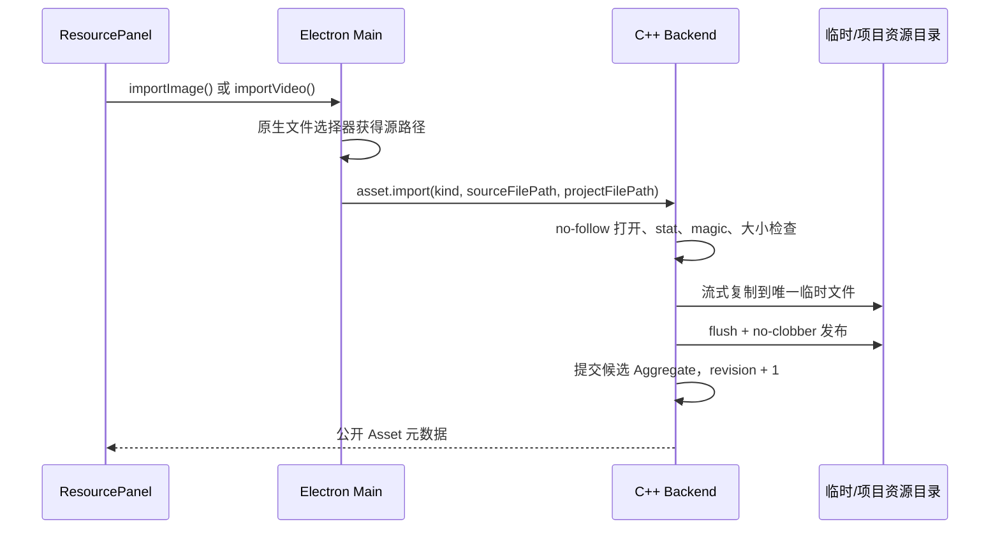

# 项目文件夹存储与媒体资源实现

## 1. 目标

VN Engine 的项目不再以用户手动选择的单个 JSON 文件为单位，而是以一个
完整项目文件夹为单位。用户打开、保存、复制和备份的都是这个文件夹。

本轮实现的目标是：

- 新建项目第一次保存时生成一个独立项目文件夹；
- “打开”只允许选择项目文件夹；
- 固定读取项目文件夹中的 `project.vn.json`；
- 对白、场景、背景切换、人物立绘和场景跳转保存在文本清单中；
- 图片和视频保存在项目自己的资源目录中；
- 未保存项目仍可以先导入图片和视频；
- 保存失败时，已经存在的项目仍然可以正常打开；
- Renderer 不接触源文件路径、目标路径或资源相对路径；
- 不提供旧版“选择任意 `.vn.json`”入口。

本轮的视频闭环指“安全导入、出现在资源清单、随项目保存并在重开后恢复”。
视频的时间轴播放和拖动进度条属于后续播放功能，需要在受控资源协议中支持
HTTP Range，不和项目文件夹迁移混在同一个提交中。

## 2. 项目目录格式

```text
我的游戏/
├── project.vn.json
├── assets/
│   ├── images/
│   │   ├── id-12.png
│   │   └── id-18.webp
│   ├── videos/
│   │   └── id-25.mp4
│   └── audio/
└── .vnengine/                   # 可选；当前版本不会创建
    └── cache/                   # 未来可重建缓存
```

### 2.1 `project.vn.json`

这是项目唯一的文本清单，也是一次保存是否完成的提交标记。它包含：

- 项目、场景和时间线节点；
- 对白文本；
- 背景、立绘和场景跳转引用；
- Asset 元数据；
- Asset 在项目文件夹内的相对路径。

清单不包含图片或视频的二进制内容，也不保存本机绝对路径。

### 2.2 `assets/`

资源按照媒体类型存放：

- `assets/images/`：PNG、JPEG、WebP；
- `assets/videos/`：MP4、WebM；
- `assets/audio/`：为后续音频保留。

资源的磁盘文件名由 C++ 生成的 Asset ID 决定。用户原始文件名只作为
`displayName` 保存，因此两个同名源文件不会相互覆盖。

背景图和人物立绘不需要使用两个不同的物理目录。二者都是图片 Asset，具体
用途由时间线中的背景节点或人物节点对 `assetId` 的引用决定。

### 2.3 `.vnengine/`

这里只能保存可重新生成的数据，例如缩略图和索引缓存。运行所需的业务数据
不能只存在这里。删除这个目录后，项目仍然必须可以完整打开。

## 3. 权威数据和进程职责



职责划分：

- React：编辑 UI，只持有 Project 快照和 `{id,type,displayName}`；
- Preload：提供最窄的 API，不提供 Node 文件系统能力；
- Electron Main：显示原生目录/文件选择器，掌握所有本机路径；
- C++：校验业务模型、序列化项目、生成 Asset ID 和更新 revision；
- 文件系统：保存固定清单和不可变媒体资源。

Renderer 不得向 Main 传入 `filePath`、`projectRootPath`、
`relativePath` 或 `sourceFilePath`。它只能发出：

```ts
openProject()
saveProject()
importImage()
importVideo()
```

## 4. 新建与首次保存

新项目继续在独立 Electron 窗口和独立 C++ Backend 中创建。保存之前，项目
没有正式目录；导入的媒体先写入该窗口独享的临时工作区。

首次保存流程：



最终项目目录已经存在时，首版拒绝覆盖并要求选择其他名称。整个目录不作为
原子提交对象；固定清单 `project.vn.json` 才是最后提交点。覆盖一个任意非空
目录无法在各平台上形成可靠的单步原子事务。

任何步骤失败时：

- 当前窗口仍保持未保存状态；
- 临时媒体继续保留，用户可以重新保存；
- 已存在的目标项目不会被截断或删除；
- 首次保存创建的目录如果仍为空，会被安全移除；
- 不会把 C++ 私有工作路径暴露给 Renderer。

## 5. 打开项目文件夹

原生对话框使用：

```ts
properties: ['openDirectory']
```

打开顺序：

1. 用户选择一个目录；
2. Main 规范化并验证目录不是符号链接或特殊对象；
3. Main 固定解析 `<目录>/project.vn.json`；
4. AssetPreviewService 用 no-follow 句柄稳定读取一次清单，并校验每个
   被引用的图片和视频文件；
5. Main 将上一步的同一份 JSON 字节交给 C++，C++ 解析到临时
   `ProjectAggregate`，不再按路径第二次读取；
6. C++ 完成 schema、节点引用和 Asset 引用校验；
7. C++ 成功后才替换当前 aggregate；
8. Main 激活项目资源能力令牌；
9. Main 更新窗口文件会话；
10. Renderer 接收净化后的 Project、Assets 和保存状态。

如果清单缺失、JSON 损坏、引用非法，或者任一媒体文件缺失、是链接、
超限或内容与类型不匹配，旧项目和旧资源预览能力保持不变。

Main 和 C++ 使用同一份稳定字节快照，避免文件在两次读取之间被替换后，
文本状态与资源清单来自两个不同版本。

## 6. 普通保存

项目已经有正式目录时，保存仍然以 `project.vn.json` 作为最后提交点：

1. 提交当前表单或 Blockly 草稿；
2. 等待已有 C++ mutation 队列完成；
3. 把新增图片和视频发布为不可变 Asset 文件；
4. flush/fsync 新资源；
5. 在项目目录写 `project.vn.json.tmp-*`；
6. flush/fsync 临时清单；
7. 原子替换 `project.vn.json`；
8. 成功后才更新 `savedRevision` 和“已保存”状态。

不能先删除旧清单，也不能直接以 truncate 模式覆盖它。崩溃后允许的稳定状态是：

- 旧清单引用完整旧资源；或
- 新清单引用完整新资源。

资源发布成功、清单发布失败时，最多留下本次发布中的未引用资源，
不会出现清单引用缺失文件。后续可以增加“清理未使用资源”功能回收孤立文件。

## 7. 图片和视频导入

图片和视频使用同一条安全导入架构，但使用不同的格式验证规则。



每次导入必须满足：

- 源文件是常规文件；
- 拒绝 symlink、junction、reparse point、FIFO 和设备文件；
- 同一个文件句柄完成检查与流式复制；
- 扩展名必须和 magic bytes 一致；
- 复制前后核对源文件快照，防止导入过程中被替换；
- 临时目标使用独占创建；
- 正式发布不覆盖已存在文件；
- 失败时不提交 Aggregate、不增加 revision、不留下临时文件；
- 绝对路径不出 Main/C++ 边界。

### 7.1 图片

支持 PNG、JPEG、WebP，继续使用现有 128 MiB 上限和流式复制。图片预览通过
窗口独享的 `vn-asset://` capability URL，不使用 `file://`。

### 7.2 视频

首版支持 MP4 和 WebM。导入过程只做容器格式识别和安全复制，不解码整段视频，
因此大文件不会整体进入内存。视频导入成功后：

- Asset 类型为 `video`；
- 文件位于 `assets/videos/`；
- 资源面板显示视频名称和类型；
- 保存并重开项目后仍能恢复该 Asset。

后续要播放视频时，`vn-asset://` 必须增加 `HEAD`、单段 Range、`206`、
`Content-Range` 和 `Accept-Ranges: bytes`，不能直接向 `<video>` 返回本机路径。

## 8. Main 私有会话与公开状态

Main 内部会话保存：

```ts
type PrivateProjectStorage = {
  projectRootPath: string | null;
  manifestPath: string | null;
};
```

Renderer 只接收：

```ts
type ProjectStoragePresentation = {
  hasStorage: boolean;
  projectFolderName: string | null;
  revision: number;
  savedRevision: number | null;
  isDirty: boolean;
};
```

工具栏可以显示文件夹名，但不能把完整路径放进 DOM、tooltip 或 IPC 响应。

## 9. 并发与窗口边界

- 每个窗口拥有独立 BackendClient、ProjectFileSession、临时工作区和资源协议；
- 普通 C++ mutation 与 open/save/import 都通过
  `FileOperationCoordinator` 共用同一个窗口级串行边界；
- 原生文件选择器打开期间，不允许另一个文件操作替换当前项目；
- 后端 `project.open`、`project.save` 和 `asset.import` 不使用会产生“Main 已超时、
  C++ 稍后仍提交”分裂状态的应用层超时；
- 未来应增加项目根目录锁，同一项目被第二个窗口打开时聚焦原窗口或只读打开；
- 保存前可比较打开时记录的 manifest 摘要，拒绝静默覆盖外部修改。

当前 macOS/Linux 的 C++ 媒体导入使用目录句柄相对操作；Main 发布整个
项目时仍使用 no-follow、文件快照与原子清单提交。Windows 版已拒绝静态
junction/reparse point，但在 Windows 对抗本机恶意进程并发改写
reparse point 前，还需要升级为完全的 handle-relative 创建与重命名。

## 10. 主要文件调用关系

项目文件夹：

```text
Toolbar / App
  → useEngineProject
  → window.vnProjectFiles
  → preload.ts
  → registerProjectFileIpc.ts
  → ProjectFileSession + ProjectStorageSession
  → BackendClient
  → C++ project.open / project.save
```

媒体导入：

```text
ResourcePanel
  → useEngineProject.importImage/importVideo
  → window.vnAssets
  → preload.ts
  → registerAssetIpc.ts
  → ProjectStorageSession.assetImportLocation
  → C++ asset.import(kind)
  → AssetPreviewService
  → React Assets 快照
```

## 11. 验收清单

### 项目目录

- 新项目首次保存后只产生一个独立项目文件夹；
- 文件夹内固定存在 `project.vn.json` 和媒体目录；
- 打开按钮只能选择文件夹；
- 选择没有清单的目录会报错且不替换当前项目；
- 两个项目文件夹的 assets 不会互相共享；
- 文件夹改名或整体移动后仍能打开。

### 安全保存

- 保存前 C++/表单/Blockly 草稿全部提交；
- 磁盘满、权限失败、原子替换失败时旧清单字节不变；
- 失败后保持“未保存”；
- 临时工作区不会被当成正式目标；
- 清理临时目录失败后不会被另一个项目复用。

### 媒体

- 未保存项目可导入图片和视频；
- 图片和视频使用不同资源目录；
- 错误扩展名、伪造 magic、目录、symlink、超限文件全部拒绝；
- 导入失败不增加 Asset、不改变 revision；
- 保存、关闭、选择项目文件夹重开后，图片和视频清单完全恢复；
- Renderer IPC 和 DOM 中不出现本机资源路径。

### 回归

- Cmd/Ctrl+S 仍走同一个安全保存流程；
- 项目名、对白、背景、立绘、场景跳转功能不受影响；
- 图片拖入背景/立绘块仍然有效；
- TypeScript、ESLint、Vitest、C++ CTest 和 Electron production package 全部通过。
