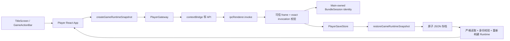

<!-- 文件职责：记录 Player 存读档系统；关键内容：版本化快照、槽位、身份隔离、原子存储和 UI。 -->

# Player 保存与读取实现

> 实现状态：已完成第一阶段。正式 Player 提供 3 个手动存档槽和 1 个独立快速存档槽；
> 主界面可以读取存档，游戏内底栏可以保存、读取、快速保存、快速读取和快进；“选项”
> 已经启用，并使用与存档彼此独立的 `PlayerSettingsV2`；其中也保存中/英文界面偏好。

## 1. 当前用户体验

正式 Player 的主界面按钮按以下顺序纵向排列：

1. 开始游戏
2. 读取游戏
3. CG画廊
4. 选项
5. 退出游戏

五个入口与标题、说明文字和间距被当成一张完整菜单卡统一布局。共享
`useAutoFitScale` 使用 `ResizeObserver` 测量菜单卡的未缩放尺寸与当前容器尺寸，取宽高
缩放比中的较小值并以中心点等比缩放；因此正式 Player、Editor 全屏主界面预览，以及
表单中的 16:9 小预览都会完整显示整张菜单，而不会只压缩某一个按钮或裁掉末项。长标题
会自动换行并作为菜单卡的一部分参与缩放，不会被静默省略；标题页背景仍使用
`object-fit: contain`，缩放菜单不会裁切作者的背景图。

“读取游戏”会打开存档窗口。窗口显示 3 个手动槽和快速存档槽；有内容的槽位会显示
保存时间、场景名和当前对白或状态摘要，空槽不能读取。

进入剧情后，画面最下方固定显示一条操作栏：

- 保存：打开 3 个手动槽；覆盖已有槽位前要求再次确认；
- 读取：显示 3 个手动槽和快速存档槽；读取失败不会改变当前进度；
- 快速保存：直接覆盖独立的 `quick` 槽，并显示成功或失败提示；
- 快速读取：直接读取 `quick` 槽；没有快速存档时显示明确提示；
- 快进：点击按钮切换连续对白推进；短按空格推进一句，长按空格临时快进，松开停止；
- 选项：打开正式 Player 的持久化音量与显示设置；
- 返回标题：结束当前剧情会话、卸载剧情媒体并返回当前游戏的标题页，不触发 Player quit IPC。

存档窗口打开或保存/读取请求进行中时，剧情点击、键盘推进、Choice、视频完成事件和
背景媒体会被暂停或拦截。操作栏按钮自身也会阻止 pointer 事件冒泡，因此点击“保存”
不会顺带推进下一句对白。读取成功后会重新挂载游戏画面，确保 BGM、语音和视频根据
载入进度重新同步。

Editor 的主界面整体预览继续复用同一个 `TitleScreen`，并显示完整的“读取游戏”入口；
点击后只展示预览说明，不会访问磁盘或 Player 用户数据。真实存读档仍只属于正式 Player。

## 2. 功能边界

玩家存档仍与作者项目和导出内容分离；当前版本边界是：

- `project.vn.json` 是 author v19；
- `game.json` 是 runtime v9，Player Reader 兼容 runtime v1–v9；
- 存档在 Player 用户数据目录中使用独立的 `saveVersion: 1`；
- 新写入的进度是 `GameRuntimeSnapshot v4`；v1–v3 仅按各自旧能力受限兼容；
- C++ 作者后端不参与存档，避免把玩家进度写回作者项目；
- `.vngame` 和独立应用的 Resources 仍然只读。

每个游戏的存档由以下身份共同约束：

- `projectId`：区分不同游戏；
- `runtimeVersion`：区分不兼容的 Runtime 语义；
- `contentFingerprint`：当前 `game.json` UTF-8 内容的 SHA-256。

相同内容重新导出后仍可读取原存档；只要游戏语义内容改变，指纹就会改变。旧版本存档
会保留在独立命名空间，当前版本看到的是空槽，不会误读或覆盖旧游标；若存档文件内部
身份被篡改或与其命名空间不一致，则会被明确判定为无效或不兼容。

## 3. 为什么不直接保存整个 `GameRuntime`

运行中的 `GameRuntime` 含有两类数据：

- 必要进度：当前 Scene、节点游标、运行状态、BGM、变量、Repeat 栈、CG 和播放序号；
- 派生显示：完整对白、Choice 文案和正在阻塞的视频 Asset 等。

如果直接 `JSON.stringify(GameRuntime)`，旧存档会长期携带作者文本和派生状态。游戏更新
后，这些内容可能与当前 `game.json` 不一致；Renderer 进程也不应被信任为文件存储的
权威来源。

因此 `@vnengine/runtime` 当前定义独立的 `GameRuntimeSnapshot v4`：

```json
{
  "snapshotVersion": 4,
  "status": "playing",
  "sceneId": "scene-1",
  "nextNodeIndex": 4,
  "backgroundAssetId": "room",
  "bgmAssetId": "theme",
  "bgmSequence": 1,
  "dialogueSequence": 3,
  "videoSequence": 0,
  "cgAssetId": null,
  "cgLeadInMs": 0,
  "cgSequence": 2,
  "characterEffectSequence": 0,
  "characters": [],
  "variables": {
    "affection": 3,
    "route": "A"
  },
  "loopStack": [
    {
      "repeatNodeId": "repeat-1",
      "remainingIterations": 2
    }
  ]
}
```

v4 继续保存 snapshot v3 已有的背景、立绘、活动 CG、规范排序变量表和活动 Repeat，另外
保存全局单调 `characterEffectSequence`，以及每个活动人物的最终 `opacity` 和分层
`effectSequence`；它不保存瞬时 effect，也仍不复制对白文本、Choice 文案或视频 Asset。
读取时 Runtime 会用
当前已验证的 `ProjectDocument` 和预编译控制流核对快照，再从阻塞节点重新构建：

- `playing` 必须停在 Dialogue；
- `playingVideo` 必须停在含有效 Asset 的 Video；
- `waitingCgLeadIn` 必须停在匹配的 CgDisplay root，图片和整数毫秒必须与项目一致；
- `choosing` 必须停在至少含一个选项的 Choice；
- `finished` 的游标必须精确位于 Scene 末尾；
- 变量必须在当前项目逻辑节点中声明，名称/值和总预算必须合法；
- Repeat 栈必须与当前游标所在的嵌套控制结构、root ID、次数上限完全一致；
- 背景和立绘必须能由当前场景节点证明；
- 全局人物特效序号不得小于任一活动人物的分层序号；恢复后瞬时 effect 固定为 `null`，
  避免读档重播，旧 v1–v3 以活动人物最大序号迁移全局计数；
- 缺失 Scene、越界游标、错误状态、未知字段和不可能状态都会被拒绝。

Reader 仍解析 legacy `snapshotVersion: 1/2`。v1 没有变量或循环栈，只能恢复无逻辑的
旧进度；若当前 Scene 的游标前缀包含变量、If/Else、Repeat 或 SceneJump，就会
fail closed，不会猜测缺失状态。先前场景如何进入当前 Scene 不由 v1 快照记录，也不会
被这里误判。v2 能恢复逻辑状态，但没有 CG 字段，因此不能用于含显示 CG 节点的 v8
项目。所有新保存固定写 v3。

保存前 Renderer 用当前 Project 和 Runtime 生成规范快照；Electron Main 再次严格解析快照，
并用当前 Main-owned 游戏会话恢复 Runtime。只有恢复结果可再次生成完全相同的规范快照时，
才允许写入文件。

## 4. 完整调用链



### 4.1 Renderer

[`App.tsx`](../apps/player/src/renderer/App.tsx) 管理标题页、剧情状态、存档窗口、快速操作和
请求世代。打开其它 `.vngame` 时会递增 bundle generation，旧游戏尚未完成的异步请求
不能更新新游戏界面。

[`GameScreen.tsx`](../apps/player/src/renderer/GameScreen.tsx) 把保存窗口和存取期间视为
`interactionBlocked`：暂停媒体、禁止剧情推进，并在读取成功后通过 generation key 重新
挂载媒体组件。底栏、暂停页、结束页和运行错误页中的“返回标题”会丢弃当前内存运行态、
卸载剧情 BGM、语音和视频，再重新挂载当前内容包的标题页；标题页自己的“退出游戏”仍由
宿主决定退出桌面进程或执行 Web 的安全退出行为。

共享的 [`GameActionBar.tsx`](../packages/player-ui/src/GameActionBar.tsx)、
[`SaveSlotDialog.tsx`](../packages/player-ui/src/SaveSlotDialog.tsx) 和
[`TitleScreen.tsx`](../packages/player-ui/src/TitleScreen.tsx) 只接收回调，不接触 Electron、
路径或文件系统，因此 Editor 可以继续安全复用没有存档回调的标题页。

### 4.2 Preload 与 IPC

[`playerProtocol.ts`](../apps/player/src/shared/playerProtocol.ts) 只允许以下存档动作：

- `list-save-slots`
- `save-game`
- `load-game-slot`
- `quick-save`
- `quick-load`

协议只接受固定槽位 `1 | 2 | 3 | "quick"` 和 exact `GameRuntimeSnapshot`，不接受路径、
项目 ID、指纹或任意文件名。Renderer 无权选择存档目录或冒充另一个游戏。

[`preload.ts`](../apps/player/src/preload.ts) 通过 `contextBridge` 暴露业务方法；
[`registerPlayerIpc.ts`](../apps/player/src/main/ipc/registerPlayerIpc.ts) 继续检查可信主 frame、
调用 exact fields 和当前窗口会话。游戏身份只取自 Main 的 `PlayerBundleSession`。

### 4.3 Main 存储

[`PlayerBundleLoader.ts`](../apps/player/src/main/content/PlayerBundleLoader.ts) 在严格验证
`game.json`、manifest 和 Asset 后计算内容指纹；
[`PlayerBundleSession.ts`](../apps/player/src/main/content/PlayerBundleSession.ts) 为每次成功
换包递增 generation。

[`PlayerSaveStore.ts`](../apps/player/src/main/save/PlayerSaveStore.ts) 把存档写到
`app.getPath('userData')/saves` 下。游戏目录名是带命名空间前缀的
`SHA-256(projectId + runtimeVersion + contentFingerprint)`，槽文件名只能是
`slot-1.json`、`slot-2.json`、`slot-3.json` 或 `quick.json`。原始项目 ID、版本和指纹
都不直接参与路径拼接；同一项目的不同内容版本也位于不同物理目录，不会互相覆盖。

写入事务为：

1. 在 0700 的游戏目录创建随机临时文件；
2. 使用 `O_EXCL`、`O_NOFOLLOW` 和 0600 权限打开；
3. 写完整 JSON 并 `fsync`；
4. 再检查活动 bundle generation；
5. 覆盖时先把旧槽原子移动为固定 `.bak`；
6. 把临时文件原子移动为最终槽；
7. 非 Windows 平台同步目录项。

若发布新文件前失败，会恢复旧槽；若进程在两次 rename 之间退出，下一次读取会在最终槽
缺失时使用 `.bak` 恢复可读进度。读取只接受普通、单硬链接、大小不超过 256 KiB 的文件，
使用 `O_NOFOLLOW` 打开，并比较读取前后的 dev、ino、size、mtime 和 ctime。损坏的单个槽
只会从列表中隔离，不会让其它槽或 Player 启动失败。

原始文件系统异常只写入 Main 本地诊断。Renderer 只收到不含路径的稳定中文错误。

## 5. 本地存档格式

每个槽使用独立 JSON：

```json
{
  "format": "vn-engine-player-save",
  "saveVersion": 1,
  "game": {
    "projectId": "example-project",
    "runtimeVersion": 9,
    "contentFingerprint": "64位小写SHA-256"
  },
  "slotId": 1,
  "savedAt": "2026-08-24T06:00:00.000Z",
  "snapshot": {
    "snapshotVersion": 4,
    "status": "playing",
    "sceneId": "scene-1",
    "nextNodeIndex": 4,
    "backgroundAssetId": "room",
    "bgmAssetId": "theme",
    "bgmSequence": 1,
    "dialogueSequence": 3,
    "videoSequence": 0,
    "characters": [],
    "variables": {
      "affection": 3
    },
    "loopStack": [],
    "cgAssetId": null,
    "cgLeadInMs": 0,
    "cgSequence": 0,
    "characterEffectSequence": 0
  }
}
```

Reader 对顶层、`game` 和 `snapshot` 都执行 exact-fields 校验；未来新增字段必须提升
`saveVersion` 或 `snapshotVersion`，不能静默改变既有 v1/v2/v3/v4 语义。

## 6. 技术栈

| 层 | 技术 | 本功能中的职责 |
| --- | --- | --- |
| UI | React 19、TypeScript 5.9 | 标题页入口、游戏底栏、槽位窗口、覆盖确认、busy/toast 状态 |
| 共享组件 | `@vnengine/player-ui` | `TitleScreen`、`GameActionBar`、`SaveSlotDialog`，供 Player 使用并保持 Editor 预览无磁盘能力 |
| 运行时 | `@vnengine/runtime` | 纯函数创建/严格恢复 `GameRuntimeSnapshot v4`，保存变量/循环栈/CG/人物最终视觉状态，并受限兼容旧 v1–v3 |
| 桌面边界 | Electron 43 Main / Preload / sandboxed Renderer | `contextBridge` 窄端口、可信 frame 校验、Main-owned 游戏身份 |
| 本地存储 | Node.js `fs/promises`、`crypto`、`app.getPath('userData')` | SHA-256 命名、随机临时文件、fsync、rename、备份恢复和安全读取 |
| 构建 | Vite 5、Electron Forge 7 | 打包 Main、Preload、Renderer；存档始终位于外部用户目录，不写 asar/Resources |
| 验证 | Vitest、jsdom、Node 临时目录测试 | Runtime round-trip、IPC 拒绝、原子覆盖、损坏隔离、Renderer 交互和媒体生命周期 |

C++20 Backend 仍负责作者项目，而不参与 Player 存档。这一边界让玩家保存功能可以在
通用 Player、embedded 独立游戏和未来 Windows Player 中复用，同时不增加作者工程文件
的写入面。

## 7. 测试覆盖

自动测试覆盖以下关键路径：

- Dialogue、Choice、Video、CG lead-in 和 finished 的 v4 快照创建/恢复，以及旧 v1–v3 兼容；
- 人物最终 opacity、全局/分层特效序号、恢复不重播与 clear→loop 后序号继续单调；
- 从当前 Project 核对背景、BGM、立绘、自定义坐标、变量、Repeat 栈，并重建对白、选项和视频；
- 未声明变量、伪造循环 owner/剩余次数、逻辑路径上的 v1 快照和变量预算超限拒绝；
- 错误 cursor、未知字段、伪造派生状态和 runtimeError 拒绝；
- 3 个手动槽与 quick 槽保存/读取、覆盖和按游戏隔离；
- `game.json` 指纹变化后的独立空命名空间，以及存档内部身份不一致时的拒绝；
- 损坏槽隔离、symlink 拒绝、大小限制和路径不泄漏；
- bundle 切换前后的 generation 检查；
- 标题页读取入口、底栏固定按钮、覆盖确认、快速操作反馈；
- 存取期间 Esc、点击推进、Choice 和视频事件不穿透；
- 读取后媒体组件重新挂载；Editor 只预览存档入口，不调用存档 IPC。

## 8. 当前限制与下一阶段

- Video 存档当前保存“正在播放该视频”，不保存秒级播放位置；读取后从该视频开头播放；
- BGM 和对白语音在读取后重新开始，不保存媒体 currentTime；
- 游戏内容指纹变化后会进入新的空命名空间，旧存档不会自动迁移；当前没有作者控制的
  跨内容版本迁移脚本；
- 存档仅保存在本机，没有 Steam Cloud、iCloud 或跨设备同步；
- 暂未提供删除存档按钮；覆盖手动槽和快速保存可以替换原内容；
- 快进是 `GameScreen` 生命周期内的本地播放策略，不写入项目或存档。进入 Choice 时不会
  自动选择，进入 Video 时不会强制跳过；暂停、打开模态窗口、运行结束、返回标题或失去
  窗口焦点都会取消快进，避免交互穿透。当前选项只保存四路音量和显示偏好，没有
  混入游戏进度快照；完整实现见
[Player 选项系统](./player-options-implementation.md)。
