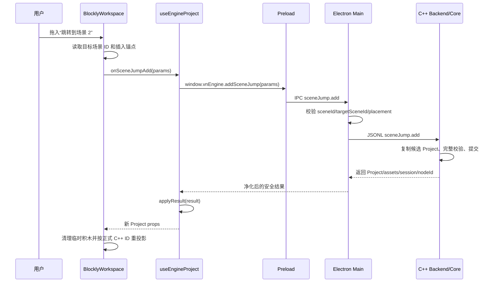

<!-- 文件职责：记录场景跳转积木；关键内容：Author 节点、IPC、Blockly、Runtime 与预览。 -->

# 场景跳转积木实现流程

> 总体技术选型和面试问答见
> [技术栈与面试讲解指南](./technical-stack-interview-guide.md)；正式预览状态机见
> [游戏顺序预览](./game-preview-runtime.md)。

## 技术栈与面试答法

| 部分 | 使用技术 | 关键价值 |
| --- | --- | --- |
| 节点模型 | C++20 `std::variant` | `SceneJumpNode` 成为真正的剧情节点，不是 UI 临时字段 |
| 引用关系 | 稳定 Scene UUID、ProjectAggregate 校验 | 场景改名/排序不影响跳转，删除被引用场景会被拒绝 |
| 文件格式 | nlohmann/json、版本化严格 Reader/Writer | 跳转在 v6 引入；当前 v22 仍严格保存 `targetSceneId` |
| 公共类型 | TypeScript discriminated union | React/Blockly 用 `node.type` 安全缩窄 |
| 跨进程 | contextBridge、Electron IPC、JSONL | 请求逐层校验，C++ 返回完整权威快照 |
| 图形化编辑 | Blockly 13 动态 Dropdown、自定义 Block | 场景列表变化时仍以 ID 绑定目标 |
| 预览 | TypeScript 纯状态机、`Set` 循环检测 | 自动执行跳转并阻止无对白死循环 |
| 测试 | CTest、Vitest、真实 C++ Backend 集成 | 覆盖模型、持久化、协议、积木和运行语义 |

面试中最值得强调的是：一个“跳转积木”横跨领域模型、持久化、跨进程协议、
两套编辑器和运行时。修改文件多不是代码耦合失控，而是每一层都要明确理解
同一个新业务概念，同时 C++ 仍保持唯一数据真相。

## 为什么一个积木需要修改这么多代码

“场景跳转”并不只是 Blockly 画布上的一张积木图片。它会改变游戏剧情的
真实执行顺序，因此必须同时成为：

1. C++ 能理解和校验的剧情节点；
2. 项目文件能够保存和重新读取的数据；
3. Electron 跨进程协议允许传递的类型；
4. 表单编辑器和 Blockly 都能操作的同一份业务数据；
5. 正式游戏预览能够执行的运行时指令。

如果只修改 Blockly，那么跳转只存在于当前页面：切换编辑模式或重新打开
项目就会消失，正式预览也完全不知道它的含义。如果只修改预览，则编辑器
无法创建和保存它。如果不修改 C++ 校验，目标场景被删除后还会留下悬空
引用。

因此这次修改覆盖的文件较多，但每一层只负责自己的边界，没有在多个地方
重复保存项目真相。C++ Project 仍然是唯一权威数据源。

## 总体分层

| 层 | 主要职责 | 关键文件 |
| --- | --- | --- |
| C++ 模型 | 定义 `SceneJumpNode` 和领域不变量 | `engine/include/vnengine/model.hpp`、`project.hpp` |
| C++ Core | 新增、更新、查找跳转节点，保护被引用场景 | `engine/src/core/project.cpp` |
| C++ Backend | 将 JSON 命令翻译为 Core 操作，返回稳定错误码和快照 | `engine/src/backend/backend.cpp` |
| 持久化 | 跳转在 v6 引入；当前 Writer v22、Reader v1–v22 | `engine/src/backend/serialization.cpp` |
| 共享 TypeScript | 描述跨进程 DTO 和命令参数 | `apps/editor/src/shared/projectTypes.ts`、`engineProtocol.ts` |
| Electron 边界 | 校验 Renderer 请求、桥接安全 API、净化 C++ 响应 | `validateEngineInvocation.ts`、`preload.ts`、`backendResponse.ts` |
| React 状态协调 | 串行发送命令并应用完整 C++ 快照 | `useEngineProject.ts` |
| 表单编辑器 | 在剧情列表新增/显示/修改跳转节点 | `useFormEditor.ts`、`ScenePanel.tsx`、`InspectorPanel.tsx` |
| Blockly | 定义积木、投影节点、处理新增/字段修改/重排/删除 | `sceneJumpBlock.ts`、`BlocklyWorkspace.tsx` 等 |
| 预览运行时 | 执行跳转、重置视觉状态、检测循环 | `previewRuntime.ts`、`useGamePreview.ts` |
| 测试 | 锁定模型、协议、积木事件和预览行为 | `engine/tests/**`、`apps/editor/tests/**` |

## 进程之间怎么通信

场景跳转业务通信不使用 HTTP，也不启动业务 Web Server。开发模式仍会使用
Vite dev server 提供 Renderer/HMR；它不承载剧情命令。完整业务通信方式是：

```text
React / Blockly
  │ 调用 window.vnEngine.addSceneJump(...)
  ▼
Preload contextBridge
  │ Electron ipcRenderer.invoke
  ▼
Electron Main
  │ 校验 method 和 params
  ▼
BackendClient
  │ 通过 C++ 子进程 stdin/stdout 发送一行 JSON（JSONL）
  ▼
C++ Backend / Core
```

返回方向相反：C++ 输出一行 JSON，Main 解析并删除不应暴露的字段，Preload
把安全结果交给 React，`useEngineProject` 再用结果中的完整 Project 快照更新
页面。

采用这条边界的原因：

- Renderer 不能直接操作 C++ 内存；
- Renderer 不能直接使用 Node/Electron 的高权限 API；
- Main 可以在请求进入 C++ 前做严格的参数形状校验；
- C++ 继续负责最终业务规则，而不是信任前端；
- 表单和 Blockly 最终都会收到同一份 C++ 快照。

## 完整新增流程

下面以“从 Blockly 工具箱拖入跳转积木”为例。



具体步骤：

1. `sceneJumpBlock.ts` 注册 `vn_scene_jump`，字段值保存目标 Scene ID，界面只
   显示“场景 N · 名称”。积木不保存数组下标，因为场景排序变化后 ID 仍稳定。
2. `BlocklyWorkspace.tsx` 识别用户拖放，计算 `beforeNodeId`，但不把 Blockly
   临时 ID 当成项目 ID。
3. `useEngineProject.addSceneJump` 将操作放入现有 Engine action queue，防止和
   其他新增、删除、保存请求乱序。
4. `preload.ts` 只暴露具名业务方法，Renderer 无法自己选择任意 IPC channel。
5. `validateEngineInvocation.ts` 拒绝缺少目标、类型错误以及同时提供两个锚点
   的请求。
6. `backend.cpp` 创建完整候选 aggregate，并调用 `add_scene_jump_node`。
7. Core 检查来源场景、目标场景、自跳转和插入锚点；只有全部成功才创建
   C++ 权威 ID。
8. Backend 再执行完整 aggregate 校验，之后一次性提交候选并增加 revision。
9. C++ 返回完整 Project。Blockly 清理自己的临时状态，重新使用正式 node ID
   投影，所以画布和磁盘不会形成两份项目数据。

表单编辑器走的是同一条后半段链路。区别只是入口由
`useFormEditor.insertSceneJump` 发起，并在 `InspectorPanel` 中通过下拉框调用
`sceneJump.update`。

## 为什么必须扩展联合类型

C++ 中原本的时间线是：

```cpp
std::variant<Dialogue, BackgroundNode, CharacterNode>
```

加入跳转后成为：

```cpp
std::variant<Dialogue, BackgroundNode, CharacterNode, SceneJumpNode>
```

TypeScript 中同样把 `SceneNode` 扩展为判别联合：

```ts
type SceneNode =
  | DialogueNode
  | BackgroundNode
  | CharacterNode
  | SceneJumpNode;
```

这样改动后，编译器会强制所有消费时间线的地方处理新类型。例如旧代码的
`else` 曾默认“不是对白和背景就一定是人物”，加入跳转后这个假设不再成立。
TypeScript 编译错误因此准确指出了必须迁移的表单列表、Blockly 投影和预览
运行时。这些修改不是冗余，而是在消除会把跳转误当成立绘的运行时错误。

## C++ 领域规则和事务边界

### 新增规则

`add_scene_jump_node` 按以下顺序执行：

1. 来源场景存在；
2. 目标场景存在；
3. 目标不能等于来源；
4. `afterNodeId` 与 `beforeNodeId` 不能同时使用；
5. 插入锚点必须属于来源场景；
6. 所有检查通过后才生成 ID 并插入节点。

失败不会消耗 ID，也不会修改 Project。

### 更新规则

`update_scene_jump_node` 先确认节点确实是 `SceneJumpNode`，再验证新目标。
目标未变化是成功 no-op，不增加 revision。

### 删除场景保护

删除 Scene 前会扫描所有场景中的跳转节点。如果任何节点仍引用目标场景，
返回 `scene_in_use`。这样不会产生：

```text
跳转节点 targetSceneId = 已经不存在的 ID
```

UI 可以先删除跳转节点或把它改到其他目标，再删除场景。

### 为什么 Backend 使用候选对象

新增跳转时不是直接修改当前 aggregate，而是先复制出 candidate：

```text
当前 aggregate
  └─复制→ candidate
             ├─执行新增
             ├─完整验证
             └─成功后整体替换当前 aggregate
```

即使将来出现 ID 碰撞或新增跨节点不变量，失败也不会让当前内存项目处于
“改了一半但 revision 没变”的状态。

## 项目文件为什么升级到 v6

v5 的严格格式只认识对白、背景和人物节点。若继续把新字段写成 v5，会出现
两个问题：

- 旧程序打开文件时不知道 `sceneJump` 是什么；
- 文件声明自己是 v5，但实际结构已经不是 v5，版本号失去意义。

场景跳转功能完成时 Writer 固定写 v6，Reader 接受 v1–v6；之后音频升级为 v7、
视频节点升级为 v8。完整现状见视频文档。v6 当时的演进关系是：

```text
v1–v2：对白时间线
v3：增加背景节点
v4：背景允许 null（清除背景）
v5：增加人物立绘节点
v6：增加场景跳转节点
```

`serialization.cpp` 对 v6 跳转节点严格要求：

```json
{
  "id": "jump-node-id",
  "type": "sceneJump",
  "targetSceneId": "scene-2"
}
```

缺字段、多字段、字段类型错误、目标不存在或自跳转都会被拒绝。项目打开先在
局部 candidate 中完成解析和校验，失败不会替换当前已经打开的项目。

## C++ 快照如何投影到两套编辑器

### 表单编辑器

- `ScenePanel.tsx` 根据 `node.type` 显示“跳转场景”和目标编号；
- `useFormEditor.ts` 在插入前先提交当前对白草稿，防止完整 Project 响应覆盖
  尚未提交的输入；
- `InspectorPanel.tsx` 排除当前场景，提供其他场景的下拉选项；
- 修改选项调用 `sceneJump.update`，不直接修改 React 中的 Project。

### Blockly

- `projectSceneToWorkspace.ts` 把 `SceneJumpNode` 创建为 `vn_scene_jump`；
- `setSceneJumpBlockOptions` 根据当前 Project 生成动态场景列表；
- `sceneJumpBlockEvents.ts` 只把正式节点的最终下拉变化翻译成更新命令；
- `dialogueBlockEvents.ts` 的通用重排识别跳转积木；
- `blockSelection.ts` 把它纳入框选；
- `EngineTrashcan.ts` 把它纳入 backend-first 删除；
- `blockEditorLayout.ts` 把它视为完整剧情链的一部分；
- `toolbox.ts` 只有在项目至少存在两个场景时才提供跳转积木。

之所以需要修改这些通用 Blockly 文件，是因为“能显示”不等于“是完整可用的
剧情积木”。如果少改其中某项，会分别出现不能框选、不能删除、不能重排、
布局根节点识别失败等不一致行为。

## 正式预览如何执行跳转

旧的 `advanceGamePreview` 只接收一个 Scene，因此天然无法找到另一个 Scene。
现在它接收完整 Project，并把运行位置表示为：

```ts
{
  sceneId,
  nextNodeIndex,
  backgroundAssetId,
  characters,
  dialogue,
  status,
}
```

玩家点击时，运行时从 `sceneId + nextNodeIndex` 继续向后自动处理视觉节点，
直到遇到下一句对白才暂停。执行跳转时：

```text
sceneId          = targetSceneId
nextNodeIndex    = 0
background       = 目标场景初始背景
characters       = 空
dialogue         = 空
```

然后继续自动执行目标场景开头的背景和人物节点，直到遇到对白。人物清空是
明确的场景边界语义，避免上一场景的立绘意外泄漏到新场景。

### 为什么没有跳转就停止

`project.scenes` 的数组顺序主要服务编辑器场景列表，不等于游戏控制流。如果
场景末尾自动进入数组中的下一个场景，那么用户调整列表顺序就可能静默改变
剧情。因此只有显式跳转节点才能改变 Scene；没有跳转时返回 `finished`。

### 循环保护

跳转可能形成：

```text
场景 1 → 场景 2 → 场景 1
```

如果循环途中没有对白，单次 `advance` 永远不会把控制权还给玩家。运行时用
`Set<sceneId:nodeIndex>` 记录本次自动执行访问过的位置，再次访问相同位置就
返回 `runtimeError`。如果循环中有对白，则每次遇到对白都会结束当前 advance，
玩家仍可控制，所以不会被误判为死循环。

## 关键错误码

| 错误码 | 含义 |
| --- | --- |
| `scene_not_found` | 来源场景不存在 |
| `target_scene_not_found` | 目标场景不存在 |
| `scene_jump_node_not_found` | 要修改的节点不是有效跳转节点 |
| `scene_jump_self_target` | 跳转到节点所在场景 |
| `scene_jump_placement_conflict` | 同时传了 after/before 锚点 |
| `node_not_found` | 时间线插入锚点不存在 |
| `scene_in_use` | 目标场景仍被跳转节点引用，不能删除 |

错误由 C++ 最终决定。Main 的 TypeScript 校验用于尽早拒绝错误 JSON 形状，
但不会替代 C++ 领域校验。

## 主要源码调用关系

### 新增或更新跳转

```text
ScenePanel / BlocklyWorkspace
  → useFormEditor 或 useEngineProject
  → window.vnEngine.addSceneJump / updateSceneJump
  → preload.ts
  → validateEngineInvocation.ts
  → BackendClient JSONL
  → backend.cpp
  → project.cpp
  → success_response(Project 快照)
  → backendResponse.ts
  → useEngineProject.applyResult
  → Form/Blockly 重新渲染
```

### 保存和打开

```text
ProjectAggregate(SceneJumpNode)
  → project_file_to_json
  → v6 project.vn.json
  → project_file_from_json
  → validate_project_aggregate
  → ProjectAggregate
```

### 正式预览

```text
开始按钮
  → prepareCurrentEdits
  → 获取最新 C++ Project 快照
  → startGamePreview(entrySceneId)
  → advanceGamePreview(Project, Runtime)
  → SceneJumpNode 改变 sceneId
  → 遇到 Dialogue 后等待下一次点击
```

## 自动测试覆盖

### C++ Core

- 新增跳转和更新目标；
- 同值更新不产生变更；
- missing target、自跳转和错误锚点不修改项目；
- 被引用 Scene 无法删除；
- aggregate 拒绝悬空目标。

### C++ Backend / 持久化

- `sceneJump.add/update` 命令返回正式 node ID；
- 错误码稳定；
- v6 来源文件打开后，保存为 v22 并重新打开仍保留目标 ID；
- v1–v21 均能读取并升级为当前 v22 写出格式；
- 非法打开不替换当前项目和 session。

### TypeScript / Electron

- Main validator 接受正确参数并拒绝冲突参数；
- Preload 方法映射到正确 method；
- Backend response 能验证并净化 `sceneJump` 节点；
- C++ 未知字段不会直接穿透给 Renderer。

### Blockly / 预览

- 跳转积木字段事件只作用于正式节点；
- 跳转积木不会被误认成新对白；
- 没有跳转时场景末尾结束；
- 跳转进入目标场景并重置人物/加载背景；
- 无对白跳转循环返回运行错误。

## 开发环境排错：为什么代码正确但旧窗口一直报错

场景跳转同时新增了 Preload API 和 C++ Backend method。Vite 可以热更新
Renderer 组件，但下面两部分不会随 React 热更新自动替换：

- 已加载进当前窗口的 Preload 脚本；
- Electron Main 已经启动的 C++ 子进程。

因此，在开发中第一次加入 `addSceneJump/updateSceneJump` 后，如果只等待页面
热更新，可能出现：

```text
window.vnEngine.addSceneJump is not a function
```

或旧 C++ 返回：

```text
unknown method: sceneJump.add
```

这不代表 Project 数据损坏。应完整退出所有编辑器窗口和旧 Electron 进程，
然后从仓库根目录重新执行启动命令。`pnpm start` 会先构建最新 C++ Backend，
再启动 Electron。Renderer 也会把这两类旧模块错误转换成明确的重启提示。

## 产品规则

- 场景不会按 `project.scenes` 数组顺序自动播放。
- 只有时间线执行到显式 `SceneJumpNode` 时，才切换到目标场景。
- 跳转后清空上一场景人物层，加载目标场景初始背景，并从目标场景第一个节点继续执行。
- 目标场景开头的背景、立绘、连续跳转会自动执行；遇到对白才等待玩家点击。
- 当前阶段不允许跳转到节点所在的同一场景，避免最直接的无意义循环。
- 跨场景无对白循环由预览状态机检测并显示运行错误。

## 数据模型

```cpp
struct SceneJumpNode {
  std::string id;
  std::string target_scene_id;
};

using SceneNode = std::variant<
  Dialogue,
  BackgroundNode,
  CharacterNode,
  SceneJumpNode>;
```

磁盘 v6：

```json
{
  "id": "jump-node-id",
  "type": "sceneJump",
  "targetSceneId": "scene-2"
}
```

这一阶段 Reader 接受 v1–v6、Writer 写 v6；当前 Reader 接受 v1–v22、Writer
写 v22。Project/Scene `schemaVersion` 仍保持 1。

## C++ 命令

```text
sceneJump.add {
  sceneId,
  targetSceneId,
  afterNodeId?,
  beforeNodeId?
}

sceneJump.update {
  sceneId,
  nodeId,
  targetSceneId
}
```

删除与重排继续复用 `timeline.deleteMany/reorder/reorderMany`。删除被任何跳转节点引用的场景时返回 `scene_in_use`，且 Project/revision 不变。

## Blockly

积木外观：

```text
切换到场景 [场景 2 ▼]
```

- 下拉框保存 `targetSceneId`，显示“场景 N”以及自定义名称。
- 工具箱中的新积木默认指向第一个其他场景。
- 项目只有一个场景时不提供可提交目标。
- 场景列表或名称更新后重新投影/更新 toolbox。
- 单拖、框选、Delete、垃圾桶和组重排继续使用通用时间线操作。

## 预览状态机

`advanceGamePreview` 改为接收完整 Project。遇到跳转节点时：

```text
sceneId = targetSceneId
nextNodeIndex = 0
backgroundAssetId = targetScene.backgroundAssetId
characters = []
dialogue = null
```

单次 advance 使用 `Set<sceneId:nodeIndex>` 记录自动执行位置。在再次遇到同一位置且尚未出现对白时返回 `runtimeError`，防止 `场景1→场景2→场景1` 卡死。

## 验收

1. 没有跳转节点时，入口场景末尾直接结束。
2. 场景 1 的跳转积木可选择场景 2。
3. 预览执行到跳转后进入场景 2，并停在其第一条对白。
4. 跳转后场景 1 人物层全部清空。
5. 场景 2 初始背景和开头视觉节点正确执行。
6. 连续 `1→2→3` 可自动执行。
7. 无对白自动循环安全报错。
8. 删除被引用场景会失败且不改变项目。
9. 保存重开后目标 Scene ID 不变。
10. 在跳转功能引入时，v1–v5 文件会保存为 v6；当前 Reader 支持
    v1–v22，Writer 固定保存为 v22。
