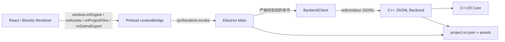

# VN Engine 技术栈与面试讲解指南

本文是当前项目的面试总入口。它回答三个问题：项目用了什么技术、各部分
为什么这样设计、一次操作如何穿过所有进程。具体实现细节继续查看：

- [当前架构](./architecture.md)
- [项目文件夹与媒体资源](./project-folder-storage.md)
- [人物立绘](./character-portrait-implementation.md)
- [游戏顺序预览](./game-preview-runtime.md)
- [场景跳转](./scene-jump-implementation.md)
- [语音与背景音乐](./audio-implementation.md)
- [视频播放积木](./video-playback-block.md)
- [选项分支](./choice-branch-implementation.md)
- [CG 画廊](./cg-gallery-implementation.md)
- [独立游戏导出与 Player](./game-export-player.md)
- [Web Player ZIP 导出](./web-player-export.md)
- [Player 保存与读取](./save-load-implementation.md)
- [Player 选项系统](./player-options-implementation.md)

## 1. 30 秒项目介绍

这是一个面向视觉小说的桌面编辑器。界面使用 Electron、React、TypeScript
和 Blockly；剧情模型、项目校验、文件格式和资源导入由 C++20 负责。
Electron Main 启动每个窗口独立的 C++ 子进程，双方通过 stdin/stdout 上的
JSON Lines 协议通信，而不是 HTTP。C++ 返回完整权威快照，表单编辑器和
图形化编辑器都只是在同一份 Project 上提供不同操作方式。

项目目前支持：

- 场景、对白、背景切换、人物立绘、阻塞式视频、选项分支和显式场景跳转；
- Editor 默认进入排在“场景 1”之前的软件托管主界面，可用表单或固定 Blockly 结构配置
  独立游戏标题、背景图片和背景音乐，并预览完整标题页流程；
- 独立的软件托管 CG 画廊编辑场景：表单手动新增/删除页面并编辑固定九槽，Blockly
  由作者从工具箱拖入每页大模块；空项选择“无”，资源面板点击不直接加入；
- 表单编辑与 Blockly 图形化编辑；作者可用编号“延伸”积木主动拆分长剧情；
- 分类剧情 Toolbox、变量 Set/Change、可嵌套 If/Else 和固定次数 Repeat；表单以只读树
  展示逻辑，正式预览执行真实变量和控制流；
- 项目文件夹保存、打开和未保存状态；
- PNG/JPEG/WebP 图片、MP4/WebM 视频与 MP3/WAV/Ogg 音频安全导入；
- 对白语音和时间线 BGM，正式预览使用独立双音轨控制器；
- 正式顺序预览、阻塞式视频/选项、鼠标/键盘推进和跳转循环检测；
- 共享 Runtime/Player UI、v16→runtime v7 `.vngame` 目录导出和通用 Player；
- Player 兼容 runtime v1–v7，v7 标题页渲染独立标题、自定义背景、循环标题音乐，以及固定的
  正式 Player 的“开始游戏 / 读取游戏 / CG 画廊 / 选项 / 退出游戏”入口；
  读取游戏使用 3 个手动槽和独立快速槽；选项支持四路音量、窗口/全屏和三档窗口尺寸；
  画廊每页固定九格，支持分页、点击放大和 Esc 返回；
- macOS Editor 本地每游戏 `*-macOS.zip` 导出（内含唯一已签名 `.app`）、embedded
  Player，以及通用/每游戏三平台 GitHub Actions 发布门禁；
- 可部署到 HTTP/HTTPS 静态站点的 `*-Web.zip`：复用 Runtime/Player UI，以 Fetch 加载
  内嵌内容，并在 IndexedDB 保存浏览器存档和选项；
- 原子清单保存、IPC 权限收窄和真实 C++ 集成测试。

### 两分钟回答模板

> 我做的是一个视觉小说桌面编辑器。界面层选 Electron、React 和 Blockly，
> 因为它们适合复杂表单与可视化拖拽；剧情模型放在 C++20 Core 中，用
> `std::variant` 表达普通剧情、变量、paired logic markers 与作者专用
> `StoryExtensionNode`。Renderer 不直接改
> Project，而是经 contextBridge 和 Electron IPC 到 Main，再由 Main 通过 JSONL
> 请求 C++；C++ 校验成功后返回完整快照，所以表单和 Blockly 不会产生两份真相。
> 主界面在场景选择器里排在剧情场景之前，但它是 Editor 托管的 synthetic scene，
> 不写进 `project.scenes`；固定根积木编辑独立游戏标题并包裹背景图片和背景音乐积木，拖入资源后通过
> `startScreen.update` 原子更新项目级配置。
> CG 画廊使用另一个 synthetic scene，表单和独立 Blockly 页模块共同编辑
> `project.cgGallery.pages[].imageAssetIds`；页面至少一项，每页精确九个可空槽位，
> 非空图片 ID 跨页唯一，由 `cgGallery.update` 原子校验并提交。
> 剧情逻辑在权威扁平时间线中用 owner ID 配对，Blockly 投影为 C 形 If/Else 和 Repeat；
> 新增、整棵删除和整体重排都由 C++ 专用命令原子完成，表单只显示缩进树。
>
> 文件层采用项目文件夹：文本在固定 `project.vn.json`，二进制媒体在 assets。
> 图片、视频和音频由 C++ 用文件句柄、magic bytes 和流式复制安全导入；保存时先发布
> 资源，最后原子替换 manifest，失败不会截断旧项目。Renderer 没有 Node 权限，
> 也拿不到本机路径，图片、音频和视频通过带 capability token 的 `vn-asset://` 协议读取。
> 测试上用 CTest 覆盖领域和文件事务，用 Vitest 覆盖 IPC、Blockly 和预览状态机，
> 并有启动真实 C++ 子进程的 JSONL 集成测试。
>
> 游戏导出复用既有 C++ 保存链冻结 v16 和 revision；Editor Main 再严格编译
> runtime v7，只复制剧情、主界面与 CG 非空槽引用媒体，并通过同盘 staging、SHA-256 和原子
> rename 发布。Player 兼容 runtime v1–v7；标题音乐由标题页独立控制，进入剧情
> 后停止，不会与剧情 BGM 共享生命周期；runtime v5 扁平 CG 会分块补空槽，v1–v4
> 迁移为一张全空页。
> 通用 Player 通过 Main 原生目录选择器打开 `.vngame`，候选完整验证后才切换会话，
> Renderer 始终拿不到路径。玩家存档同样不信任 Renderer 提供路径或游戏身份：
> Renderer 只发送版本化的小型进度快照，Main 用当前 bundle 的 projectId、runtimeVersion
> 和 game.json SHA-256 恢复校验，再通过临时文件、fsync、备份和 rename 发布固定槽。
> 当前 `GameRuntimeSnapshot v2` 保存变量和 Repeat 栈；旧 v1 只兼容未经过逻辑的历史进度。
> Player 选项是另一份独立的 `PlayerSettingsV2`：Renderer 只发送 exact 非空 patch，
> Main 在 `userData` 原子保存设置并拥有窗口控制。四路有效音量统一按
> `master × channel` 计算，更新 `volume` 而不重建音轨；窗口预设会限制在当前 Display
> workArea 内并同步操作系统原生全屏状态。中英 Player 外壳由 typed catalog 与 React
> Context 即时切换，旧设置 v1 严格迁移为中文；作者剧情文本保持原文。它不改变
> author v16、runtime v7 或存档快照。
> 独立应用模式在 macOS 使用平台/架构严格匹配的 Player
> 模板，先在私有目录注入 `Resources/game`，再改显示名/ID/版本、ad-hoc 签名；随后
> 用 `ditto` 生成 `*-macOS.zip`，在另一私有目录解压并复验唯一 `.app` 的签名，最后
> 以单个文件、无覆盖方式发布。为兼容
> Electron Helper，本地模板内部的 `CFBundleName`/`CFBundleExecutable` 仍保持
> `VN Engine Player`。Windows/Linux 和正式图标/签名由目标 runner 的可复用 workflow
> 重新构建。流水线代码已经完成，但受保护 Environment、真实凭据 runner 执行和
> 干净机器正式发布尚未验收。

## 2. 技术栈总表

| 部分 | 技术栈 | 在项目中的职责 |
| --- | --- | --- |
| 桌面应用 | Electron 43 | 窗口、原生菜单、文件选择器、Main/Preload/Renderer 进程边界 |
| UI | React 19、React DOM | 编辑器组件、状态协调、表单、资源条与预览界面 |
| 前端语言 | TypeScript 5.9 | 判别联合、IPC DTO、编译期约束和纯状态机 |
| 共享运行时 | pnpm workspace、`@vnengine/runtime` | 无 React/DOM/Node/Electron 的剧情 reducer，供 Editor 与 Player 复用 |
| 播放器 UI 原语 | `@vnengine/player-ui`、React ports | 舞台、视频和双音轨控制；媒体 URL 由宿主 Gateway 注入 |
| 图形化编辑 | Blockly 13.1 | 分类 Toolbox、变量与 C 形逻辑、编号延伸分页、主界面固定积木树，以及固定九槽 CG 页模块 |
| 样式与画面 | HTML、CSS | 背景、立绘、对白框及编辑器布局；当前没有使用 Canvas/Pixi |
| 本地业务核心 | C++20、STL | ProjectAggregate、领域规则、ID、revision 和事务性修改 |
| C++ 构建 | CMake 3.20+ | Core、Backend、测试目标和 Release 后端安装 |
| JSON | nlohmann/json 3.11.3 | 只用于 C++ Backend 的协议和项目文件边界 |
| 进程通信 | Electron IPC + JSONL | Renderer→Main 使用 IPC；Main→C++ 使用带请求 ID 的逐行 JSON |
| 文件系统 | Electron dialog、Node `fs`、C++ OS 文件 API | 项目目录、临时工作区、流式复制、fsync 和原子替换 |
| Runtime 导出 | TypeScript strict parser、Node streams、SHA-256 | 已保存 v16→runtime v7、严格逻辑结构、资源闭包与 staging 原子发布 |
| 安全资源读取 | Electron 自定义 `vn-asset://` 协议 | 用 capability token 加载图片/音频/视频，用 Range 播放音频和视频且不暴露路径 |
| 独立 Player | Electron、`vn-game-asset://`、原生目录选择器 | 候选先校验后 commit，成功换包轮换 token，失败保留旧包 |
| Player 选项 | `PlayerSettingsV2`、typed i18n catalog、React Context/模态层、Node `fs`、Electron BrowserWindow/Display | 中英外壳即时切换、v1迁移、四路音量预览、exact patch IPC、userData 原子持久化、workArea 与原生全屏同步 |
| Editor 本地化 | `EditorSettingsV1`、typed catalog、React Context、Blockly 动态字段、Electron IPC、Node `fs` | 顶栏中英切换、全窗口广播、原生菜单/对话框同步、作者内容不翻译、设置原子持久化 |
| 独立应用导出 | exact Player template、私有 staging、`plutil`、`codesign`、`ditto` | macOS 先组装/签名，再 ZIP、私有解压验签，失败不覆盖已有 ZIP |
| Web Player 导出 | Vite、Fetch、Web Crypto、IndexedDB、Fullscreen API、yazl/yauzl | 相对路径静态模板、同源内容加载、浏览器存档/设置、跨平台 ZIP 生成和复验 |
| 前端构建 | Vite 5、Electron Forge 7、pnpm | 构建时 metadata/icon/extraResource 与通用、embedded 两种 Player |
| 发布流水线 | GitHub Actions reusable workflow、protected Environment、build receipt、SHA-256/GPG | 三平台在原生 runner 构建；签名/图标/GPG key 只来自 Environment Secrets；缺正式凭据不允许 unsigned fallback |
| 自动测试 | Vitest 3、CTest | TS 单元/集成测试与 C++ Core/Backend/文件系统测试 |
| 静态质量 | TypeScript typecheck、ESLint、编译器 warnings | 类型、代码规范和跨平台 C++ 警告检查 |

开发命令当前通过 Node.js 24 执行；正式 Electron 应用使用 Electron 自带的
Node 运行时，不要求最终用户安装 Node.js。

## 3. 总体架构



项目不建立业务 API 的 HTTP 服务。Electron Main 和 C++ 是同一台电脑上的
一对一父子进程，JSONL 已经足以提供异步请求、错误传播和请求 ID 关联，同时
减少业务端口、鉴权、服务发现和进程清理等额外复杂度。开发时 Vite 仍使用本地
HTTP/WebSocket 提供 Renderer 页面和 HMR，但它不承载项目业务命令。

## 4. 各部分使用的技术栈

### 4.1 C++ 领域模型

使用技术：C++20、`std::variant`、`std::optional`、STL 容器、CMake。

核心结构是：

```cpp
using SceneNode = std::variant<
    Dialogue,
    BackgroundNode,
    CharacterNode,
    SceneJumpNode,
    BgmNode,
    VideoNode,
    ChoiceNode,
    StoryExtensionNode>;

struct ProjectAggregate {
  Project project;
  std::vector<Asset> assets;
};
```

`Project` 还持有项目级 `StartScreen`，其中标题是独立于项目名的非空文本，背景图片和
音乐则是可空 Asset ID。它不是剧情 `SceneNode`：标题页先于剧情运行，但不会参与
`Scene.nodes` 顺序或场景跳转。C++ 在一次候选提交中校验标题非空、背景只能引用
image、音乐只能引用 audio；非法输入不产生部分修改，相同配置是 no-op。

`std::variant` 表达普通剧情、变量、控制 root/marker 与作者专用延伸节点，避免用一个
大对象加很多可空字段；导出前只过滤延伸。`ProjectAggregate` 把 Project 和 Asset 清单放在同一个一致性边界中，
因此背景或人物引用不存在的图片时，C++ 可以在提交前整体拒绝。

ChoiceNode 内部使用 `std::vector<ChoiceOption>`；Option 有独立稳定 ID、非空文案
和目标 Scene ID。它是父节点的子实体，不是独立 SceneNode。

面试回答重点：C++ 是业务真相，不是为了替代 React 渲染。它负责领域不变量、
文件兼容，以及独立 Player、导出工具和未来原生 Runtime 可复用的剧情数据。

### 4.2 C++ Backend 与 JSONL

使用技术：C++20、nlohmann/json、stdin/stdout、请求 ID、JSON Lines。

每个请求是一行 JSON：

```json
{"id":1,"method":"timeline.reorder","params":{"sceneId":"s1","nodeId":"n1","beforeNodeId":null}}
```

每个响应也只有一行。Main 通过 `id` 找到对应 Promise。stdout 专用于协议，
日志写 stderr，避免日志破坏 JSON 解析。

Backend 把 JSON 参数翻译为 Core 操作。重要修改会先验证或构造候选对象，只有
完整成功才提交，并按真实变化更新 `revision`；no-op 不增加 revision。

### 4.3 Electron Main、Preload 与 IPC

使用技术：Electron Main/Preload、`contextBridge`、`ipcRenderer.invoke`、
原生 `dialog`、Node child process。

调用链：

```text
React action
  → window.vnEngine.addCharacter(...)
  → preload.ts
  → Electron IPC
  → registerEngineIpc.ts
  → BackendClient.request(...)
  → C++ JSONL
```

安全配置包括：

- `contextIsolation: true`；
- `nodeIntegration: false`；
- `sandbox: true`；
- Renderer 只能调用 Preload 暴露的具名方法；
- Main 同时校验调用来源、method 和 params；
- C++ 响应在 Main 再按公开 DTO 白名单重建；
- 禁止编辑器导航到外部页面或创建继承权限的新窗口。

面试回答重点：TypeScript 类型只在编译期存在，IPC 对面可能是被篡改的运行时
数据，所以 Main 仍然必须做运行时校验。

### 4.4 React 状态协调

使用技术：React Hooks、TypeScript、Promise、`async/await`、`useRef`。

`useEngineProject` 持有当前 Project、公开 Assets 和文件会话状态。修改命令通过
Promise 队列串行发送；成功后应用 C++ 返回的完整快照，失败时不乐观修改项目。

Editor 另持有当前 surface（主界面、CG 画廊或剧情 Scene）的 UI 状态。新建、打开或
首次加载项目后默认选择主界面；两个软件页面使用保留 synthetic scene ID，不进入 C++
场景集合。切换 surface 前会先提交主界面草稿或等待 CG 页面更新，沿用统一的 Engine Promise 队列。

保存、打开、导入或开始预览前，`App` 会先提交当前编辑模式的可见草稿：

```text
图形模式：Blockly 活动字段（含主界面标题/CG 固定槽）→ 项目名称草稿
表单模式：当前表单草稿（含主界面标题/CG 固定槽）→ 项目名称草稿
二者随后：等待 Engine action queue → 文件操作或正式预览
```

React StrictMode 在开发环境会重复执行 effect。启动初始化使用 hook 实例内的
`useRef<Promise>` 复用同一个 pending 请求；没有使用模块全局 Promise，因为
多个编辑器窗口必须连接各自独立的后端项目。

### 4.5 表单编辑器

使用技术：React 受控组件、TypeScript 判别联合、局部草稿、纯预览归约函数。

左侧时间线同时展示对白、背景、人物、BGM、视频、选项和跳转。选中节点后根据 `node.type`
显示不同检查器。输入中的内容先是 React 草稿，提交后才进入 C++。导航、保存、
导入和模式切换都必须先 commit 草稿，失败则停止下一步操作。

表单模式不会提供“+ 视频”，但会显示、修改、移动和删除由 Blockly 创建的
VideoNode，确保两种编辑方式仍然读取同一条权威时间线。
ChoiceNode 同样可以在表单时间线中查看、移动和删除，但选项内容与目标只读，
创建和内部编辑集中在图形化模式。

人物节点的“具体坐标”只在表单中以画面百分比 X/Y 编辑；`null` 继续使用左/中/右
预设。Blockly 不暴露数值，存在坐标时只把位置字段投影为“自定义”。预览与 Player
共享同一 `VisualStage` 定位逻辑。

### 4.6 Blockly 图形化编辑

使用技术：Blockly 13、自定义 Block、动态 Toolbox、DragStrategy、Blockly
事件、DOM Pointer Events、React 组件封装。

C++ 快照会投影成对白、背景、人物、BGM、视频、选项、跳转、变量和控制积木。Blockly 不是第二个数据库：
新增、字段修改、删除和重排都会转换成 typed Engine 命令，然后等待 C++ 新快照
重新投影。

自定义交互包括：

- 单块拖动与 `timeline.reorder`；
- 长按框选、多选组拖与 `timeline.reorderMany`；
- Delete、Backspace 和自定义垃圾桶；
- 图片拖入背景/人物积木的白色资源槽；
- 音频拖入对白/BGM 槽，视频拖入 VideoNode 白色资源槽；
- ChoiceNode 使用 statement input 包含专用连接类型的 ChoiceOption，支持内部字段编辑和重排；
- If/Else 与 Repeat 使用 C 形 statement input；底层 paired markers 不直接显示，控制结构
  通过专用原子 add/delete/reorder 命令整体变更；
- 作者从 Toolbox 插入向下开放的“延伸”页首决定横向分段位置；编辑白色数字字段会原子移动整页，显式跳转也会直接截段；
- 每场景独立保存画布根位置、缩放和滚动位置；
- 较小连接吸附半径，只有靠近连接点才出现连接预览。

“延伸”从作者项目 v12 起就是带稳定 ID 的编辑节点，可从 Toolbox 创建和删除；它自身不做
单块拖动，数字输入会移动它及其后直到下一延伸前的整段，并按权威时间线重新编号。
表单会隐藏它，Compiler 会在生成 runtime v7 前剥离，因此它没有游戏运行行为。

剧情 Toolbox 按剧情、逻辑、变量、音乐和图片分类。变量、If/Else、Repeat 可嵌入普通
剧情和其它控制积木，最大嵌套 16 层；Repeat 为 1–1000 次。表单把隐藏 markers 还原成
Then/Else/body 缩进树，只读显示逻辑摘要；条件和值仍在 Blockly 修改。完整实现见
[逻辑 Blockly 实现](./logic-blockly-implementation.md)。

主界面提供表单和独立 Blockly 工作区；Blockly 固定投影为“主界面游戏名根积木 → 背景图片
→ 背景音乐”。三个积木均不可移动、删除或改写结构，也没有 Toolbox；根积木包含白色
标题输入，两个资源子积木使用白色下拉框，第一项固定为“无”，并保留对应类型资源拖放。
表单模式提供同样的标题输入、两个白色选择框和标题页设计预览。两种视图都只操作 C++ 快照中的
`project.startScreen`，切换视图前会等待活动更新完成。

CG 画廊有自己的表单与 Blockly 工作区，而不是混入剧情 Toolbox。表单提供“新增一页/
删除本页”、页选择、固定九格预览和九个图片下拉框；Blockly 中作者从 CG Toolbox
拖入一个大模块才新增页面，已提交页模块不可移动，并且不能删除最后一页。每个模块固定
九个白色图片下拉框，“无”会把该槽保留为 `null`，不会压缩后续槽位。页码由
`project.cgGallery.pages` 顺序投影；非空图片 ID 跨页唯一，同一图改选到新槽时表现为移动。
资源面板在 CG 模式只展示素材，点击/拖拽不会直接加入。两种视图都通过
`cgGallery.update` 一次性提交完整页面数组。

布局数据属于编辑器视图状态，不进入剧情 Project，避免 UI 坐标和游戏执行顺序
形成两个业务真相。

### 4.7 项目文件夹与安全保存

使用技术：Electron 原生目录选择器、Node 文件 API、C++ 序列化、临时文件、
流式复制、`fsync`、原子 rename/replace。

项目格式：

```text
项目名/
├── project.vn.json
└── assets/
    ├── images/
    ├── videos/
    └── audio/
```

保存不是直接覆盖 JSON：先生成完整新清单和资源，资源先发布并持久化，最后才
原子替换 `project.vn.json`。清单是 commit marker；失败时旧清单仍引用完整旧
资源，最多留下未被清单引用的安全孤立文件。

未保存项目导入媒体时，每个窗口使用 Main 私有临时工作区。第一次保存才把
资源和清单安全发布到正式项目文件夹。

当前 Writer 写 `fileVersion: 16`，Reader 支持 v1–v16。v9 曾新增 ChoiceNode 的
严格嵌套 options；v10 新增 `project.startScreen` 背景/音乐，v11 新增独立 `title`。
读取 v1–v9 时媒体迁移为 `null`，读取 v1–v10 时标题从 `project.name` 迁移；v12
新增作者手动延伸节点，v13 为人物节点新增可空百分比坐标，v14 以扁平图片 ID 数组
新增项目级 CG 画廊。v15 改为至少一页、每页精确九个 `string | null` 的固定槽结构。
读取 v14 时按顺序每九张分块并补 `null`，读取 v1–v13 时生成一张全空页；下一次保存
v16 新增变量、严格条件 AST 和 If/Else/Repeat paired markers。下一次保存统一写 v16，
未来版本仍被拒绝。

### 4.8 图片、视频与音频导入

使用技术：Electron file dialog、C++ OS 文件句柄、magic bytes、流式 I/O、
no-follow/no-clobber、Asset ID。

Renderer 只表达 `importImage()`、`importVideo()` 或 `importAudio()`，不传任何路径。Main 通过
原生对话框得到源路径，再把 Main 私有路径交给 C++。

C++ 检查常规文件、链接、大小、扩展名和文件头；在同一文件句柄上验证并流式
复制，复制前后复核源快照。临时目标独占创建，正式发布禁止覆盖。

图片支持 PNG/JPEG/WebP；视频支持 MP4/WebM；音频支持 MP3/WAV/Ogg。
三者都能安全导入、保存和重开。正式预览通过 Range 响应播放音频和视频。

### 4.9 安全图片、音频与视频读取

使用技术：Electron 自定义 protocol、capability token、每窗口独立 session、
流式 Response、CSP。

React 获得的不是 `file://` 和磁盘路径，而是：

```text
vn-asset://image/<project-generation-token>/<opaque-asset-token>
vn-asset://audio/<project-generation-token>/<opaque-asset-token>
vn-asset://video/<project-generation-token>/<opaque-asset-token>
```

Main 只允许当前窗口、当前项目代际且存在于私有 manifest 的资源。音频和视频
支持 HEAD、GET 和单段 Range 的 200/206/416 响应。切换项目会轮换 token，使旧
URL 自动失效；Renderer 无法把任意本机路径拼成可读取 URL。

### 4.10 主界面、CG 画廊、背景、人物、场景跳转和选项

使用技术：C++ `std::variant`、TypeScript discriminated union、统一时间线、
纯 reducer、Blockly 自定义积木。

- 背景节点从当前位置开始生效，直到下一个背景节点；`assetId:null` 表示无背景。
- `StartScreen` 是项目级标题页配置，不是剧情节点；标题可独立于项目名修改且不能为空，
  背景和音乐可分别设为“无”。
- `CgGallery` 也是项目级配置，不是剧情节点；`pages` 至少一页，每页九槽，非空
  `imageAssetIds` 跨页唯一且必须引用现有 image Asset，空槽的位置同样具有语义。
- 人物节点修改 1–10 中的一层，保存图片、左中右位置和 layer；高层渲染在前。
- 场景跳转节点保存稳定 `targetSceneId`，不会根据 Scene 数组顺序隐式跳转。
- BGM 节点切换或停止循环音乐；Dialogue 的 `voiceAssetId` 绑定一次性人物语音。
- VideoNode 的空槽跳过；绑定视频后阻塞时间线，ended 或按 Enter 跳过才继续。
- ChoiceNode 的空 options 跳过；非空时等待玩家点击，Option 保存稳定 ID、文案和目标 Scene ID。
- 删除和重排都复用通用 `timeline.*`，保证混合节点操作是原子的。

### 4.11 正式游戏预览

使用技术：React、TypeScript 纯函数状态机、`Map`/`Set`、DOM Pointer/Keyboard
事件、共享 `VisualStage`、`HTMLAudioElement` 和 `HTMLVideoElement`。

Editor 的普通剧情预览从当前选中的剧情场景开始；选择主界面或 CG 画廊时则先显示与 Player 共享的
`TitleScreen`，点击“开始游戏”后从 `entrySceneId` 开始，点击“CG 画廊”进入同一正式画廊。
正式 Player 保持相同标题页入口。
背景、人物、BGM、变量、逻辑控制和跳转是自动节点；对白是点击停顿点；
非空 VideoNode 是媒体阻塞点。视频播放期间普通点击和 Space 不推进，只有
ended 或非长按 Enter 才恢复扫描。非空 ChoiceNode 是选择阻塞点，渲染固定
54px 高的居中矩形按钮；选项增加只扩展列表并调整纵坐标，超量时内部滚动。
点击选项后按稳定 Option ID 跳转。跳转进入目标场景时重置人物层并加载其初始背景，
同时保持 BGM；包含变量和循环栈的执行签名检测重复状态，每次推进还有 10000 个自动
步骤的硬预算，防止控制流与跳转组合卡死。

预览状态是临时会话，不写回 Project、revision、`entrySceneId` 或磁盘。Editor 与独立 Player 已
复用抽离后的共享 TypeScript Runtime。等任意脚本或跨语言确定性回放变得
复杂后，再评估把同一语义
下沉到 C++ Runtime。

独立 Player 在进入剧情状态机前先显示 runtime v7 的 `game.startScreen`。独立标题直接来自
`game.json` 文本，背景经 `vn-game-asset://` 加载；标题音乐使用标题页自己的循环 `<audio>`，在“开始游戏”、
换包或组件卸载时暂停并归零。剧情开始后才由共享 Player UI 接管时间线 BGM，因此
两个音频生命周期互不污染。runtime v1 没有该字段、v2 没有独立标题，Reader 会分别
补空媒体或从 `game.title` 补标题。runtime v6/v7 严格读取固定页面；runtime v5 的扁平
列表按序分块补空，v1–v4 规范化为一张全空页。

### 4.12 Player 本地选项

使用技术：React 19、共享 `OptionsDialog`、`HTMLAudioElement`/`HTMLVideoElement`、
Electron contextBridge/IPC、BrowserWindow/Display、Node `fs/promises`。

正式 Player 从标题页、游戏内底栏和暂停菜单进入同一个选项弹层。设置模型是独立的
`PlayerSettingsV2`：默认界面语言为 zh-CN，四路音量均为 1，窗口模式默认 windowed，
窗口尺寸默认 medium。Reader 把精确旧 v1 迁移为中文，Writer 只写 exact v2。
Renderer 启动时先等 Main 读取设置，再挂载标题媒体，避免已静音用户听到 100% 音量
闪现；滑杆先即时预览，提交时只发送相对最近确认值的 exact 非空 patch。

Main 在可信主 frame 校验后串行合并 patch，并把 exact v2 文档原子写入
`userData/settings/settings.json`。窗口预设为 960×600、1280×800、1600×1000；Main
按当前 Display `workArea` 等比缩小并居中。原生 enter/leave-full-screen 事件会反写
权威模式，全屏转换有 5 秒上限。窗口启动时在 `loadURL` 完成后、`show()` 前执行显示
激活，设置 IPC 会等待 activation gate；只有包含显示字段的 patch 才应用几何，因此
纯音量更新不会缩放或重新居中用户手动调整过的窗口。退出前会等待最后一次已接受写入
完成，重复 `before-quit` 也不能绕过 flush。

small、medium、large 同时把 `.player-app` 的根字号设为 14px、16px、18px。其余 Player
字体使用 `em` 或以 `em` 为边界的 `clamp()`，所以窗口预设与文字层级同步变化；全屏
仍沿用所选预设。根节点属性改变不会重挂 GameScreen、立绘、Choice 或媒体。

标题音乐和剧情 BGM 使用 `masterVolume × bgmVolume`，对白语音使用
`masterVolume × voiceVolume`，视频使用 `masterVolume × videoVolume`。改变音量只更新
现有媒体元素的 `volume`，不会重置 `currentTime`。弹层实现 focus trap、Esc 捕获、busy
防重复提交和关闭后焦点恢复。CG 画廊、存档、选项和打开失败弹层由同步 latch 保持
互斥。`@vnengine/player-ui` 的完整中英 catalog 通过 Context 更新 UI 和 `<html lang>`，
不使用 locale key 重挂组件，因此剧情、媒体、快进、CG 页码和焦点不会被重置。
底层界面进入 `inert`，同一时刻只保留一个有效模态层。Editor 标题页预览只使用
组件内存，窗口控件禁用且不会调用 Player IPC。详见
[Player 选项系统](./player-options-implementation.md)。

### 4.13 Editor 本地化

使用技术：React Context、TypeScript typed catalog、Blockly 13 动态字段、Electron
contextBridge/IPC、Node `fs/promises`。

顶栏“导出”旁的“设置”切换 `zh-CN / en-US`。Renderer 先即时预览，再通过窄 patch 把
选择交给 Main；Main 串行写入 exact `EditorSettingsV1`，成功后广播全部 Editor 窗口并
重建应用菜单。generation 防止旧读取、旧成功响应或旧失败回滚覆盖更新的跨窗口事件。
设置文件位于 `userData/editor-settings`，以 nofollow、fsync、备份和 rename 发布。

React 不使用 locale key。普通剧情、主界面和 CG 三套 Blockly 工作区只原位更新静态
字段、Tooltip、Dropdown 与 Toolbox，关闭 Blockly Events 后再渲染；speaker、对白、
Choice、标题、素材 ID、连接和 Workspace 都不改。项目名、场景名和作者文本保持原文。
原生菜单、项目/资源/导出对话框每次从 Main 权威语言取文案。详见
[Editor 中英文切换](./editor-localization-implementation.md)。

### 4.14 构建、打包和测试

使用技术：CMake、CTest、Vitest、Node Test、TypeScript、ESLint、Vite、Electron
Forge、GitHub Actions。

- `vn_engine_core` 不依赖 Electron 和 JSON；
- C++ 查询、验证、mutation 与媒体 sniff/文件发布分为独立编译单元；
- TypeScript Runtime 在无 DOM/Node types 的独立 tsconfig 下通过；
- `vn_engine_backend` 链接 Core 与 nlohmann/json；
- Vitest 单测覆盖 IPC 校验、状态机、Blockly helper 和安全存储；
- 集成测试会启动真实 C++ JSONL Backend；
- CTest 分别覆盖 Core、Backend、原子文件和媒体导入；
- Release C++ 可执行文件通过 `cmake --install` 放入 `engine/stage/backend`；
- Forge 用 `extraResource` 把它复制到 `Resources/backend`，因为可执行文件不能
  从 `app.asar` 内直接运行；
- macOS Editor package/make 会先生成 exact Player 模板并复制到
  `Resources/player-templates`；模板声明 `runtimeCompatibility: ">=1 <8"`，CI 会
  复验兼容区间并确保模板不含预置 game/metadata；
- 发布脚本负责输入校验、签名、公证、build receipt、checksums 和完整制品集合；
  正式 workflow 缺任一 Environment Secret 都不会降级成 unsigned release；
- 通用 Player 的 `SHA256SUMS` 同时覆盖三平台 ZIP 和最终 `release-set.json`，随后用
  GPG detached signature 签名；所有第三方 Action 固定完整 commit SHA。

## 5. 七条重点调用链

### 5.1 编辑主界面与 CG 画廊

```text
Editor 新建/打开/初始化项目
  → 默认选择软件托管的主界面 synthetic scene
  → 用户选择表单或固定“主界面游戏名 → 背景图片 → 背景音乐”Blockly 树
  → 填写独立标题，通过白色下拉框选择素材、“无”，或将图片/音频拖入对应积木
  → useEngineProject.updateStartScreen
  → Preload / Main 校验 exact params
  → C++ 校验标题非空、Asset 存在且类型匹配并原子提交
  → 返回完整 Project 快照并重新投影资源名称
  → 播放按钮使用共享 TitleScreen 预览标题页，开始游戏后进入 entrySceneId

用户选择 CG 画廊 synthetic scene
  → 表单手动新增/删除页面，或从 Blockly Toolbox 拖入一个新页模块
  → 在固定九槽下拉框中选择图片或“无”；资源面板点击不直接加入
  → useEngineProject.updateCgGallery(pages)
  → Preload / Main 校验 exact params
  → C++ 校验至少一页、每页九槽、非空 ID 跨页唯一且全部为 image 后原子提交
  → 返回完整 Project 快照并按原页面/槽位重新投影
  → 播放按钮打开完整主界面，通过“CG 画廊”检查分页、点击大图和 Esc 返回
```

### 5.2 修改一个剧情积木

```text
Blockly BLOCK_CHANGE / 拖放
  → BlocklyWorkspace 解析 nodeId 和字段
  → useEngineProject typed action
  → Preload contextBridge
  → Main 校验 IPC
  → BackendClient JSONL
  → C++ Core 验证并提交
  → 完整 Project 快照
  → React 更新 props
  → Blockly 重新投影
```

### 5.3 保存项目

```text
Cmd/Ctrl+S 或工具栏保存
  → 提交表单/Blockly/项目名草稿
  → 等待 Engine 队列
  → Main 选择或复用项目目录
  → C++ 序列化到 Main 私有工作清单
  → Main 校验并发布资源
  → 原子替换 project.vn.json
  → savedRevision 更新
  → 标题显示“已保存”
```

### 5.4 导入一张图片

```text
ResourcePanel.importImage
  → 无路径 IPC
  → Main 原生文件选择器
  → C++ asset.import(image)
  → 安全验证与流式 no-clobber 复制
  → Asset 加入 Aggregate，revision + 1
  → Main 注册预览能力
  → React 重新申请 vn-asset:// URL
```

### 5.5 开始正式预览

```text
播放按钮
  → 提交当前编辑草稿
  → 获取最新 C++ Project 快照
  → startGamePreview(entrySceneId)
  → 自动归约背景/人物/BGM/跳转
  → 停在对白、阻塞视频或非空选项
  → 视频 ended/Enter 后恢复扫描
  → 选项点击后按 optionId 进入目标场景
  → 玩家输入后 advanceGamePreview
```

### 5.6 导出内容包、Web ZIP 或独立游戏

```text
Editor 点击“导出”
  → 弹层选择 .vngame 内容包、Web 游戏 ZIP 或独立游戏应用
  → 独立应用填写应用名、x.y.z 版本和 Application ID
  → 提交项目名、表单和 Blockly 草稿
  → 等待 Engine 队列并走既有 C++ 保存链
  → Main 确认 clean/saved revision，稳定读取磁盘 v16
  → TypeScript 严格编译 runtime v7，只复制剧情、主界面与 CG 非空槽引用媒体
  → 同盘 staging 计算 SHA-256、写 manifest 并复验
  → 内容包：原子 rename 为 .vngame 目录
  → Web：合并预构建 Vite payload 与 game/<buildId>
  → yazl 流式生成 *-Web.zip，yauzl 重新读取契约后原子发布
  → 通用 Player：Main 原生选择并完整验证候选，成功才 commit/轮换 token
  → macOS 独立应用：在私有目录复制 strict Player 模板并注入 Resources/game
  → 更新显示名/ID/版本，保留内部 VN Engine Player Helper 命名
  → ad-hoc sign + deep/strict verify
  → ditto 生成 *-macOS.zip，再私有解压并复验唯一 .app
  → 以单个普通文件、无覆盖方式发布 ZIP；embedded Player 启动后禁止换包
```

Editor 和 Player 的 Renderer 都不指定或获得本机路径。导出失败不会发布半成品；
打开候选失败或取消不会替换 Player 已经激活的旧游戏。`.vngame` 仍是目录包；目标
FileProvider 目录只接触最终 ZIP，不直接接触签名后的 `.app` 树。

Web ZIP 根目录的 `index.html` 通过相对 URL 加载 `player-assets`；WebGateway 只接受
exact `web-export.json` 中的同源 `game/<buildId>`，再复用共享 Runtime parser 和 Player
UI。浏览器存档/设置使用 IndexedDB；窗口尺寸禁用，全屏使用 Fullscreen API，退出返回
标题页。它不携带 Electron、C++ Backend 或编辑权限，且必须通过 HTTP/HTTPS 部署。
详见 [Web Player ZIP 导出](./web-player-export.md)。

runtime v7 manifest 使用 `playerCompatibility: ">=7 <8"`；Player Reader 同时接受
runtime v1–v7，而当前 Player 模板用 `runtimeCompatibility: ">=1 <8"` 明确覆盖七代
输入。运行 v7 时标题页使用独立标题与固定九槽 CG 画廊，并固定显示
“开始游戏 / 读取游戏 / CG 画廊 / 选项 / 退出游戏”。Editor 整体预览也显示完整菜单，
但读取入口只弹出说明、不访问磁盘；正式 Player 才注入存档操作。通用 Player 的
“打开其他游戏”入口放在“选项”中。

正式 Windows/Linux 每游戏产物不会由 macOS Editor 修改现成可执行文件，而由
`player-game-build.yml` 在对应 runner 用同一 metadata 与 bundle artifact 重新运行
Forge，随后执行平台签名、验证、checksum 和 build receipt。workflow 已实现，
但 GitHub 外部的 protected Environments/Rulesets、真实 Environment Secrets runner
执行和干净机器 smoke 尚未完成正式验收。配置清单见
[独立游戏导出文档](./game-export-player.md#91-上线前必须完成的-github-外部配置)。

### 5.7 调整 Player 选项

```text
标题页 / 游戏内底栏 / 暂停菜单点击“选项”
  → 共享 OptionsDialog 打开并锁住剧情交互、捕获 Tab/Esc
  → 语言选择先更新 typed catalog Context 与 html lang，作者剧情文本保持原文
  → 音量滑杆先更新 React 状态，现有媒体元素立即应用 master × channel
  → 指针/键盘调整结束时生成相对已确认设置的非空 patch
  → PlayerGateway / Preload contextBridge
  → Main 校验可信主 frame、exact invocation 和 PlayerSettingsV2 值域
  → PlayerSettingsManager 串行合并最新原生窗口状态
  → PlayerSettingsStore 以 temp + fsync + backup + rename 发布到 userData
  → patch 含显示字段时，Main 才应用 workArea 安全尺寸或原生全屏
  → 纯音量 patch 保留用户手动窗口几何；Main 返回完整权威设置
  → Renderer 接受结果；失败时回滚并显示不含路径的稳定错误
```

Editor 的标题页整体预览复用相同弹层，但只更新组件内存；窗口模式和尺寸禁用，
没有 `window.vnPlayer` 设置调用。选项设置与作者项目 v16、runtime v7 和存档快照相互独立。

## 6. 面试常见问题与回答

### 为什么选择 Electron + React + C++，而不是全部 TypeScript？

Electron/React 适合快速开发编辑器交互，Blockly 和 DOM 生态成熟；C++ Core
负责稳定的数据模型、文件兼容和可复用运行规则。两者通过窄协议解耦，未来原生
Player 或命令行导出工具可以直接复用 Core，而不依赖 Electron。

### 为什么业务后端不用 HTTP？

这是同机父子进程的一对一业务通信，不需要额外 Web Server。Electron IPC 解决
Renderer→Main，JSONL 解决 Main→C++；请求 ID 足以映射 Promise。这样没有业务
端口冲突、监听权限、网络鉴权和服务发现，部署面更小。Vite dev server 只服务
开发态页面/HMR，不属于这条业务后端链路。

### 为什么 C++ 每次返回完整 Project，而不是只返回 patch？

C++ 是唯一业务真相。完整快照让 React 直接替换旧状态，避免前端 patch 与后端
规则不同步。当前视觉小说项目数据量适中，正确性收益大于快照传输成本；数据量
增长后可以在协议层加入 revision + patch，但不能建立第二套业务规则。

### 如何保证 Renderer 不能任意读本机文件？

Renderer 没有 Node 权限，只能调用 contextBridge 暴露的具名 API；路径由 Main
的原生 dialog 产生，响应又经过白名单净化。图片、音频和视频使用带能力令牌的
自定义协议和 opaque asset token，而不是 `file://` 或用户可拼接的绝对路径。

### 保存失败为什么不会损坏旧项目？

保存采用“资源先、清单后”。新数据先写同目录临时文件并 flush/fsync，资源发布
完成后，最后一步才原子替换固定 manifest。旧 manifest 从不先删除或 truncate，
因此失败时仍能打开旧版本。

### 为什么 Player 的窗口选项必须由 Main 管理？

Renderer 是低权限且可被运行时输入影响的一层，不应获得任意 BrowserWindow 控制。
它只能发送不含路径或宽高的 `small | medium | large` / windowed/fullscreen patch；Main
再按当前 Display `workArea` 限制尺寸、同步系统原生全屏事件并原子保存。这样既避免
超出屏幕，也不会因为 Renderer 的旧快照覆盖用户刚刚用系统按钮改变的真实窗口状态。

### 为什么 Blockly 不是权威数据源？

Blockly 是编辑视图。它的事件被翻译为 C++ 命令，成功后再用 C++ 快照重建。
否则表单、Blockly、保存文件会各自维护顺序并产生冲突。二维布局单独存视图状态，
剧情顺序只在 Scene.nodes 中保存。

### 为什么主界面和 CG 画廊不直接做成 Scene 0/1？

主界面和 CG 画廊都是 Player 外壳状态，不执行对白、跳转或时间线节点。若伪造成普通 Scene，
删除保护、入口场景、跳转引用和 Runtime reducer 都要增加无意义特例。Editor 因而只
提供独立 synthetic scene；持久化层分别保存 `project.startScreen` 与
`project.cgGallery.pages[].imageAssetIds`，既能沿用场景切换体验，又不会污染剧情模型。

### 为什么预览状态机先写在 TypeScript？

最初需求是编辑器内的只读预览，TS 纯函数便于快速迭代和用 Vitest 做输入输出测试，
也不修改 Project；现在 reducer 已抽成 Editor/Player 共享的 TypeScript Runtime。
等任意脚本或跨语言确定性回放变得复杂后，再评估
下沉到 C++ RuntimeSession。

### Promise 和 async/await 在项目里解决什么问题？

IPC、C++ 子进程响应、文件选择和磁盘写入都不会同步完成。Promise 表示“未来的
结果”，`async/await` 让这些步骤保持顺序但不阻塞 UI 线程。项目还使用 Promise
队列防止两次 mutation 乱序。

### 如何处理 React StrictMode 的重复初始化？

StrictMode 会在开发环境重复执行 effect。hook 使用实例级 `useRef` 保存 pending
初始化 Promise，第二次 effect 复用它，因此只发一次 `project.ensure`。不能使用
模块全局 Promise，因为多个 Electron 窗口有各自独立 C++ Backend。

### 当前项目还有哪些明确边界？

- 视频已支持安全导入、VideoNode、Range streaming 与阻塞式正式预览；当前还没有裁剪、字幕或转码；
- 音频已能安全导入并播放对白语音/BGM；当前还没有淡入淡出、波形和音效节点；
- Player 选项已支持中英界面、主/BGM/语音/视频音量、窗口/全屏和三档尺寸；语言只影响
  Player 外壳，不自动翻译作者剧情。当前还没有文字速度、
  自动播放速度、SFX 通道、无边框窗口或设置云同步；
- 正式预览已有背景、人物、对白、BGM、视频、选项、跳转、变量、If/Else 和固定 Repeat；
  ChoiceOption 自身暂不支持条件可见性或副作用；
- 项目 Writer 为 v16、Reader 支持 v1–v16；v9 保存 ChoiceNode/ChoiceOption，v10
  新增项目级主界面背景/音乐配置，v11 新增独立标题，v12 新增作者手动延伸，v13
  新增人物自定义坐标，v14 新增扁平 CG 画廊，v15 改为固定九槽页面，v16 新增变量和配对逻辑；
- Editor 已完成 v16→runtime v7 内容包导出；Player 兼容 runtime v1–v7，packaged macOS
  Editor 还能通过 strict
  当前架构模板事务式导出每游戏 `*-macOS.zip`，其中只有一个使用模板默认图标和
  ad-hoc 签名的 `.app`；ad-hoc 产物只适合本机或内部测试；
- Editor 还可导出 `*-Web.zip` 静态站点；浏览器版存档按 origin 隔离，不提供云同步、
  跨域名迁移、强制窗口尺寸或可靠关闭标签页；
- packaged Player 支持通用选择器和固定 embedded 内容两种互斥模式；`.vngame`
  双击关联仍未完成；
- 三平台 internal CI、每游戏 reusable workflow 和通用 Player formal release workflow
  已实现；`player-release`/`game-release` protected Environment、不可变 tag/release、
  真实凭据 GitHub runner 执行和干净机器 smoke 尚无完整验收记录；
- Blockly 布局目前是会话级视图状态，尚未持久化到 `.vnengine`；
- 同一项目根的多窗口排他锁、Undo/Redo 和资源垃圾回收仍是后续工作。

面试中应明确区分“实现了导出/流水线”与“完成了正式发行”。不要把历史计划中的
PixiJS、Zod、Zustand 或 Playwright 描述成当前技术，也不要在没有 Environment
审批记录、真实凭据 runner 记录和干净机结果时声称正式签名发布已经完成。

## 7. 常用验证命令

```sh
fnm exec --using=24 pnpm --dir apps/editor typecheck
fnm exec --using=24 pnpm --dir apps/editor lint
fnm exec --using=24 pnpm --dir apps/editor test
fnm exec --using=24 pnpm --dir apps/editor package
fnm exec --using=24 pnpm --dir packages/runtime test
fnm exec --using=24 pnpm --dir apps/player test
fnm exec --using=24 pnpm --dir apps/player package
fnm exec --using=24 pnpm --dir apps/player test:release-tools
```

`test` 会先构建 C++，运行 CTest，再运行 Vitest。面试中可以把测试策略概括为：
“领域规则用 C++ Core 测试，文件事务用 Backend/文件系统测试，进程契约用真实
JSONL 集成测试，Renderer 纯逻辑和 IPC 边界用 Vitest。”
