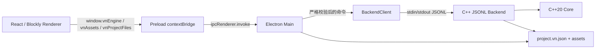

# VN Engine 技术栈与面试讲解指南

本文是当前项目的面试总入口。它回答三个问题：项目用了什么技术、各部分
为什么这样设计、一次操作如何穿过所有进程。具体实现细节继续查看：

- [当前架构](./architecture.md)
- [项目文件夹与媒体资源](./project-folder-storage.md)
- [人物立绘](./character-portrait-implementation.md)
- [游戏顺序预览](./game-preview-runtime.md)
- [场景跳转](./scene-jump-implementation.md)
- [语音与背景音乐](./audio-implementation.md)
- [视频播放积木](./video-playback-block.md)
- [选项分支](./choice-branch-implementation.md)

## 1. 30 秒项目介绍

这是一个面向视觉小说的桌面编辑器。界面使用 Electron、React、TypeScript
和 Blockly；剧情模型、项目校验、文件格式和资源导入由 C++20 负责。
Electron Main 启动每个窗口独立的 C++ 子进程，双方通过 stdin/stdout 上的
JSON Lines 协议通信，而不是 HTTP。C++ 返回完整权威快照，表单编辑器和
图形化编辑器都只是在同一份 Project 上提供不同操作方式。

项目目前支持：

- 场景、对白、背景切换、人物立绘、阻塞式视频、选项分支和显式场景跳转；
- 表单编辑与 Blockly 图形化编辑；
- 项目文件夹保存、打开和未保存状态；
- PNG/JPEG/WebP 图片、MP4/WebM 视频与 MP3/WAV/Ogg 音频安全导入；
- 对白语音和时间线 BGM，正式预览使用独立双音轨控制器；
- 正式顺序预览、阻塞式视频/选项、鼠标/键盘推进和跳转循环检测；
- 原子清单保存、IPC 权限收窄和真实 C++ 集成测试。

### 两分钟回答模板

> 我做的是一个视觉小说桌面编辑器。界面层选 Electron、React 和 Blockly，
> 因为它们适合复杂表单与可视化拖拽；剧情模型放在 C++20 Core 中，用
> `std::variant` 表达对白、背景、人物、场景跳转、BGM、视频和选项七种节点。Renderer 不直接改
> Project，而是经 contextBridge 和 Electron IPC 到 Main，再由 Main 通过 JSONL
> 请求 C++；C++ 校验成功后返回完整快照，所以表单和 Blockly 不会产生两份真相。
>
> 文件层采用项目文件夹：文本在固定 `project.vn.json`，二进制媒体在 assets。
> 图片、视频和音频由 C++ 用文件句柄、magic bytes 和流式复制安全导入；保存时先发布
> 资源，最后原子替换 manifest，失败不会截断旧项目。Renderer 没有 Node 权限，
> 也拿不到本机路径，图片、音频和视频通过带 capability token 的 `vn-asset://` 协议读取。
> 测试上用 CTest 覆盖领域和文件事务，用 Vitest 覆盖 IPC、Blockly 和预览状态机，
> 并有启动真实 C++ 子进程的 JSONL 集成测试。

## 2. 技术栈总表

| 部分 | 技术栈 | 在项目中的职责 |
| --- | --- | --- |
| 桌面应用 | Electron 43 | 窗口、原生菜单、文件选择器、Main/Preload/Renderer 进程边界 |
| UI | React 19、React DOM | 编辑器组件、状态协调、表单、资源条与预览界面 |
| 前端语言 | TypeScript 5.9 | 判别联合、IPC DTO、编译期约束和纯状态机 |
| 图形化编辑 | Blockly 13.1 | 自定义剧情积木、连接、拖动、框选、重排和垃圾桶 |
| 样式与画面 | HTML、CSS | 背景、立绘、对白框及编辑器布局；当前没有使用 Canvas/Pixi |
| 本地业务核心 | C++20、STL | ProjectAggregate、领域规则、ID、revision 和事务性修改 |
| C++ 构建 | CMake 3.20+ | Core、Backend、测试目标和 Release 后端安装 |
| JSON | nlohmann/json 3.11.3 | 只用于 C++ Backend 的协议和项目文件边界 |
| 进程通信 | Electron IPC + JSONL | Renderer→Main 使用 IPC；Main→C++ 使用带请求 ID 的逐行 JSON |
| 文件系统 | Electron dialog、Node `fs`、C++ OS 文件 API | 项目目录、临时工作区、流式复制、fsync 和原子替换 |
| 安全资源读取 | Electron 自定义 `vn-asset://` 协议 | 用 capability token 加载图片/音频/视频，用 Range 播放音频和视频且不暴露路径 |
| 前端构建 | Vite 5、Electron Forge 7、pnpm | Main/Preload/Renderer 构建与桌面应用打包 |
| 自动测试 | Vitest 3、CTest | TS 单元/集成测试与 C++ Core/Backend/文件系统测试 |
| 静态质量 | TypeScript typecheck、ESLint、编译器 warnings | 类型、代码规范和跨平台 C++ 警告检查 |

开发命令当前通过 Node.js 24 执行；正式 Electron 应用使用 Electron 自带的
Node 运行时，不要求最终用户安装 Node.js。

## 3. 总体架构



项目不建立业务 API 的 HTTP 服务。Electron Main 和 C++ 是同一台电脑上的
一对一父子进程，JSONL 已经足以提供异步请求、错误传播和请求 ID 关联，同时
减少业务端口、鉴权、服务发现和进程清理等额外复杂度。开发时 Vite 仍使用本地
HTTP/WebSocket 提供 Renderer 页面和 HMR，但它不承载项目业务命令。

## 4. 各部分使用的技术栈

### 4.1 C++ 领域模型

使用技术：C++20、`std::variant`、`std::optional`、STL 容器、CMake。

核心结构是：

```cpp
using SceneNode = std::variant<
    Dialogue,
    BackgroundNode,
    CharacterNode,
    SceneJumpNode,
    BgmNode,
    VideoNode,
    ChoiceNode>;

struct ProjectAggregate {
  Project project;
  std::vector<Asset> assets;
};
```

`std::variant` 表达“节点只能是七种类型之一”，避免用一个大对象加很多可空
字段。`ProjectAggregate` 把 Project 和 Asset 清单放在同一个一致性边界中，
因此背景或人物引用不存在的图片时，C++ 可以在提交前整体拒绝。

ChoiceNode 内部使用 `std::vector<ChoiceOption>`；Option 有独立稳定 ID、非空文案
和目标 Scene ID。它是父节点的子实体，不是第八种 SceneNode。

面试回答重点：C++ 是业务真相，不是为了替代 React 渲染。它负责领域不变量、
文件兼容和未来 Player/导出工具可复用的剧情数据。

### 4.2 C++ Backend 与 JSONL

使用技术：C++20、nlohmann/json、stdin/stdout、请求 ID、JSON Lines。

每个请求是一行 JSON：

```json
{"id":1,"method":"timeline.reorder","params":{"sceneId":"s1","nodeId":"n1","beforeNodeId":null}}
```

每个响应也只有一行。Main 通过 `id` 找到对应 Promise。stdout 专用于协议，
日志写 stderr，避免日志破坏 JSON 解析。

Backend 把 JSON 参数翻译为 Core 操作。重要修改会先验证或构造候选对象，只有
完整成功才提交，并按真实变化更新 `revision`；no-op 不增加 revision。

### 4.3 Electron Main、Preload 与 IPC

使用技术：Electron Main/Preload、`contextBridge`、`ipcRenderer.invoke`、
原生 `dialog`、Node child process。

调用链：

```text
React action
  → window.vnEngine.addCharacter(...)
  → preload.ts
  → Electron IPC
  → registerEngineIpc.ts
  → BackendClient.request(...)
  → C++ JSONL
```

安全配置包括：

- `contextIsolation: true`；
- `nodeIntegration: false`；
- `sandbox: true`；
- Renderer 只能调用 Preload 暴露的具名方法；
- Main 同时校验调用来源、method 和 params；
- C++ 响应在 Main 再按公开 DTO 白名单重建；
- 禁止编辑器导航到外部页面或创建继承权限的新窗口。

面试回答重点：TypeScript 类型只在编译期存在，IPC 对面可能是被篡改的运行时
数据，所以 Main 仍然必须做运行时校验。

### 4.4 React 状态协调

使用技术：React Hooks、TypeScript、Promise、`async/await`、`useRef`。

`useEngineProject` 持有当前 Project、公开 Assets 和文件会话状态。修改命令通过
Promise 队列串行发送；成功后应用 C++ 返回的完整快照，失败时不乐观修改项目。

保存、打开、导入或开始预览前，`App` 会先提交当前编辑模式的可见草稿：

```text
图形模式：Blockly 活动字段 → 项目名称草稿
表单模式：项目名称草稿 → 表单对白草稿
二者随后：等待 Engine action queue → 文件操作或正式预览
```

React StrictMode 在开发环境会重复执行 effect。启动初始化使用 hook 实例内的
`useRef<Promise>` 复用同一个 pending 请求；没有使用模块全局 Promise，因为
多个编辑器窗口必须连接各自独立的后端项目。

### 4.5 表单编辑器

使用技术：React 受控组件、TypeScript 判别联合、局部草稿、纯预览归约函数。

左侧时间线同时展示对白、背景、人物、BGM、视频、选项和跳转。选中节点后根据 `node.type`
显示不同检查器。输入中的内容先是 React 草稿，提交后才进入 C++。导航、保存、
导入和模式切换都必须先 commit 草稿，失败则停止下一步操作。

表单模式不会提供“+ 视频”，但会显示、修改、移动和删除由 Blockly 创建的
VideoNode，确保两种编辑方式仍然读取同一条权威时间线。
ChoiceNode 同样可以在表单时间线中查看、移动和删除，但选项内容与目标只读，
创建和内部编辑集中在图形化模式。

### 4.6 Blockly 图形化编辑

使用技术：Blockly 13、自定义 Block、动态 Toolbox、DragStrategy、Blockly
事件、DOM Pointer Events、React 组件封装。

C++ 快照会投影成对白、背景、人物、BGM、视频、选项和跳转积木。Blockly 不是第二个数据库：
新增、字段修改、删除和重排都会转换成 typed Engine 命令，然后等待 C++ 新快照
重新投影。

自定义交互包括：

- 单块拖动与 `timeline.reorder`；
- 长按框选、多选组拖与 `timeline.reorderMany`；
- Delete、Backspace 和自定义垃圾桶；
- 图片拖入背景/人物积木的白色资源槽；
- 音频拖入对白/BGM 槽，视频拖入 VideoNode 白色资源槽；
- ChoiceNode 使用 statement input 包含专用连接类型的 ChoiceOption，支持内部字段编辑和重排；
- 每场景独立保存画布根位置、缩放和滚动位置；
- 较小连接吸附半径，只有靠近连接点才出现连接预览。

布局数据属于编辑器视图状态，不进入剧情 Project，避免 UI 坐标和游戏执行顺序
形成两个业务真相。

### 4.7 项目文件夹与安全保存

使用技术：Electron 原生目录选择器、Node 文件 API、C++ 序列化、临时文件、
流式复制、`fsync`、原子 rename/replace。

项目格式：

```text
项目名/
├── project.vn.json
└── assets/
    ├── images/
    ├── videos/
    └── audio/
```

保存不是直接覆盖 JSON：先生成完整新清单和资源，资源先发布并持久化，最后才
原子替换 `project.vn.json`。清单是 commit marker；失败时旧清单仍引用完整旧
资源，最多留下未被清单引用的安全孤立文件。

未保存项目导入媒体时，每个窗口使用 Main 私有临时工作区。第一次保存才把
资源和清单安全发布到正式项目文件夹。

当前 Writer 写 `fileVersion: 9`，Reader 支持 v1–v9。v9 新增 ChoiceNode 的
严格嵌套 options；旧版本仍按各自能力读取，不能混入未来节点字段。

### 4.8 图片、视频与音频导入

使用技术：Electron file dialog、C++ OS 文件句柄、magic bytes、流式 I/O、
no-follow/no-clobber、Asset ID。

Renderer 只表达 `importImage()`、`importVideo()` 或 `importAudio()`，不传任何路径。Main 通过
原生对话框得到源路径，再把 Main 私有路径交给 C++。

C++ 检查常规文件、链接、大小、扩展名和文件头；在同一文件句柄上验证并流式
复制，复制前后复核源快照。临时目标独占创建，正式发布禁止覆盖。

图片支持 PNG/JPEG/WebP；视频支持 MP4/WebM；音频支持 MP3/WAV/Ogg。
三者都能安全导入、保存和重开。正式预览通过 Range 响应播放音频和视频。

### 4.9 安全图片、音频与视频读取

使用技术：Electron 自定义 protocol、capability token、每窗口独立 session、
流式 Response、CSP。

React 获得的不是 `file://` 和磁盘路径，而是：

```text
vn-asset://image/<project-generation-token>/<opaque-asset-token>
vn-asset://audio/<project-generation-token>/<opaque-asset-token>
vn-asset://video/<project-generation-token>/<opaque-asset-token>
```

Main 只允许当前窗口、当前项目代际且存在于私有 manifest 的资源。音频和视频
支持 HEAD、GET 和单段 Range 的 200/206/416 响应。切换项目会轮换 token，使旧
URL 自动失效；Renderer 无法把任意本机路径拼成可读取 URL。

### 4.10 背景、人物、场景跳转和选项

使用技术：C++ `std::variant`、TypeScript discriminated union、统一时间线、
纯 reducer、Blockly 自定义积木。

- 背景节点从当前位置开始生效，直到下一个背景节点；`assetId:null` 表示无背景。
- 人物节点修改 1–10 中的一层，保存图片、左中右位置和 layer；高层渲染在前。
- 场景跳转节点保存稳定 `targetSceneId`，不会根据 Scene 数组顺序隐式跳转。
- BGM 节点切换或停止循环音乐；Dialogue 的 `voiceAssetId` 绑定一次性人物语音。
- VideoNode 的空槽跳过；绑定视频后阻塞时间线，ended 或按 Enter 跳过才继续。
- ChoiceNode 的空 options 跳过；非空时等待玩家点击，Option 保存稳定 ID、文案和目标 Scene ID。
- 删除和重排都复用通用 `timeline.*`，保证混合节点操作是原子的。

### 4.11 正式游戏预览

使用技术：React、TypeScript 纯函数状态机、`Map`/`Set`、DOM Pointer/Keyboard
事件、共享 `VisualStage`、`HTMLAudioElement` 和 `HTMLVideoElement`。

预览从 `entrySceneId` 开始。背景、人物、BGM 和跳转是自动节点；对白是点击停顿点；
非空 VideoNode 是媒体阻塞点。视频播放期间普通点击和 Space 不推进，只有
ended 或非长按 Enter 才恢复扫描。非空 ChoiceNode 是选择阻塞点，渲染固定
54px 高的居中矩形按钮；选项增加只扩展列表并调整纵坐标，超量时内部滚动。
点击选项后按稳定 Option ID 跳转。跳转进入目标场景时重置人物层并加载其初始背景，
同时保持 BGM；`Set<sceneId:index>` 检测没有可停留节点的自动跳转循环。

预览状态是临时会话，不写回 Project、revision 或磁盘。当前先用 TS 纯状态机
获得快速可测的编辑器预览；独立 Player 的 MVP 会复用抽离后的共享 TypeScript
Runtime。等变量、脚本、跨版本存档或确定性回放变得复杂后，再评估把同一语义
下沉到 C++ Runtime。

### 4.12 构建、打包和测试

使用技术：CMake、CTest、Vitest、TypeScript、ESLint、Vite、Electron Forge。

- `vn_engine_core` 不依赖 Electron 和 JSON；
- `vn_engine_backend` 链接 Core 与 nlohmann/json；
- Vitest 单测覆盖 IPC 校验、状态机、Blockly helper 和安全存储；
- 集成测试会启动真实 C++ JSONL Backend；
- CTest 分别覆盖 Core、Backend、原子文件和媒体导入；
- Release C++ 可执行文件通过 `cmake --install` 放入 `engine/stage/backend`；
- Forge 用 `extraResource` 把它复制到 `Resources/backend`，因为可执行文件不能
  从 `app.asar` 内直接运行。

## 5. 四条重点调用链

### 5.1 修改一个积木

```text
Blockly BLOCK_CHANGE / 拖放
  → BlocklyWorkspace 解析 nodeId 和字段
  → useEngineProject typed action
  → Preload contextBridge
  → Main 校验 IPC
  → BackendClient JSONL
  → C++ Core 验证并提交
  → 完整 Project 快照
  → React 更新 props
  → Blockly 重新投影
```

### 5.2 保存项目

```text
Cmd/Ctrl+S 或工具栏保存
  → 提交表单/Blockly/项目名草稿
  → 等待 Engine 队列
  → Main 选择或复用项目目录
  → C++ 序列化到 Main 私有工作清单
  → Main 校验并发布资源
  → 原子替换 project.vn.json
  → savedRevision 更新
  → 标题显示“已保存”
```

### 5.3 导入一张图片

```text
ResourcePanel.importImage
  → 无路径 IPC
  → Main 原生文件选择器
  → C++ asset.import(image)
  → 安全验证与流式 no-clobber 复制
  → Asset 加入 Aggregate，revision + 1
  → Main 注册预览能力
  → React 重新申请 vn-asset:// URL
```

### 5.4 开始正式预览

```text
播放按钮
  → 提交当前编辑草稿
  → 获取最新 C++ Project 快照
  → startGamePreview(entrySceneId)
  → 自动归约背景/人物/BGM/跳转
  → 停在对白、阻塞视频或非空选项
  → 视频 ended/Enter 后恢复扫描
  → 选项点击后按 optionId 进入目标场景
  → 玩家输入后 advanceGamePreview
```

## 6. 面试常见问题与回答

### 为什么选择 Electron + React + C++，而不是全部 TypeScript？

Electron/React 适合快速开发编辑器交互，Blockly 和 DOM 生态成熟；C++ Core
负责稳定的数据模型、文件兼容和可复用运行规则。两者通过窄协议解耦，未来原生
Player 或命令行导出工具可以直接复用 Core，而不依赖 Electron。

### 为什么业务后端不用 HTTP？

这是同机父子进程的一对一业务通信，不需要额外 Web Server。Electron IPC 解决
Renderer→Main，JSONL 解决 Main→C++；请求 ID 足以映射 Promise。这样没有业务
端口冲突、监听权限、网络鉴权和服务发现，部署面更小。Vite dev server 只服务
开发态页面/HMR，不属于这条业务后端链路。

### 为什么 C++ 每次返回完整 Project，而不是只返回 patch？

C++ 是唯一业务真相。完整快照让 React 直接替换旧状态，避免前端 patch 与后端
规则不同步。当前视觉小说项目数据量适中，正确性收益大于快照传输成本；数据量
增长后可以在协议层加入 revision + patch，但不能建立第二套业务规则。

### 如何保证 Renderer 不能任意读本机文件？

Renderer 没有 Node 权限，只能调用 contextBridge 暴露的具名 API；路径由 Main
的原生 dialog 产生，响应又经过白名单净化。图片、音频和视频使用带能力令牌的
自定义协议和 opaque asset token，而不是 `file://` 或用户可拼接的绝对路径。

### 保存失败为什么不会损坏旧项目？

保存采用“资源先、清单后”。新数据先写同目录临时文件并 flush/fsync，资源发布
完成后，最后一步才原子替换固定 manifest。旧 manifest 从不先删除或 truncate，
因此失败时仍能打开旧版本。

### 为什么 Blockly 不是权威数据源？

Blockly 是编辑视图。它的事件被翻译为 C++ 命令，成功后再用 C++ 快照重建。
否则表单、Blockly、保存文件会各自维护顺序并产生冲突。二维布局单独存视图状态，
剧情顺序只在 Scene.nodes 中保存。

### 为什么预览状态机先写在 TypeScript？

当前需求是编辑器内的只读预览，TS 纯函数便于快速迭代和用 Vitest 做输入输出测试，
也不修改 Project。独立 Player 的 MVP 会先把 reducer 抽成 Editor/Player 共享的
TypeScript Runtime；等变量、脚本、跨版本存档和确定性回放变得复杂后，再评估
下沉到 C++ RuntimeSession。

### Promise 和 async/await 在项目里解决什么问题？

IPC、C++ 子进程响应、文件选择和磁盘写入都不会同步完成。Promise 表示“未来的
结果”，`async/await` 让这些步骤保持顺序但不阻塞 UI 线程。项目还使用 Promise
队列防止两次 mutation 乱序。

### 如何处理 React StrictMode 的重复初始化？

StrictMode 会在开发环境重复执行 effect。hook 使用实例级 `useRef` 保存 pending
初始化 Promise，第二次 effect 复用它，因此只发一次 `project.ensure`。不能使用
模块全局 Promise，因为多个 Electron 窗口有各自独立 C++ Backend。

### 当前项目还有哪些明确边界？

- 视频已支持安全导入、VideoNode、Range streaming 与阻塞式正式预览；当前还没有裁剪、字幕或转码；
- 音频已能安全导入并播放对白语音/BGM；当前还没有淡入淡出、波形和音效节点；
- 正式预览已有背景、人物、对白、BGM、视频、选项和跳转；选项暂不支持变量、条件可见性或副作用；
- 项目 Writer 为 v9、Reader 支持 v1–v9；v9 保存 ChoiceNode/ChoiceOption；
- Blockly 布局目前是会话级视图状态，尚未持久化到 `.vnengine`；
- 同一项目根的多窗口排他锁、Undo/Redo 和资源垃圾回收仍是后续工作。

面试中应明确区分“已实现”和“计划实现”，不要把历史计划中的 PixiJS、Zod、
Zustand、Playwright 或游戏导出描述成当前已经采用的技术。

## 7. 常用验证命令

```sh
fnm exec --using=24 pnpm --dir apps/editor typecheck
fnm exec --using=24 pnpm --dir apps/editor lint
fnm exec --using=24 pnpm --dir apps/editor test
fnm exec --using=24 pnpm --dir apps/editor package
```

`test` 会先构建 C++，运行 CTest，再运行 Vitest。面试中可以把测试策略概括为：
“领域规则用 C++ Core 测试，文件事务用 Backend/文件系统测试，进程契约用真实
JSONL 集成测试，Renderer 纯逻辑和 IPC 边界用 Vitest。”
