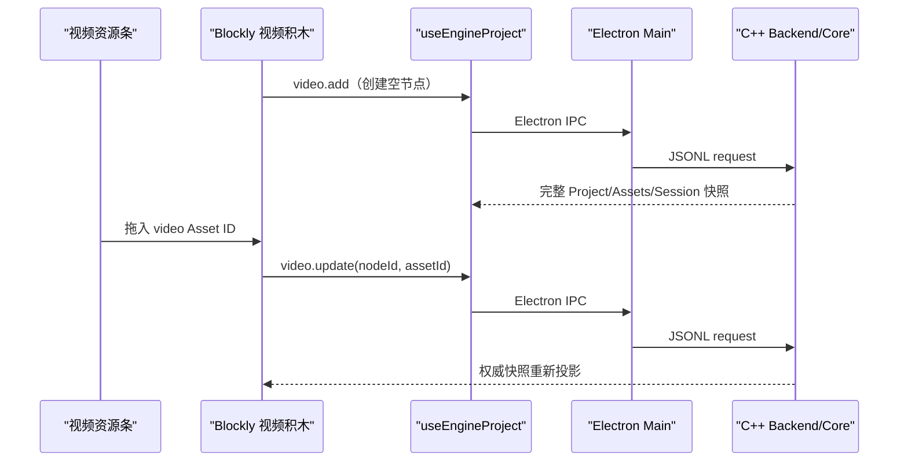

# 视频播放积木实现技术栈

> 本文描述“视频播放”时间线节点的产品语义、跨进程链路和实现边界。
> 总体架构与面试讲解见 [技术栈与面试讲解指南](./technical-stack-interview-guide.md)。

## 1. 产品目标

作者可以把已经导入项目的视频拖入 Blockly 的“播放视频”积木。正式游戏预览
执行到该节点时，暂时停止对白推进并播放视频；视频正常结束或玩家按 Enter 跳过后，
继续执行视频节点之后的剧情。

交互边界：

- 视频积木只在图形化编辑器的 Toolbox 中创建；
- 新视频积木的资源槽默认为空；
- 顶部资源条中的视频可以拖进白色视频槽；
- 表单编辑器不提供“+ 视频”按钮，但会显示已经存在的视频时间线节点；
- 普通编辑预览不自动播放视频；
- 只有正式游戏预览执行到视频节点时才播放。

## 2. 技术栈

| 部分 | 技术栈 | 作用 |
| --- | --- | --- |
| 领域模型 | C++20、`std::variant`、`std::optional` | VideoNode 成为强类型时间线节点，空槽使用 null |
| 持久化 | nlohmann/json、fileVersion v8 | 严格保存视频节点及 Asset ID；v1–v7 项目没有 VideoNode |
| 跨进程 | Electron IPC、contextBridge、JSONL | Renderer 发送类型化命令，C++ 返回权威完整快照 |
| 图形编辑 | Blockly 13、自定义 Block、HTML Drag and Drop | 空白视频槽、资源拖放、重排、框选和删除 |
| 安全媒体 | Electron `vn-asset://`、capability token、Range | `<video>` 按需读取 MP4/WebM，不暴露文件路径 |
| 正式预览 | React 19、TypeScript 纯状态机、HTMLVideoElement | 视频阻塞剧情，ended 后恢复时间线 |
| 测试 | CTest、Vitest、真实 C++ JSONL 集成 | 覆盖格式、协议、Blockly、Range 和播放生命周期 |

## 3. 为什么视频是时间线节点

视频不是场景的静态属性，也不是 Dialogue 的附件。它会在剧情中的一个确定位置
接管画面，并在结束后把控制权交回同一条时间线，因此应建模为独立节点：

```cpp
struct VideoNode {
  std::string id;
  std::optional<std::string> asset_id;
};

using SceneNode = std::variant<
    Dialogue,
    BackgroundNode,
    CharacterNode,
    SceneJumpNode,
    BgmNode,
    VideoNode>;
```

- `asset_id == null`：积木尚未绑定视频，预览时直接跳过；
- 非 null：必须引用当前 ProjectAggregate 中 `AssetType::video` 的资源；
- VideoNode 只保存 Asset ID，不保存绝对路径、项目相对路径或 capability URL；
- 删除和重排复用统一的 `timeline.*` 命令。

视频节点在 `fileVersion:8` 引入。当前 Writer 固定写 v13；Reader 接受 v1–v13，旧版本
只是不包含 VideoNode，不会凭空生成空视频节点。v8 节点严格写作
`{id,type:"video",assetId:string|null}`。

## 4. 作者操作链路



拖放只传公开的 Asset ID。Renderer 不能提交文件路径，也不能自行把拖入结果当成
项目真相；只有 C++ 命令成功后返回的快照才会重绘 Blockly。

## 5. 表单编辑器边界

表单模式与图形模式仍操作同一份 C++ 时间线，但产品入口不同：

- ScenePanel 会把现有 VideoNode 显示为“视频播放”；
- 选中后可以查看或替换所引用的视频；
- 时间线重排和删除继续可用；
- 表单检查器的插入按钮区不增加“+ 视频”，因此不能从表单模式新建视频节点。

这样不会隐藏已有项目数据，同时保留“视频积木是图形化流程能力”的产品约束。

## 6. 正式预览状态机

`previewRuntime` 仍是无 DOM、无 IPC 的纯函数。遇到绑定了资源的 VideoNode 时，
返回一个阻塞视频状态，并把 `nextNodeIndex` 保持在视频节点之后：

```text
扫描自动节点
  → 遇到 VideoNode
  → runtime 进入 playingVideo
  → React 获取 opaque media URL
  → HTMLVideoElement 播放
  → ended / 按 Enter 跳过
  → 从 nextNodeIndex 继续扫描
  → 停在下一条 Dialogue 或下一个 VideoNode
```

视频播放期间：

- 普通鼠标点击和 Space 不会越过视频；非长按 Enter 会明确跳过；
- 正式预览不显示浏览器原生播放控件、进度条或画中画按钮；
- Escape 仍可退出整个游戏预览；
- 退出、卸载或切换到下一个视频时必须 pause、清理 src 并让异步旧请求结果失效；
- URL 获取或解码失败不能让预览永久卡死，错误信息应提示按 Enter 跳过；
- 普通表单/Blockly 编辑舞台不会创建 HTMLVideoElement。

视频接管期间，上一句 voice 会停止；当前 BGM 只做临时 pause，保留 src 和
currentTime。视频结束且后续剧情仍需要这首 BGM 时，从原暂停进度 resume；视频
结束后若立即遇到 BGM stop、预览结束或运行错误，则保持静音。

## 7. 安全视频读取

视频继续使用导入阶段生成的 `assets/videos/<assetId>.mp4|webm`。Renderer 仅请求：

```ts
window.vnAssets.getMediaUrl(assetId)
```

Main 返回窗口和项目代际私有的 URL：

```text
vn-asset://video/<generation-token>/<asset-token>
```

协议处理器必须逐次确认 Asset ID 属于当前项目，并验证常规文件、链接、大小、
扩展名、MP4/WebM 文件头和 capability token。图片只返回普通 `200`；音频和视频
支持 `HEAD`、`GET`、无 Range 的 `200`、合法单段 Range 的 `206`，以及非法或多段
Range 的 `416`。响应带准确 MIME、`Content-Length`、必要的 `Content-Range`、
`Accept-Ranges:bytes`、`no-store` 和 `nosniff`；CSP 仅通过
`media-src 'self' vn-asset:` 放行受控媒体。

## 8. 验收清单

1. 视频资源在顶部资源条中可以拖动。
2. Toolbox 可以创建空“播放视频”积木。
3. 拖入 MP4/WebM 后白色槽显示资源名称。
4. 视频积木参与连接、单块/多块重排、框选、Delete 和垃圾桶删除。
5. 表单时间线显示视频节点，但没有“+ 视频”入口。
6. `assetId:null` 的视频节点在正式预览中安全跳过。
7. 非空视频节点阻塞剧情，视频结束后自动继续。
8. 播放期间普通点击和 Space 不越过视频，Enter 会跳过并继续剧情。
9. 正式预览不显示原生视频控件、进度条和画中画入口。
10. 退出预览会停止视频并清理媒体 URL。
11. 视频期间 voice 停止、BGM 暂停；结束后有效 BGM 从原进度恢复。
12. 视频 capability 不能跨项目、跨窗口或读取任意路径。
13. 保存、关闭和重新打开后节点顺序及视频引用不变。
14. CTest、Vitest、TypeScript、ESLint 和生产打包通过。

## 9. 当前不做

- 视频裁剪、转码、字幕和多音轨选择；
- 节点级音量、淡入淡出和转场；
- 在表单编辑器中新建视频节点；
- 普通编辑舞台自动播放；
- 把视频二进制放进 JSON、IPC 或 React state。
