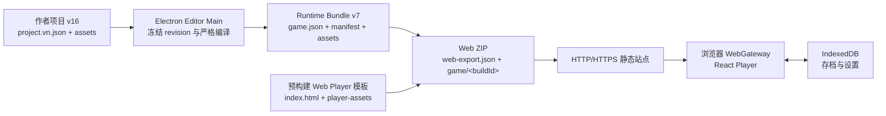
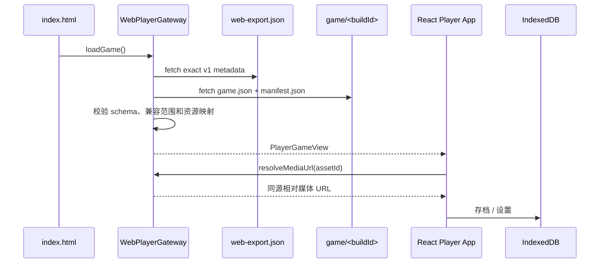

# Web Player ZIP 导出实现

> 实现目标：Editor 的导出面板新增“Web 游戏 ZIP（HTML5）”，把当前已保存的作者项目
> 编译为可部署到静态网站的浏览器版游戏。它沿用 Runtime v7、共享 React Player UI 和
> 现有媒体资源，不携带 Electron、C++ Backend 或作者编辑能力。

## 1. 名称和功能边界

用户习惯把浏览器游戏包称为 `WebGL.zip`，但当前 VN Engine 的画面由 React、DOM、CSS
和浏览器原生图片/音频/视频元素渲染，并没有把 C++ 编译成 WebAssembly，也没有把舞台
改写成 WebGL。因此产品中的准确名称是“Web 游戏 ZIP（HTML5）”，协议输出类型是
`web-player`，默认文件名为：

```text
<项目名>-Web.zip
```

第一版 Web Player 支持：

- 与桌面 Player 一致的标题页、剧情、选择、场景跳转、背景、立绘、BGM、语音和视频；
- 变量 Set/Change、If/Else 和固定次数 Repeat；
- CG 画廊、九宫格分页与大图查看；
- 浏览器本地的 3 个手动存档槽和 1 个快速槽；
- 主音量、BGM、语音和视频音量设置；
- 浏览器全屏；
- 从 ZIP 根目录的 `index.html` 自动加载同一份导出中的内嵌游戏。

第一版明确不包含：

- 作者项目编辑、媒体导入、C++ Backend 或任意本机路径访问；
- 在浏览器中打开另一份 `.vngame`；
- 可靠地关闭浏览器标签页；“退出游戏”会安全返回标题页；
- 强制调整浏览器窗口尺寸。窗口尺寸预设在 Web 中禁用，不能调用不可靠的
  `window.resizeTo()` 冒充桌面能力；
- 云存档、跨域名存档迁移、Service Worker 离线缓存和 PWA 安装。

## 2. 用户操作流程

1. 先保存当前作者项目，确保 Editor 中没有未保存修改；
2. 打开导出面板，选择“Web 游戏 ZIP（HTML5）”；
3. Web 导出不要求填写桌面应用名称、语义版本或 Application ID；
4. 选择 ZIP 保存位置；
5. Editor 在私有临时目录中编译、组装、压缩并重新读取验证产物；
6. 成功后得到 `<项目名>-Web.zip`；失败或取消不会修改作者项目和已有导出；
7. 解压并上传 ZIP 根目录中的全部文件到同一个 HTTP/HTTPS 静态站点。

不能把 ZIP 中的目录层级打散，也不建议直接双击 `index.html`。浏览器的 `file://` 页面
受 Fetch、媒体和安全策略限制；开发验收也应使用本地 HTTP server。

## 3. 总体架构



这个设计保留了项目已有的分层：

- Editor Renderer 只表达 `output: 'web-player'` 的导出意图，不传入模板路径、输出目录或
  任意文件系统路径；
- Electron Main 冻结当前保存版本并负责文件事务、模板验证和 ZIP 生成；
- Runtime Compiler 继续把 author v16 编译为 runtime v7，不为 Web 复制另一套剧情语义；
- `@vnengine/runtime` 继续提供纯 TypeScript 状态机；
- `@vnengine/player-ui` 继续提供标题页、舞台、CG、存档和选项组件；
- WebGateway 只替换桌面 Player 的 Electron Preload/Main 传输与本地存储端口。

## 4. ZIP 产物契约

ZIP 解压后的根目录是一个可直接部署的静态站点：

```text
<项目名>-Web.zip
├── index.html
├── web-export.json
├── README.txt
├── player-assets/
│   ├── <带 hash 的 JavaScript>
│   └── <带 hash 的 CSS 或其它前端资源>
└── game/
    └── <buildId>/
        ├── game.json
        ├── manifest.json
        └── assets/
            ├── images/
            ├── audio/
            └── videos/
```

`index.html` 必须位于 ZIP 根目录。`player-assets` 由 Vite 生成并使用内容 hash 文件名；
游戏内容仍使用 Runtime Bundle 的 `buildId` 隔离，避免发布新版本时路径碰撞。

`web-export.json` 是 Web 启动入口的版本化、exact-fields 元数据。它声明：

- `format`：固定为 `vn-engine-web-export`；
- `webExportVersion`：当前为 `1`；
- `runtimeVersion`：当前导出的 Runtime 版本；
- `playerCompatibility`：Web Player 与 Runtime 的兼容范围；
- `gameRoot`：只允许指向 ZIP 内的 `game/<buildId>` 相对目录。

当前 v1 文件精确为五个字段，例如：

```json
{
  "format": "vn-engine-web-export",
  "webExportVersion": 1,
  "runtimeVersion": 7,
  "playerCompatibility": ">=7 <8",
  "gameRoot": "game/018f-example-build-id"
}
```

Loader 还会检查 `manifest.json` 中的 `buildId` 与 `gameRoot` 最后一段完全相同，避免元数据
指向一个目录、目录内部却声明为另一份构建。`gameRoot` 不带结尾 `/`；Vite 的
`base: './'` 已经固定前端资源基准，不把 `basePath` 或 Player 构建版本混入 Web 运行契约。

Web Player 不从查询参数、location hash 或用户输入推导游戏路径。所有启动路径都来自经过
严格解析的 `web-export.json`，并在同源相对 URL 边界内解析。

## 5. Web Player 模板

浏览器模板在 Player 应用内独立构建：

```text
apps/player/
├── vite.web.config.ts
└── src/web/
    ├── index.html
    ├── index.tsx
    ├── WebBundleLoader.ts
    ├── WebPlayerGateway.ts
    └── WebStorage.ts
```

Vite 配置的关键约束是：

- `root` 指向 `src/web`；
- `base: './'`，保证部署在域名根目录或任意子目录时都使用相对 URL；
- 输出到 `.vite/web-player/payload`；
- 静态前端资源统一放入 `player-assets`；
- `build:web-template` 只在构建/打包阶段生成模板，玩家点击导出时不临时运行 Vite 或下载
  npm 依赖。

构建后的 payload 会被 stage 到 `engine/stage/web-player-template/payload`，并配有
`engine/stage/web-player-template/web-player-template.json` exact-fields 模板清单：

```json
{
  "format": "vn-engine-web-player-template",
  "templateVersion": 1,
  "payloadRoot": "payload",
  "entry": "index.html",
  "runtimeCompatibility": ">=1 <8",
  "playerVersion": "<模板构建版本>",
  "files": [
    {
      "path": "index.html",
      "bytes": 1234,
      "sha256": "<64 位小写 SHA-256>"
    }
  ]
}
```

`files` 精确列出 payload 的每个普通文件及其大小、SHA-256；加载模板时既要验证每个条目，
也要确认实际文件集合没有缺失或额外内容。Editor 只消费经过验证的模板，不接受 Renderer
指定的模板路径。模板可以读取 runtime v1–v7；当前新导出固定生成 runtime v7，且
`web-export.json` 声明 `playerCompatibility: ">=7 <8"`。

## 6. WebGateway 和浏览器运行链

Web 入口向现有 React `App` 注入与桌面版相同形状的窄 `PlayerGateway`：



与 Electron Gateway 的差异只有平台端口，不改变剧情执行语义：

- `loadGame()` 固定加载 ZIP 内嵌内容；
- `openGame()` 返回不支持，不弹本机目录选择器；
- `resolveMediaUrl(assetId)` 只能从已验证 manifest 的 Asset ID 映射生成同源 URL；
- 存档与设置使用 IndexedDB；
- 全屏使用 Fullscreen API；
- `quit()` 返回标题页，不尝试强制关闭标签页。

Fetch 层必须检查 HTTP 状态、JSON 大小与结构、Runtime 版本、manifest 资源闭包及相对路径。
未知字段、绝对 URL、协议 URL、反斜杠、`..` 穿越、重复资源 ID 和不兼容版本都应拒绝，
不能把服务器的 HTML fallback 当成 JSON 继续解析。

## 7. 浏览器存档和设置

Web Player 使用 IndexedDB，而不是把存档混入导出的只读目录。

存档命名空间继续由游戏身份隔离：

```text
projectId + runtimeVersion + contentFingerprint
```

其中 `contentFingerprint` 由当前 `game.json` 的稳定内容计算。相同内容重新部署后可以继续
读取原存档；内容变化后进入新的命名空间，避免把旧游标错误应用到新剧情。存档内容仍是
`GameRuntimeSnapshot v2`，包含变量和 Repeat 栈；读取时继续由 `@vnengine/runtime`
严格恢复并重建派生画面。旧 v1 只兼容没有经过逻辑节点的历史进度。

设置与存档共用 IndexedDB 的 `documents` object store。当前写入独立的 `settings-v2`
key；若它不存在，Reader 会回退读取并严格迁移旧 `settings-v1`：

- 中/英文 Player 界面偏好可以持久化；
- 四路音量可以持久化；
- 全屏状态服从浏览器权限和用户手势，不承诺刷新后自动进入全屏；
- 窗口尺寸预设保留协议兼容值，但 Web UI 中禁用，不改变浏览器窗口；
- IndexedDB 不可用、被隐私模式限制或配额不足时，界面返回稳定错误，不伪报保存成功。

浏览器存储以 origin 为边界。同一游戏换域名、协议或端口后，浏览器会把它视为不同站点，
原存档不会自动出现。清除站点数据也会删除 Web 存档和选项。

## 8. Editor 导出事务

Web 导出复用现有 Runtime Bundle 的一致性与安全边界，流程如下：

1. 要求项目已有存储位置、没有未保存修改，并冻结 `projectRootPath`、revision 和已保存
   manifest SHA-256；
2. 再向窗口专属 C++ Backend 读取权威 Project/Asset 快照，确认它仍与冻结版本一致；
3. 解析并验证预构建 Web Player 模板；
4. 获取目标 ZIP 的导出锁，在私有临时目录创建 staging；
5. 调用 Runtime Bundle Exporter，把严格编译结果写入 `game/<buildId>`；
6. 写入版本化 `web-export.json` 和部署说明，并复制模板 payload；
7. 使用 `yazl` 流式生成临时 ZIP；
8. 使用 `yauzl` 重新读取 ZIP，验证条目集合、重复条目、路径、文件类型、大小和内容契约；
9. 再次确认源项目在导出期间没有变化；
10. 原子发布目标 ZIP，最后清理 staging、临时 ZIP 与导出锁。

导出器拒绝绝对路径、空路径段、`.`/`..`、反斜杠、重复 ZIP entry、符号链接和模板中的
额外未声明文件。ZIP 内容顺序和 metadata 应保持可复现；JSON、HTML、JavaScript、CSS 与
README 使用 DEFLATE，已经压缩过的图片、音频和视频媒体使用 ZIP STORE。所有文件都通过
流处理，不把整个游戏一次性读入内存。

任何一步失败都只留下 Main 日志中的诊断细节。Renderer 收到不含本机路径的稳定错误，
作者项目和已有目标 ZIP 均不被修改。

## 9. 为什么使用 `yazl` 和 `yauzl`

桌面 macOS 应用导出可以依赖平台工具处理 `.app` 和签名，但 Web ZIP 必须在 macOS、
Windows 和 Linux Editor 中产生相同结构。项目把 `yazl` 和 `yauzl` 作为直接、锁定版本的
Node 依赖：

- `yazl` 提供基于流的跨平台 ZIP 写入；
- `yauzl` 以 lazy entries 方式重新打开生成结果，适合执行 ZIP Slip、重复路径、文件类型
  与大小验证；
- 生成和验证使用两条独立路径，避免“写入器认为成功”直接等同于“发布产物可读”。

这两个库只运行在受信任的 Electron Main/构建环境，不进入浏览器 bundle。

## 10. 部署要求

解压后应把根目录中的所有文件原样上传。静态服务器至少需要满足：

- 通过 HTTP 或 HTTPS 提供文件，生产环境推荐 HTTPS；
- 保留目录层级、文件名大小写和带 hash 的 Player 资源名；
- 为 HTML、JavaScript、CSS、JSON、JPEG/PNG/WebP、MP3/WAV/Ogg、MP4/WebM 返回正确
  MIME type；
- 缺失的 JSON、JS、媒体文件返回真实 404，不能统一回退到 `index.html`；
- 对视频和较大音频支持 Range 请求及 `206 Partial Content`；
- 若站点部署在子目录，不能重写掉相对 `player-assets` 和 `game/<buildId>` 路径；
- CSP 至少允许当前站点自身的脚本、样式、图片、音频、视频和 `blob:` 媒体需求；
- 如需禁止站点被其它页面嵌入，应由服务器响应头设置
  `Content-Security-Policy: frame-ancestors 'none'`；该指令写在 HTML 的 meta CSP 中不会生效；
- 更新版本时应原子上传完整目录，避免新 `index.html` 暂时引用尚未上传的 hash 文件。

可部署到支持静态文件的 GitHub Pages、Cloudflare Pages、itch.io HTML5 或普通 Nginx，
但具体平台仍需按照上述 MIME、Range、404 和子目录规则验收。

## 11. 浏览器平台限制

- 音频和带声音的视频通常需要首次用户点击后才能播放；标题页的交互负责建立 activation，
  不能在页面加载阶段强制绕过自动播放策略；
- Fullscreen API 需要用户手势，浏览器或嵌入式 iframe 也可能拒绝全屏；
- 浏览器不能可靠关闭非脚本打开的标签页，所以退出只返回标题页；
- 窗口大小由用户和浏览器管理，Web Player 不保证桌面版的 960×600、1280×800、
  1600×1000 内容区；
- IndexedDB 属于站点数据，可能被用户清理，也可能在隐私模式或配额策略下不可用；
- 第一版没有离线缓存。页面首次加载、刷新和媒体播放都需要部署服务器可访问；
- 跨域 CDN 需要额外正确配置 CORS；默认产物按同源部署设计；
- Safari、Chrome 和 Firefox 对媒体编码支持并不完全相同，作者仍应使用项目当前允许且目标
  浏览器实际支持的编码组合。

## 12. 技术栈

| 层 | 技术 | 本功能中的职责 |
| --- | --- | --- |
| 导出 UI | React 19、TypeScript 5.9 | 新增 `web-player` 选项，隐藏桌面应用 metadata，显示产物结果 |
| 导出边界 | Electron 43 Main / Preload / IPC | exact invocation、可信 frame、Main-owned 保存对话框和稳定错误 |
| 作者模型 | C++20 Backend、JSONL | 提供当前窗口的权威 Project/Asset 快照和 revision，不进入 Web 产物 |
| Runtime 编译 | TypeScript、现有 Runtime Bundle Exporter | author v16 → runtime v7，逻辑结构、资源闭包、hash、媒体魔数和源稳定性验证 |
| ZIP | Node.js streams、`yazl`、`yauzl` | 跨平台流式压缩、重新读取、ZIP Slip/重复 entry/大小与结构验证 |
| Web 构建 | Vite 5、`@vitejs/plugin-react` | `base: './'`、hash 资源、独立 Web payload 和模板 staging |
| Web UI | React 19、`@vnengine/player-ui` | 复用标题页、剧情舞台、CG、存档和选项，不携带编辑器界面 |
| 剧情状态机 | `@vnengine/runtime` | 复用 runtime v7 逻辑语义与 `GameRuntimeSnapshot v2` |
| 浏览器端口 | Fetch、URL、Web Crypto、IndexedDB、Fullscreen API | 同源 bundle 加载、资源 URL、内容身份、本地存储和全屏 |
| 验证 | Vitest、Node Test、jsdom、真实浏览器 smoke | 协议、导出回滚、ZIP 契约、Gateway、存储、UI 与部署行为 |

Electron Forge 仍负责桌面 Editor/Player 打包；它不负责运行 Web 页面。Web 产物不包含
Electron runtime，因此体积和权限面都明显小于独立桌面应用 ZIP。

## 13. 自动测试和验收矩阵

### 13.1 协议与 Editor UI

- `GameExportRequest` 只接受 exact `{ output: 'web-player' }`；
- 多余字段、桌面 application metadata、路径和未知 output 被拒绝；
- Web 模式显示正确选项、默认文件名和成功提示；
- Web 模式不要求 Application ID；取消保存对话框不创建产物。

### 13.2 导出器与 ZIP

- 正确模板和 Runtime Bundle 产生精确根目录结构；
- `web-export.json` 字段、版本、兼容范围和 `gameRoot` 与实际目录一致；
- ZIP 中没有 staging 根目录、绝对路径、`..`、反斜杠、重复 entry、symlink 或额外文件；
- 模板清单损坏、缺文件、多文件、资源变化和源 revision 变化时失败；
- 在 Runtime、metadata、压缩、复验和发布前注入故障时，旧目标保持不变且临时内容被清理；
- Unicode 项目名和 Windows/macOS/Linux 路径得到稳定的 `<项目名>-Web.zip`。

### 13.3 WebGateway 与存储

- 正常 HTTP 响应可加载 runtime v7、逻辑节点和全部 Asset ID；
- 404、HTML fallback、畸形 JSON、未知字段、不兼容版本和危险路径被拒绝；
- 资源 URL 保持同源且不能越出 `gameRoot`；
- 三个手动槽、quick 槽、内容身份隔离和 snapshot 严格恢复；
- 设置持久化、损坏记录回退和 IndexedDB 错误反馈；
- 窗口尺寸在 Web 中禁用，全屏只经 Fullscreen API，退出返回标题页。

### 13.4 浏览器端到端验收

至少在最新版 Chrome、Firefox 和 Safari 执行：

1. 在域名根目录和二级子目录各部署一次；
2. 打开标题页，确认背景、标题音乐和五个入口；
3. 完整走一段 Dialogue、Choice、SceneJump、BGM、语音和 Video；
4. 验证变量 Set/Change、If/Else 两个分支与 Repeat，并在循环内保存/刷新/读取；
5. 打开 CG 画廊，检查九宫格、分页、大图和 Esc 返回；
6. 保存、刷新页面、读取，再验证 quick save/load；
7. 调整四路音量，刷新后确认设置保留；
8. 测试全屏进入/退出、窄窗口和移动浏览器降级；
9. 在 DevTools Network 中确认 JSON/媒体状态码、MIME、Range 和无跨域错误；
10. 确认控制台没有未处理异常，缺失文件显示稳定错误页而不是白屏。

## 14. 实现与维护流程

功能迭代建议保持以下顺序：

1. 先冻结 Web export metadata、模板 manifest 和 ZIP 条目契约；
2. 修改共享 IPC 类型与 exact validator，再接入 Editor 导出 UI；
3. 建立独立 Vite Web 入口和 WebGateway，不在浏览器代码中导入 Electron/Node API；
4. 实现 IndexedDB 存档/设置和平台能力降级；
5. 构建并 stage 模板；
6. 实现 WebPlayerExporter 的 staging、ZIP、复验、原子发布和回滚；
7. 完成单元、故障注入、跨平台路径和浏览器端到端验收；
8. 最后更新本文及总文档索引，保证文档只描述已经落地并通过验证的能力。

修改 Runtime 或 ZIP 契约时必须提升对应版本并保留明确的兼容读取策略；不能在
`webExportVersion: 1` 下静默新增必需字段或改变 `gameRoot` 语义。修改共享 Player UI 时，
桌面 Player、Editor 完整预览和 Web Player 都必须回归。

## 15. 与其它文档的关系

- [独立游戏 Player 与导出流程](./game-export-player.md)：Runtime Bundle、桌面 Player、
  独立应用模板和发布门禁；
- [当前架构](./architecture.md)：Editor、Main、C++ Backend、Runtime 和 Player UI 的职责；
- [Player 保存与读取](./save-load-implementation.md)：`GameRuntimeSnapshot v2` 和桌面
  Main-owned 存档安全模型；
- [逻辑 Blockly 实现](./logic-blockly-implementation.md)：变量、控制结构、自动步骤预算和
  v2 快照；
- [Player 选项系统](./player-options-implementation.md)：四路音量、显示设置和媒体生命周期；
- [CG 画廊实现](./cg-gallery-implementation.md)：CG 数据模型、九槽页面和 Runtime 资源闭包。
